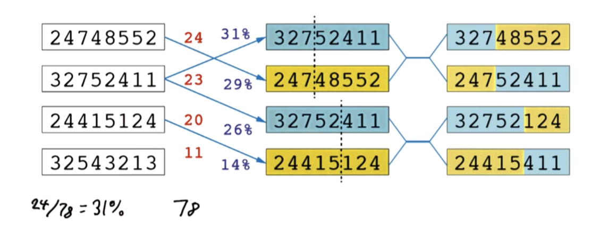
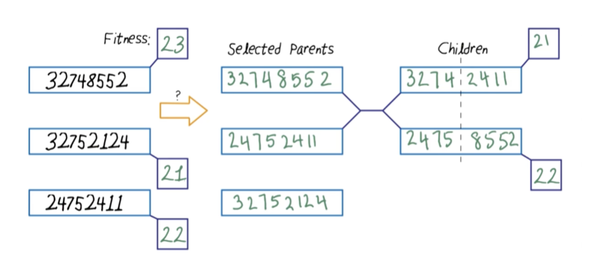

# C-2: Advanced Optimization Techniques

1. Simulated Annealing
    - Metallurgical Inspiration and Physical Analogy
    - Temperature Scheduling Functions
    - Acceptance Probability Calculations
    - Algorithm Implementation Details
    - Completeness and Efficiency Properties
2. Genetic Algorithms
    - Evolutionary Principles and Natural Selection
    - Population Initialization and Representation
    - Fitness Function Design and Evaluation
    - Selection Methods and Probabilities
    - Crossover Operations and Chromosome Splitting
3. Mutation and Evolution
    - Mutation Mechanisms and Rates
    - Creating Diversity in Solutions
    - Population Evolution Over Generations
    - Convergence Properties
    - Case Study: 8-Queens Problem Solution
4. Derivative-Free Optimization
    - Blackbox Optimization Approaches
    - Applications in Noisy Environments
    - Comparing Optimization Techniques
    - Hybrid Approaches and Real-World Implementation

#### Simulated Annealing

##### Metallurgical Inspiration and Physical Analogy

Simulated annealing draws its inspiration from metallurgy, specifically the annealing process used to strengthen metals
and glass. In physical annealing, a material is heated to a high temperature and then gradually cooled in a controlled
manner. This process allows the atoms in the material to move from their initial positions (high-energy states) and
gradually settle into configurations with lower energy as the temperature decreases, ultimately forming a more optimal
crystalline structure with minimum energy.

The genius of simulated annealing lies in this physical analogy. Just as atoms in a hot metal can move freely and have
enough energy to escape local energy minima, the algorithm initially accepts many non-improving moves when the
computational "temperature" is high. As the temperature decreases according to a cooling schedule, the algorithm becomes
increasingly selective, eventually accepting only improving moves when the temperature approaches zero.

This technique addresses a fundamental limitation of hill climbing algorithms: their tendency to get trapped in local
optima. By occasionally accepting worse solutions, especially early in the search process, simulated annealing can
escape local maxima and continue exploring the search space, potentially finding the global optimum.

The physical theory underpinning simulated annealing comes from statistical thermodynamics. At thermal equilibrium, the
probability of a system being in a state with energy $E$ is proportional to $e^{-E/kT}$, where $T$ is the temperature
and $k$ is Boltzmann's constant. This relationship, known as the Boltzmann distribution, inspired the acceptance
probability function used in the algorithm. The following psudo-code returns a solution state inputs: problem, a problem
schedule, a mapping from time to "temperature" provided below:

```python
function SIMULATED-ANNEALING(problem,schedule) returns a solution state
    inputs: problem, a problem
            schedule, a mapping from time to "temperature"

    current ← MAKE-NODE(problem.INITIAL-STATE)
    for t = 1 to ∞ do
        T ← schedule(t)
        if T = 0 then return current
        next ← a randomly selected successor of current
        ΔE ← next.VALUE - current.VALUE
        if ΔE > 0 then current ← next
        else current ← next only with probability e^(ΔE/T)
```

Simulated annealing represents a significant advancement in optimization techniques, addressing many of the limitations
of simple hill climbing approaches. Let me provide a comprehensive explanation of this algorithm based on the pseudocode
you've shared.

###### Theoretical Foundation

Simulated annealing draws inspiration from metallurgy—specifically the physical process of annealing, where materials
are heated and then slowly cooled to reduce defects and increase strength. In computational optimization, this metaphor
translates into initially allowing significant exploration of the solution space (high temperature) before gradually
focusing on refining promising solutions (cooling).

###### Core Algorithm Components

The pseudocode demonstrates the essential components of simulated annealing:

1. **State Representation**: The `current` variable represents the current solution being considered.
2. **Temperature Schedule**: The `schedule(t)` function maps time steps to temperature values, controlling how the
   algorithm balances exploration versus exploitation.
3. **Neighbor Generation**: The algorithm generates potential new solutions by randomly selecting successors to the
   current state.
4. **Acceptance Criteria**: Unlike hill climbing, simulated annealing doesn't always reject inferior solutions. It
   employs a probabilistic acceptance mechanism that depends on:
    - The magnitude of quality decrease (ΔE)
    - The current temperature (T)

###### Algorithm Execution Flow

The algorithm proceeds as follows:

1. Initialize with a starting solution: `current ← MAKE-NODE(problem.INITIAL-STATE)`
2. For each time step `t`:
    - Determine the current temperature: `T ← schedule(t)`
    - If temperature reaches zero, terminate and return the current solution
    - Generate a random neighbor: `next ← randomly selected successor of current`
    - Calculate the quality difference: `ΔE ← next.VALUE - current.VALUE`
    - Accept or reject the new solution based on:
        - If ΔE > 0 (improvement): Always accept
        - If ΔE ≤ 0 (worse solution): Accept with probability e^(ΔE/T)

###### The Acceptance Probability Formula

The probabilistic acceptance of worse solutions is governed by the formula:

$$P(\text{accept}) = e^{\Delta E / T}$$

This formula has several important properties:

1. When ΔE is close to zero (small degradation), the acceptance probability is higher
2. When ΔE is very negative (large degradation), the acceptance probability is lower
3. When T is high (early in the process), even significantly worse solutions might be accepted
4. When T is low (later in the process), only slightly worse solutions have a reasonable chance of acceptance
5. As T approaches zero, the algorithm behaves more like greedy hill climbing

###### Temperature Scheduling

The temperature schedule is crucial for simulated annealing's effectiveness:

- **Initial Temperature**: Should be high enough that approximately 80% of worse moves are initially accepted

- Cooling Rate: Typically follows one of these patterns:

    - Linear: $T(t) = T₀ - αt$
    - Geometric: $T(t) = T₀ × α^t$ (where $0 < α < 1$)
    - Logarithmic: $T(t) = T₀/log(t+1)$

While the pseudocode shows an infinite loop with termination when $T=0$, practical implementations typically use a
finite number of iterations or additional stopping criteria.

###### Understanding Cooling Rate in Simulated Annealing

The cooling rate in simulated annealing is a fundamental concept that directly influences the algorithm's performance
and behavior. Let me explain why this parameter is crucial and how each cooling schedule functions.

###### The Significance of Cooling Rate

The cooling rate determines how quickly the algorithm transitions from exploration (accepting many worse moves) to
exploitation (becoming more selective). This transition mirrors the physical annealing process where materials are
heated and slowly cooled to remove defects and achieve optimal crystalline structure.

From an algorithmic perspective, the cooling rate creates a balance between:

- Exploring widely early in the search (when temperature is high)
- Gradually focusing on promising regions (as temperature decreases)
- Finally, converging to a local optimum (at very low temperatures)

If we cool too quickly, the algorithm behaves more like hill climbing and may get trapped in poor local optima. If we
cool too slowly, the algorithm wastes computational resources exploring regions that aren't promising.

###### Understanding the Three Cooling Schedules

Let's examine each cooling schedule formula and its implications:

1. **Linear Cooling**: $T(t) = T_0 - \alpha t$

    In this approach, we subtract a fixed amount ($\alpha$) from the temperature at each iteration. For example, if
    $T_0 = 100$ and $\alpha = 0.5$, then:

    - At iteration 1: T = 100 - 0.5(1) = 99.5
    - At iteration 10: T = 100 - 0.5(10) = 95
    - At iteration 200: T = 100 - 0.5(200) = 0 (or we'd terminate once T ≤ 0)

    Linear cooling creates a consistent, predictable cooling rate. However, it doesn't adapt to the progress of the
    search or the characteristics of the solution landscape. The fixed decrement means the temperature will reach zero
    after a predetermined number of iterations, regardless of whether the algorithm has found a good solution.

2. **Geometric Cooling**: $T(t) = T_0 \times \alpha^t$ (where $0 < \alpha < 1$)

    This is the most widely used cooling schedule. Instead of subtracting a fixed amount, we multiply the temperature by
    a factor $\alpha$ at each iteration. For example, with $T_0 = 100$ and $\alpha = 0.95$:

    - At iteration 1: T = 100 × 0.95¹ = 95
    - At iteration 10: T = 100 × 0.95¹⁰ ≈ 59.9
    - At iteration 100: T = 100 × 0.95¹⁰⁰ ≈ 0.59

    Geometric cooling creates an exponential decay that starts with rapid cooling when the temperature is high (allowing
    quick movement away from poor starting points) and then slows down as the temperature decreases (allowing
    fine-tuning in promising regions). The parameter $\alpha$ directly controls the cooling speed—typical values are
    between 0.8 (faster cooling) and 0.99 (slower cooling).

3. **Logarithmic Cooling**: $\large T(t) = \frac{T_0}{\log(t+1)}$

    This schedule decreases temperature very slowly, especially in later iterations. For example, with $T_0 = 100$:

    - At iteration 1: T = 100/log(1+1) = 100/0.693 ≈ 144.3
    - At iteration 10: T = 100/log(10+1) = 100/2.398 ≈ 41.7
    - At iteration 100: T = 100/log(100+1) = 100/4.615 ≈ 21.7

    Logarithmic cooling is theoretically significant because it can guarantee convergence to the global optimum under
    certain conditions. However, it's so slow that it's rarely used in practical applications, as it would require an
    impractical number of iterations to reach low temperatures.

All three cooling schedules—linear, geometric, and logarithmic—are used in practice, but their popularity and
applicability vary depending on the specific problem characteristics and computational constraints.

Geometric cooling is indeed the most commonly used approach in practical implementations, but the other schedules have
important applications too. Let me explain when each might be preferred:

###### Linear Cooling: $T(t) = T₀ - αt$

Linear cooling is straightforward and predictable. It decreases the temperature by a constant amount at each iteration,
which means it will reach zero after a fixed number of steps.

This schedule works well when:

- You have a predetermined computational budget (known number of iterations)
- The problem landscape is relatively smooth without many local optima
- You want a simple implementation with predictable behavior
- The initial exploration and final exploitation phases should have similar durations

For example, in some scheduling problems or simple layout optimization tasks, linear cooling might provide sufficient
results while being easy to implement and tune.

###### Geometric Cooling: $T(t) = T₀ × αᵗ$ (where $0 < α < 1$)

Geometric cooling is most popular because it balances exploration and exploitation effectively for many problems. It
reduces temperature quickly at first (when values are high) and then more gradually as the temperature decreases.

This schedule is preferred when:

- The problem has multiple local optima that require escaping
- You want more iterations at lower temperatures for fine-tuning solutions
- You need a balance between exploration and exploitation
- The problem landscape is complex or unknown

Most real-world applications like VLSI circuit design, logistics optimization, and complex scheduling problems use
geometric cooling.

###### Logarithmic Cooling: $T(t) = T₀/log(t+1)$

Logarithmic cooling decreases temperature extremely slowly, especially in later iterations. While it's the least
commonly used in practice, it has significant theoretical importance.

This schedule is valuable when:

- Theoretical guarantees of finding the global optimum are paramount
- The problem is extremely complex with many deceptive local optima
- Computational resources are abundant and solution quality outweighs time constraints
- The problem has a provable structure that benefits from the logarithmic cooling properties

Some specialized applications in statistical physics simulations and certain mathematical optimization problems might
use logarithmic cooling.

###### Practical Considerations

In research and industry applications, variants and adaptations of these basic schedules are common:

1. **Adaptive cooling**: The cooling rate adjusts dynamically based on acceptance ratios or optimization progress
2. **Reheating mechanisms**: Temporarily increasing temperature when progress stalls
3. **Staged cooling**: Using different cooling rates at different temperature ranges
4. **Hybrid schedules**: Combining elements of multiple cooling approaches

The right choice depends on your specific problem, computational constraints, and quality requirements. Many
practitioners experiment with different schedules and parameters to find what works best for their particular
application.

###### Practical Implications for Implementation

When implementing simulated annealing:

1. **Selecting the Initial Temperature ($T_0$)**: This should be set so that approximately 80% of worse moves are
   initially accepted. This typically requires problem-specific tuning based on the typical magnitude of changes in the
   objective function.
2. **Choosing a Cooling Schedule**: Geometric cooling is most common due to its balance of simplicity and effectiveness.
   The cooling rate $\alpha$ can be tuned based on:
    - Available computational budget
    - Problem complexity
    - Size of the search space
    - Typical distance between local optima
3. **Termination Criteria**: Rather than waiting until T = 0 (which might never happen with some schedules), practical
   implementations often use criteria such as:
    - A minimum temperature threshold
    - Maximum number of iterations
    - No improvement over a certain number of iterations
    - Computation time limits
4. **Adaptive Cooling**: More sophisticated implementations might adjust the cooling rate dynamically based on the
   algorithm's progress:
    - Slow down cooling when finding improvements
    - Speed up cooling when stuck in a region with no improvement
    - Occasionally "reheat" to escape potential local optima

###### Example: Traveling Salesman Problem Implementation

For a concrete example, consider a simulated annealing implementation for the Traveling Salesman Problem with 100
cities:

1. Initial temperature might be set to $T_0 = 100$ (after observing that this allows about 80% of worse moves to be
   accepted)
2. Using geometric cooling with $\alpha = 0.99$ for slow cooling
3. Termination when T < 0.01 or after 10,000 iterations without improvement
4. State representation: ordered list of cities
5. Neighbor generation: swap two random cities or reverse a segment of the route

With these parameters, the algorithm would initially accept many moves that increase the total distance, gradually
becoming more selective, and eventually behaving like hill climbing in the final phases to fine-tune the solution.

###### Advantages Over Hill Climbing

1. **Escaping Local Optima**: The probabilistic acceptance of worse solutions allows the algorithm to escape local
   optima that would trap hill climbing algorithms.
2. **Balanced Exploration-Exploitation**: The temperature schedule naturally transitions from exploration (high
   temperature) to exploitation (low temperature).
3. **Theoretical Guarantees**: Under certain conditions, simulated annealing converges to the global optimum with
   probability approaching 1 (though this typically requires impractically slow cooling).
4. **Adaptability**: The algorithm can be adapted to discrete or continuous spaces and various problem structures.

###### Practical Example: Traveling Salesman Problem

For the Traveling Salesman Problem:

- **State**: An ordering of cities
- **Neighbors**: Swapping two cities or inverting a subsequence
- **Energy Function**: Total distance of the tour (to be minimized)

Early in the process (high temperature), the algorithm might accept a significantly longer route to explore different
regions of the solution space. As the temperature decreases, it becomes increasingly focused on refining promising
routes.

###### Parameter Tuning Considerations

The effectiveness of simulated annealing heavily depends on:

1. **Initial Temperature**: Too high wastes computation; too low risks getting trapped in local optima
2. **Cooling Schedule**: Too fast leads to premature convergence; too slow is computationally expensive
3. **Neighbor Generation**: Should balance between small moves for refinement and larger moves for exploration
4. **Stopping Criteria**: Can include minimum temperature, maximum iterations, or solution quality thresholds

##### Temperature Scheduling Functions

The temperature scheduling function (also called the cooling schedule) is crucial to the success of simulated annealing.
It determines how quickly the algorithm transitions from exploration (accepting many worse moves) to exploitation
(focusing on improvements). The cooling schedule must balance two competing objectives:

1. Start with a sufficiently high temperature to allow exploration of the search space
2. Cool slowly enough to allow the algorithm to find high-quality solutions

Several common temperature scheduling functions include:

1. **Linear Cooling**: $$T(t) = T_0 - \alpha t$$

    Where T₀ is the initial temperature, t is the current iteration, and α is the cooling rate. This simple approach
    reduces the temperature by a fixed amount at each step.

2. **Geometric Cooling**: $$T(t) = T_0 \times \alpha^t$$

    Where α is a value between 0 and 1 (typically 0.8 to 0.99). This is the most commonly used schedule, decreasing the
    temperature by a fixed percentage at each step.

3. **Logarithmic Cooling**: $$\large T(t) = \frac{T_0}{\log(t+1)}$$

    This schedule guarantees convergence to the global optimum under certain conditions but cools so slowly that it's
    often impractical for real applications.

4. **Adaptive Cooling**: Temperature reduction is based on observed performance. If the algorithm is making good
   progress at the current temperature, cooling proceeds more slowly; if the search seems stuck, cooling accelerates.

The initial temperature T₀ should be high enough that the acceptance probability for worse moves is initially around
0.8, allowing extensive exploration. The final temperature should be low enough that the probability of accepting a
significantly worse move is nearly zero.

Practical implementations often include "reheating" mechanisms that temporarily increase the temperature when the
algorithm appears to be stuck, providing another chance to escape local optima.

##### Acceptance Probability Calculations

The core innovation of simulated annealing is its probabilistic acceptance criterion for new states. Unlike hill
climbing, which only accepts improvements, simulated annealing uses a probability function to decide whether to move to
a new state:

1. If the new state is better (higher value for maximization problems), accept it with probability 1
2. If the new state is worse, accept it with probability: $$P(\text{accept}) = e^{\Delta E / T}$$

Where:

- ΔE is the change in energy (value difference between current and new state)
- T is the current temperature

For minimization problems (where we seek lower values), the formula becomes: $$P(\text{accept}) = e^{-\Delta E / T}$$

This formula has several important properties:

1. **Larger improvements are always accepted**: When the new solution is better, ΔE is positive (for maximization),
   making the probability greater than 1, which means automatic acceptance.
2. **Temperature controls exploration vs. exploitation**: At high temperatures, even large decreases in solution quality
   have a significant probability of acceptance. As T approaches zero, the probability of accepting worse solutions
   approaches zero.
3. **Magnitude of deterioration matters**: Small decreases in solution quality are more likely to be accepted than large
   ones. A move that worsens the solution slightly might be accepted even at relatively low temperatures.

The acceptance probability calculation implements a careful balance: it allows escape from local optima while still
generally guiding the search toward better solutions. The specific parametrization of this function significantly
impacts the algorithm's performance.

##### Algorithm Implementation Details

Here's the pseudocode for the simulated annealing algorithm:

```python
function SIMULATED-ANNEALING(problem, schedule) returns a solution state
    inputs: problem, a problem
            schedule, a mapping from time to "temperature"

    current ← MAKE-NODE(problem.INITIAL-STATE)
    for t = 1 to ∞ do
        T ← schedule(t)
        if T = 0 then return current
        next ← a randomly selected successor of current
        ΔE ← next.VALUE - current.VALUE
        if ΔE > 0 then current ← next
        else current ← next only with probability e^(ΔE/T)
```

Key implementation details include:

1. **Initial State Selection**: While a random initial state is common, starting from a reasonably good solution
   (perhaps generated by a greedy algorithm) can accelerate convergence.
2. **Neighbor Generation**: Unlike hill climbing, which evaluates all neighbors, simulated annealing typically selects a
   random neighbor. This makes each iteration more efficient but requires more iterations.
3. **Random Number Generation**: To implement the probabilistic acceptance criterion, we generate a random number r
   between 0 and 1 and accept a worse move if r < e^(ΔE/T).
4. **Equilibrium at Each Temperature**: Theoretical guarantees of finding the global optimum assume that the system
   reaches thermal equilibrium at each temperature. In practice, this means performing multiple iterations at each
   temperature before cooling.
5. **Termination Conditions**: Common stopping criteria include:
    - The temperature reaching a predefined minimum value
    - The solution quality not improving for a certain number of iterations
    - A maximum number of iterations being reached
    - The solution reaching a known optimum or acceptable quality threshold
6. **Implementation Optimizations**:
    - Caching objective function evaluations when they're expensive
    - Using data structures that allow efficient neighbor generation
    - Maintaining statistics about accepted and rejected moves to adapt the cooling schedule

A practical implementation might also include elements from other search algorithms, such as keeping track of the best
solution found so far (which might not be the current solution if a worse move was accepted).

##### Completeness and Efficiency Properties

Simulated annealing offers several theoretical and practical advantages over simpler optimization methods:

**Completeness**: Under certain conditions, simulated annealing is guaranteed to find the global optimum with
probability approaching 1. Specifically, if the cooling schedule decreases logarithmically and the algorithm performs
sufficient iterations at each temperature, it will eventually find the global optimum. However, these conditions require
impractically slow cooling for most real-world problems.

**Probabilistic Completeness**: Even with faster cooling schedules, simulated annealing is probabilistically
complete—given enough runs, it will eventually find the global optimum. This property makes it more robust than hill
climbing, which can get permanently trapped in local optima.

**Efficiency Properties**:

1. **Time Complexity**: The time complexity depends on the cooling schedule and the size of the search space. With a
   geometric cooling schedule, practical implementations typically perform O(log(T₀)) iterations, where each iteration
   involves generating and evaluating a single neighbor.
2. **Space Complexity**: O(1) beyond the storage required for representing a single state, making it memory-efficient
   compared to population-based methods like genetic algorithms.
3. **Early Quality Solutions**: Simulated annealing often finds good (though not optimal) solutions relatively early in
   the search process, making it suitable for anytime applications where an acceptable solution is needed quickly.
4. **Robustness to Landscape Structure**: Unlike hill climbing, simulated annealing performs well even on rugged
   landscapes with many local optima. It's particularly effective when good solutions are surrounded by barriers of poor
   solutions.

In practice, simulated annealing strikes a balance between exploration and exploitation that makes it well-suited for
many complex optimization problems. It requires less parameter tuning than techniques like genetic algorithms while
offering better escape from local optima than hill climbing.

For problems with expensive objective function evaluations, simulated annealing's selective neighbor evaluation
(examining only one neighbor per iteration) can be more efficient than methods that evaluate many neighbors or
population members.

The algorithm's elegant simplicity, theoretical guarantees, and practical performance have made simulated annealing a
staple in the optimization toolkit, especially for combinatorial optimization problems like the traveling salesman
problem, graph partitioning, circuit layout, and scheduling.

#### Genetic Algorithms

##### Evolutionary Principles and Natural Selection

Genetic algorithms (GAs) represent a fundamentally different approach to optimization than the methods we've discussed
previously. While hill climbing and simulated annealing operate on a single solution that evolves over time, genetic
algorithms maintain a population of candidate solutions that evolve together through mechanisms inspired by biological
evolution.

The core insight behind genetic algorithms comes from Charles Darwin's theory of natural selection. In nature, organisms
with traits well-suited to their environment are more likely to survive and reproduce, passing those beneficial traits
to their offspring. Over generations, this process leads to populations increasingly well-adapted to their environments.

Genetic algorithms simulate this evolutionary process to solve optimization problems:

1. A population of candidate solutions competes for survival based on their fitness (quality as solutions)
2. The fittest individuals are more likely to be selected as "parents" for the next generation
3. New solutions are created by combining parts of parent solutions (crossover) and introducing random changes
   (mutation)
4. This process repeats over many generations, with the population gradually improving

The power of genetic algorithms lies in their parallel exploration of the search space and their ability to combine
partial solutions. When different individuals in the population have discovered different beneficial components of the
solution, crossover operations can combine these components to create even better solutions. This "building block
hypothesis" explains why genetic algorithms often outperform methods like hill climbing on problems where good solutions
consist of multiple interacting parts.

Unlike hill climbing or simulated annealing, genetic algorithms don't explicitly attempt to follow gradients in the
search space. Instead, they use selection pressure to guide the search toward promising regions while maintaining
diversity through mutation. This makes them particularly effective for problems with rugged landscapes, discontinuities,
or deceptive gradients.

##### Population Initialization and Representation

The first step in implementing a genetic algorithm is choosing how to represent candidate solutions. This
representation, often called a "chromosome," must encode all the information needed to evaluate the solution's fitness.

Common representation schemes include:

1. **Binary Strings**: Solutions are encoded as sequences of 0s and 1s. Each position (bit) in the string represents a
   specific aspect of the solution. This is the classical representation used in early genetic algorithms.
2. **Integer or Real-Valued Vectors**: For problems with numerical parameters, solutions can be represented directly as
   vectors of integers or floating-point numbers.
3. **Permutations**: For ordering problems like the traveling salesman problem, solutions are represented as
   permutations of a fixed set of elements.
4. **Trees or Graphs**: For more complex structures like computer programs or neural network architectures, solutions
   might be represented as trees or graphs.

The representation choice significantly impacts the genetic algorithm's performance. An effective representation should:

- Allow all possible solutions to be represented
- Make similar solutions have similar representations
- Facilitate efficient crossover and mutation operations
- Map easily to and from the actual solution space

After choosing a representation, the algorithm initializes a population of candidate solutions. Typically, this initial
population is generated randomly to ensure diversity, though domain knowledge can be incorporated to bias the initial
population toward promising regions of the search space.

The population size represents another important parameter. Larger populations provide more diversity and parallel
exploration but require more computational resources per generation. Population sizes typically range from dozens to
thousands of individuals depending on the problem complexity.

For example, in the 8-Queens problem, we might represent a solution as a string of 8 digits, where each digit represents
the row position of the queen in the corresponding column. The initial population might consist of 100 random
permutations of the digits 1-8.

<div align="center">

<p style="color: #555;">Figure: Visualization of a genetic algorithm population evolving over time</p>
</div>

##### Fitness Function Design and Evaluation

The fitness function in a genetic algorithm serves the same purpose as the objective function in other optimization
methods: it quantifies how "good" each candidate solution is. This function creates the selection pressure that drives
evolution toward better solutions.

Designing an effective fitness function requires careful consideration:

1. **Accuracy**: The fitness function should accurately reflect the true quality of solutions according to the problem's
   objectives.
2. **Granularity**: It should provide sufficient differentiation between similar solutions to guide the search
   effectively.
3. **Computational Efficiency**: Since the fitness function is evaluated for every individual in every generation, it
   should be as computationally efficient as possible.
4. **Handling Constraints**: For constrained optimization problems, the fitness function must incorporate penalties for
   constraint violations or use repair mechanisms.

For the 8-Queens problem, a natural fitness function would measure how many pairs of queens are non-attacking. With 8
queens, there are 28 possible pairs (calculated as $n(n-1)/2 = 8×7/2 = 28$), so the maximum fitness is 28, representing
a solution where no queens attack each other.

<div align="center">

<p style="color: #555;">Figure: Example of fitness evaluation in genetic algorithms</p>
</div>

After evaluating the fitness of each individual, the genetic algorithm uses these values in several ways:

1. To determine which individuals survive into the next generation (if using elitism)
2. To calculate selection probabilities for reproduction
3. To track the best solution found so far and overall population statistics

Fitness evaluation is typically the most computationally expensive part of genetic algorithms, especially for complex
real-world problems. Various techniques like fitness caching, approximate evaluation, or parallelization can be employed
to mitigate this cost.

##### Selection Methods and Probabilities

Selection is the process of choosing which individuals from the current population will create offspring for the next
generation. This process embodies the "survival of the fittest" principle, giving better solutions a higher chance of
reproducing.

Several common selection methods include:

1. **Fitness-Proportionate Selection (Roulette Wheel Selection)**: Each individual's probability of selection is
   directly proportional to its fitness. If an individual has twice the fitness of another, it has twice the probability
   of being selected.

    For example, if we have four individuals with fitness values of 24, 23, 20, and 11, their selection probabilities
    would be:

    - 24/78 ≈ 31%
    - 23/78 ≈ 29%
    - 20/78 ≈ 26%
    - 11/78 ≈ 14%

    Where 78 (= 24+23+20+11) is the sum of all fitness values. This method can be visualized as a roulette wheel where
    each individual gets a slice proportional to its fitness.

2. **Rank Selection**: Individuals are sorted by fitness, and selection probability is based on rank rather than
   absolute fitness. This reduces the selection pressure when fitness values are close together or when a few
   individuals have much higher fitness than others.

3. **Tournament Selection**: A small group of individuals (typically 2-7) is randomly selected from the population, and
   the fittest individual from this group becomes a parent. This process is repeated to select each parent. Tournament
   selection doesn't require calculating selection probabilities and can be easily adjusted by changing the tournament
   size.

4. **Stochastic Universal Sampling**: A more efficient and less biased version of fitness-proportionate selection that
   ensures the actual number of offspring allocated to an individual is close to the expected number.

The selection pressure—how strongly the selection method favors fitter individuals—is a crucial parameter. Too much
pressure can lead to premature convergence, where the population loses diversity too quickly and gets trapped in local
optima. Too little pressure results in slow convergence, with the population taking many generations to improve
significantly.

Many implementations also use elitism, where a small number of the fittest individuals automatically survive unchanged
into the next generation. This ensures that the best solutions are never lost and guarantees that the best fitness in
the population never decreases from one generation to the next.

In our 8-Queens example, using fitness-proportionate selection, individuals with higher fitness (more non-attacking
pairs of queens) would be more likely to be selected as parents for creating the next generation of board
configurations.

<div align="center">

<p style="color: #555;">Figure: Selection process in genetic algorithms</p>
</div>

###### 8-Queens Genetic Algorithm Explanation

The 8-Queens problem challenges us to place eight queens on a standard 8×8 chessboard such that no queen can attack
another queen. In chess, queens can attack along rows, columns, and diagonals. This is a classic constraint satisfaction
problem that serves as an excellent demonstration of genetic algorithms.

###### Representation (Chromosome Design)

For the 8-Queens problem, we use a compact representation where each solution is encoded as a string of 8 integers,
e.g., "24748552". Each position in the string represents a column on the chessboard (1st through 8th), and the value at
each position represents the row where a queen is placed in that column. This representation automatically ensures no
two queens share the same column.

The encoding for the 8-Queens problem uses a remarkably efficient representation that captures an entire board
configuration with just 8 integers. This encoding system simplifies the problem while preserving all necessary
information.

###### How the Position Encoding Works

In this encoding scheme, each position in the string represents a column on the chessboard (from left to right), while
the value at that position indicates the row where a queen is placed.

For example, in the encoding "24748552":

- In column 1, there's a queen in row 2
- In column 2, there's a queen in row 4
- In column 3, there's a queen in row 7
- And so on through all eight columns

When visualized on a chessboard, this encoding produces a specific arrangement of queens:

```shell
  1 2 3 4 5 6 7 8
1 . . . . . . . .
2 Q . . . . . . Q
3 . . . . . . . .
4 . Q . Q . . . .
5 . . . . . Q Q .
6 . . . . . . . .
7 . . Q . . . . .
8 . . . . Q . . .
```

###### Benefits for Genetic Algorithm Operations

This representation offers several advantages for genetic algorithm operations:

1. It automatically ensures each column contains exactly one queen, reducing the search space dramatically.
2. For crossover operations, we can split and recombine these strings to create new valid configurations. For example:
    - Parent 1: "24748552" → Split into "247" and "48552"
    - Parent 2: "32752411" → Split into "327" and "52411"
    - Child: "24752411" (combining parts from both parents)
3. For mutation, we can simply swap two positions in the string or replace a value with another random digit between
   1-8.
4. Fitness evaluation becomes straightforward: count how many pairs of queens don't attack each other (don't share rows
   or diagonals).

The encoding's elegance lies in how it transforms a complex 2D board problem into a simple 1D string that still captures
all essential information, making it ideal for evolutionary algorithms.

This elegant representation reduces the search space from 64C8 (combinations of 8 queens on 64 squares) to just 8!
(permutations of row placements), making the problem much more tractable.

###### Fitness Function

The fitness function measures how close a candidate solution is to solving the problem. With 8 queens, there are 28
possible pairs of queens (calculated as 8×7÷2 = 28). For each solution, we count how many pairs of queens are
non-attacking (don't share a row or diagonal). A perfect solution has a fitness of 28 (all pairs are non-attacking). The
closer to 28, the better the solution.

For example, in the configuration "24748552":

- No two queens share the same row (since all digits are different)
- Some queens share diagonals (can be verified by checking if |row₁-row₂| = |column₁-column₂|)
- This configuration might have a fitness around 24, meaning 24 out of 28 pairs don't attack each other

###### Calculating the Number of Queen Pairs on a Chessboard

The formula 8×7÷2 = 28 represents the calculation for determining how many possible pairs of queens can be formed when
there are 8 queens on the board. Let me explain how this is derived:

When we have 8 queens on a chessboard, we need to calculate how many ways we can select 2 queens from these 8 queens to
form a pair. This is a combination problem from probability theory, specifically "n choose k" where we want to find how
many ways to choose k items from n distinct items, where order doesn't matter.

The formula for this combination is:

$${n \choose k} = \frac{n!}{k!(n-k)!}$$

In our specific case, we're choosing 2 queens from 8, so we calculate:

$${8 \choose 2} = \frac{8!}{2!(8-2)!} = \frac{8!}{2!6!}$$

Breaking this down step-by-step:

1. 8! = 8 × 7 × 6 × 5 × 4 × 3 × 2 × 1 = 40,320
2. 2! = 2 × 1 = 2
3. 6! = 6 × 5 × 4 × 3 × 2 × 1 = 720

So: $${8 \choose 2} = \frac{40,320}{2 × 720} = \frac{40,320}{1,440} = 28$$

However, there's a simpler way to calculate this directly. When choosing 2 elements from n elements, the formula
simplifies to:

$${n \choose 2} = \frac{n(n-1)}{2}$$

So for 8 queens: $${8 \choose 2} = \frac{8 × 7}{2} = \frac{56}{2} = 28$$

This gives us the total number of possible pairs of queens. The genetic algorithm's fitness function counts how many of
these pairs are non-attacking. A perfect solution with a fitness of 28 means all 28 possible pairs are non-attacking (no
queen threatens any other queen).

Understanding this calculation is important because it forms the basis of the fitness function, which drives the entire
evolutionary process in the genetic algorithm solving the 8-Queens problem.

The reason we need to calculate the number of possible queen pairs (28 pairs for 8 queens) is fundamental to how we
evaluate potential solutions in the genetic algorithm. This calculation forms the basis of our fitness function, which
is crucial for three reasons:

First, the fitness function must quantify how "good" each potential solution is. In the 8-Queens problem, a solution is
perfect when no queen can attack any other queen. By counting how many pairs of queens are non-attacking, we get a
precise measure of solution quality—ranging from 0 (worst) to 28 (perfect).

Second, this approach creates a gradual fitness landscape rather than a binary one. If we simply classified solutions as
"valid" or "invalid," the genetic algorithm would struggle to evolve because it wouldn't know which invalid solutions
are closer to being valid. By counting non-attacking pairs, we create a smooth gradient that guides the evolutionary
process. A board with 27 non-attacking pairs is much closer to a solution than one with only 20 pairs.

Third, this fitness measure provides the selection pressure needed for evolution. When solutions compete for selection
as parents, those with more non-attacking pairs have higher fitness scores and are more likely to be selected. This
gradually shifts the population toward better solutions.

###### Initialization

The genetic algorithm begins by creating a population of random candidate solutions. We generate 100-200 random
permutations of the digits 1-8, where each permutation represents a different arrangement of queens on the board. We
then evaluate the fitness of each configuration. This diverse initial population provides genetic material for
evolution.

###### Selection Process

The selection mechanism determines which individuals will reproduce. Fitness-proportionate selection gives boards with
fewer attacking queens a higher probability of selection. For example, if one board has fitness 24 and another has
fitness 20, the first board is 20% more likely to be selected.

The selection pressure must be carefully calibrated. If too high, the population quickly converges on local optima. If
too low, evolution progresses too slowly. Elitism ensures the best solutions found so far are preserved unchanged in the
next generation.

###### Crossover Operations

Crossover combines genetic material from two parent solutions. We select two parent configurations based on their
fitness, choose a random crossover point (or points), and exchange segments of the parents' representations.

For example:

- Parent 1: "24748552" → Split into "247" and "48552"
- Parent 2: "32752411" → Split into "327" and "52411"
- Child 1: "24752411" (combining first segment of Parent 1 with second segment of Parent 2)
- Child 2: "32748552" (combining first segment of Parent 2 with second segment of Parent 1)

Special care must be taken since valid solutions must contain each digit 1-8 exactly once. If crossover creates invalid
solutions (with repeated digits), repair operations must be performed.

###### Mutation

Mutation introduces random changes to maintain genetic diversity. With a small probability (typically 1-5%), random
positions in solutions are altered. For the 8-Queens representation, mutation typically involves swapping two randomly
selected positions. For example, mutating "24752411" by swapping positions 3 and 7 yields "24152471".

This occasional random perturbation helps the algorithm escape local optima by exploring new regions of the search
space.

###### Evolution Process for 8-Queens

The evolution typically progresses through several phases. In the initial population (Generation 0), we have 100 random
arrangements of queens, most with many attacking pairs. The average fitness might be around 20-22 (out of 28), with the
best individual having fitness around 24.

In early generations (1-10), selection favors better board configurations, crossover combines promising arrangements,
and the population average fitness gradually increases. The best fitness might reach 25-26.

In middle generations (10-30), the population becomes more homogeneous as beneficial patterns propagate. Mutation
becomes crucial for maintaining diversity as several good but suboptimal solutions compete in the population. The best
fitness reaches 27 in many runs.

In final generations (30-50), with proper parameter settings, the algorithm typically finds a perfect solution (fitness
28). Multiple distinct solutions might be present, as the 8-Queens problem has 92 unique solutions. An example solution
is "15863724" (a valid configuration with no attacking queens).

The genetic algorithm typically finds a solution to the 8-Queens problem within 50-100 generations, though this varies
based on random initialization and parameter settings.

##### Crossover Operations and Chromosome Splitting

Crossover (also called recombination) is the primary mechanism for creating new solutions in genetic algorithms. It
combines parts of two parent solutions to create one or more offspring that inherit characteristics from both parents.
This operation mimics sexual reproduction in biology and allows beneficial traits discovered independently in different
individuals to be combined.

The specific implementation of crossover depends on the chosen representation:

1. **Single-Point Crossover**: A single crossover point is randomly selected. All data beyond that point is swapped
   between the two parents, resulting in two children.
2. **Two-Point Crossover**: Two crossover points are selected, and the segment between them is swapped between parents.
3. **Uniform Crossover**: Each gene (bit or component) is independently chosen from either parent with some probability
   (typically 0.5).
4. **Arithmetic Crossover**: For real-valued representations, offspring can be created by taking a weighted average of
   the parents' values for each component.
5. **Order-Based Crossover**: For permutation representations (like in the traveling salesman problem), special
   crossover operators preserve the validity of the permutation while combining ordering information from both parents.

For the 8-Queens problem with a string representation like "24748552" (where each digit represents the row position of
the queen in that column), a simple crossover might split each parent's string and recombine them:

Parent 1: "24748552" → Split into "247" and "48552" Parent 2: "32752411" → Split into "327" and "52411"

Child 1: "247" + "52411" = "24752411" Child 2: "327" + "48552" = "32748552"

The crossover rate—the probability that two selected parents will undergo crossover—is typically high (0.6 to 0.9). If
crossover doesn't occur, the parents are copied unchanged to the offspring pool (though they might still undergo
mutation).

Crossover is most effective when the representation has the "building block property," where related components of the
solution are stored close together in the chromosome. This allows beneficial combinations of genes to be passed intact
to offspring. When designing a representation for a specific problem, considering how crossover will combine solution
components is essential.

The choice of crossover method and parameters significantly impacts the genetic algorithm's performance. Different
problems benefit from different crossover strategies, and experimentation is often necessary to find the most effective
approach for a particular domain.

Through selection and crossover across many generations, genetic algorithms gradually combine beneficial components of
solutions while maintaining the diversity needed to explore the search space effectively. This balance between
exploitation of known good solutions and exploration of new possibilities is what makes genetic algorithms so powerful
for complex optimization problems.

#### Mutation and Evolution

##### Mutation Mechanisms and Rates

Mutation serves as the second key genetic operator in evolutionary algorithms, complementing the role of crossover.
While crossover combines existing genetic material from parents, mutation introduces entirely new genetic information by
making random changes to individual solutions. This mechanism parallels the random genetic mutations that occur in
biological evolution.

The fundamental purpose of mutation is to maintain genetic diversity within the population and prevent premature
convergence to suboptimal solutions. It introduces variations that might not be achievable through crossover alone,
especially when the population has become relatively homogeneous. Mutation essentially acts as an insurance policy
against the loss of potentially valuable genetic material.

The specific implementation of mutation depends on the chosen representation:

For binary representations, mutation typically flips individual bits with a small probability. For example, a chromosome
"10110101" might become "10010101" if the third bit is selected for mutation.

For integer or real-valued representations, mutation might add small random values to selected components, replace
components with new random values, or swap values between positions.

For permutation-based representations, as in the 8-Queens problem, mutation often takes the form of swapping two
elements or shifting a subsequence. For instance, in the representation "24748552," a mutation might swap the positions
of two digits, changing it to "24798552" (swapping 4 and 9).

The mutation rate—the probability that each component of a solution undergoes mutation—is a critical parameter. Typical
mutation rates range from 0.001 to 0.05 per component, meaning each gene (bit, number, or element) has a 0.1% to 5%
chance of mutation. Setting the appropriate mutation rate involves balancing competing concerns:

Too high a mutation rate disrupts promising solutions and can turn the genetic algorithm into a random search, losing
the benefits of selection and crossover.

Too low a mutation rate fails to maintain adequate diversity, allowing the population to converge prematurely to local
optima.

Adaptive mutation schemes adjust the mutation rate during the evolutionary process. For example, decreasing the mutation
rate over time allows for broader exploration early in the search and finer refinement later. Alternatively, increasing
mutation when the population diversity falls below a threshold helps escape local optima.

In practice, mutation is usually applied after crossover, with each offspring having a chance to undergo mutation. This
sequence—selection, followed by crossover, followed by mutation—constitutes the complete reproductive cycle of a genetic
algorithm.

##### Creating Diversity in Solutions

Diversity in the solution population is essential for the success of genetic algorithms. Without sufficient diversity,
the algorithm can converge prematurely to suboptimal solutions, losing its ability to explore the search space
effectively. Several mechanisms work together to create and maintain diversity:

1. **Random Initialization**: The initial population is typically generated randomly to ensure a broad sampling of the
   search space. This provides the genetic raw material for subsequent evolution.
2. **Mutation**: As discussed above, mutation introduces random variations that might not be present in the current
   population, expanding the range of solutions explored.
3. **Diversifying Selection Methods**: Some selection methods are designed specifically to preserve diversity. For
   example, tournament selection with small tournament sizes gives weaker solutions a better chance of reproduction than
   fitness-proportionate selection would.
4. **Niching and Speciation**: These techniques explicitly encourage the formation of distinct subpopulations
   specialized for different regions of the search space. They typically involve modifying the fitness function to
   penalize similar solutions or grouping similar individuals and applying selection within these groups.
5. **Island Models**: The population is divided into separate "islands" that evolve independently, with occasional
   "migration" of individuals between islands. This parallel evolution approach helps maintain diverse exploration
   pathways.
6. **Diversity Metrics and Intervention**: The algorithm can monitor population diversity using metrics like genotypic
   or phenotypic variance. If diversity falls below a threshold, intervention strategies such as increased mutation
   rates or introduction of new random individuals can be triggered.
7. **Crowding and Restricted Mating**: These mechanisms prevent similar individuals from mating, encouraging
   reproduction between dissimilar solutions to maintain diversity.

For the 8-Queens problem, a diverse population would contain board configurations with queens placed in different
patterns. Without diversity, the algorithm might converge on a particular arrangement of queens that represents a local
optimum but not a complete solution (where no queens threaten each other).

The balance between diversity (exploration) and selection pressure (exploitation) is central to genetic algorithm
design. Too much diversity slows convergence, while too little leads to premature convergence to suboptimal solutions.
This balance typically shifts during the evolutionary process, with greater emphasis on exploration initially and more
focus on exploitation in later generations.

##### Population Evolution Over Generations

As a genetic algorithm runs, the population undergoes a fascinating evolutionary trajectory that typically follows
distinguishable phases:

1. **Initialization Phase**: The algorithm begins with a randomly generated population exhibiting high diversity but
   generally low fitness. The fitness values are usually widely distributed.
2. **Rapid Improvement Phase**: During the early generations, fitness improves quickly as selection favors the better
   individuals and crossover combines beneficial components. The average fitness of the population rises sharply, and
   the best fitness also improves significantly.
3. **Refinement Phase**: As evolution continues, improvements become more incremental. The population begins to converge
   toward similar high-fitness solutions, with mutation playing an increasingly important role in maintaining diversity
   and enabling further improvements.
4. **Convergence Phase**: Eventually, the population largely converges, with most individuals representing variations of
   similar high-fitness solutions. The rate of improvement slows dramatically, and the algorithm may stabilize at a
   solution that is either the global optimum or a high-quality local optimum.

Throughout this process, several population statistics provide insights into the evolutionary dynamics:

- **Best Fitness**: The fitness of the best individual in each generation typically increases monotonically (especially
  with elitism) but at a decreasing rate.
- **Average Fitness**: The mean fitness of the population increases over time, typically following an S-shaped curve
  that rises slowly at first, then rapidly, then slowly again as it approaches the best fitness.
- **Fitness Variance**: The variance in fitness usually decreases over time as the population converges, though mutation
  helps maintain some variance even in later generations.
- **Genotypic Diversity**: Measures of how different the genetic encodings are within the population, typically
  decreasing over time but ideally maintained at sufficient levels to allow continued exploration.

The evolution process isn't always smooth. Phenomena like genetic drift (random changes in population composition) can
lead to the loss of beneficial genetic material, especially in smaller populations. Similarly, deceptive fitness
landscapes can guide the population toward local optima that are difficult to escape.

Effective genetic algorithms often incorporate mechanisms to manage these evolutionary dynamics:

- **Elitism**: Preserving the best individuals ensures that progress is never lost.
- **Dynamic Parameter Adjustment**: Changing selection pressure, crossover rates, or mutation rates as evolution
  progresses helps balance exploration and exploitation appropriately at each stage.
- **Restart Mechanisms**: If the population appears to have converged prematurely, reinjecting diversity or restarting
  with a partially new population can reinvigorate the search.

The specific evolutionary trajectory depends heavily on the problem characteristics, genetic operators, and parameter
settings, making the design of effective genetic algorithms both an art and a science.

##### Convergence Properties

Understanding the convergence properties of genetic algorithms helps explain both their strengths and their limitations
as optimization tools.

Unlike methods like hill climbing or simulated annealing, genetic algorithms don't follow a single trajectory through
the search space. Instead, they maintain a population distributed across multiple regions. This fundamental difference
affects their convergence behavior:

1. **Global Convergence**: Under certain theoretical conditions, genetic algorithms can converge to the global optimum
   with probability 1 as the number of generations approaches infinity. These conditions include maintaining sufficient
   population diversity and ensuring that any solution can be reached through a combination of crossover and mutation.
   However, these theoretical guarantees rarely apply directly to practical implementations.
2. **Practical Convergence**: In practice, genetic algorithms often find high-quality solutions but may not reach the
   global optimum. They excel at identifying "good enough" solutions relatively quickly, making them valuable for
   problems where finding the absolute best solution isn't critical or is computationally infeasible.
3. **Premature Convergence**: The most common convergence issue is premature convergence to suboptimal solutions. This
   occurs when the population loses diversity too quickly, becoming dominated by similar individuals representing a
   local optimum. The algorithm then lacks the genetic variation needed to explore beyond this region.
4. **Schema Theorem and Building Block Hypothesis**: Holland's Schema Theorem, a foundation of genetic algorithm theory,
   suggests that short, low-order, above-average schemata (patterns in the genetic encoding) receive exponentially
   increasing representation in subsequent generations. This supports the building block hypothesis—the idea that
   genetic algorithms work by identifying, preserving, and combining good partial solutions (building blocks).
5. **No Free Lunch Theorem**: This theorem states that no optimization algorithm outperforms all others across all
   possible problems. Genetic algorithms have characteristic strengths and weaknesses, performing particularly well on
   problems with complex, multimodal landscapes and those where good solutions combine identifiable components.

Several factors influence convergence behavior:

- **Population Size**: Larger populations maintain more diversity and are less prone to premature convergence, but
  require more computational resources.
- **Selection Pressure**: Higher selection pressure accelerates convergence but increases the risk of premature
  convergence to suboptimal solutions.
- **Crossover and Mutation Rates**: These parameters balance exploration and exploitation, with higher mutation rates
  generally slowing convergence but improving exploration.
- **Problem Landscape**: The structure of the fitness landscape significantly affects convergence. Deceptive landscapes,
  where the path to the global optimum passes through regions of lower fitness, pose particular challenges.

For practical applications, monitoring convergence indicators helps determine when to terminate the algorithm. Common
stopping criteria include:

- Reaching a predetermined number of generations
- Achieving a fitness threshold
- Detecting that the best fitness hasn't improved for several generations
- Observing that the population diversity has fallen below a critical threshold

Understanding these convergence properties allows practitioners to design more effective genetic algorithms and set
appropriate expectations for their performance on specific problems.

##### Case Study: 8-Queens Problem Solution

The 8-Queens problem provides an excellent case study for illustrating genetic algorithms in action. The objective is to
place eight queens on an 8×8 chessboard so that no queen threatens another queen. In chess, queens can attack along
rows, columns, and diagonals.

For this problem, we'll use a representation where each solution is encoded as a string of 8 digits, with each digit
representing the row position (1-8) of the queen in the corresponding column. For example, "24748552" means:

- Column 1: Queen in row 2
- Column 2: Queen in row 4
- Column 3: Queen in row 7
- And so on...

This representation automatically ensures that no two queens share the same column. We still need to evolve solutions
that avoid conflicts along rows and diagonals.

**Step 1: Fitness Function Design** The fitness function needs to measure how close a configuration is to a valid
solution. Since we want to minimize conflicts, we can count the number of non-attacking pairs of queens. With 8 queens,
there are 28 possible pairs (calculated as 8 × 7 ÷ 2 = 28). So the maximum fitness is 28, representing a solution with
no conflicts.

For example, analyzing the configuration "24748552":

- Row conflicts: Queens in rows 2, 5, and 5 (columns 1, 6, and 8) conflict
- Diagonal conflicts: Several queens are on the same diagonals
- Total non-attacking pairs: 24 (out of 28 possible pairs)
- Fitness value: 24

**Step 2: Population Initialization** We generate an initial population of, say, 100 random configurations. Each is a
random permutation of the digits 1-8. In our example, the initial population might include:

- "24748552" (fitness: 24)
- "32752411" (fitness: 23)
- "24415124" (fitness: 20)
- "32543213" (fitness: 11)
- ... (96 more random configurations)

**Step 3: Selection** Using fitness-proportionate selection, configurations with higher fitness have a greater chance of
being selected as parents. For our example candidates:

- "24748552" has a 31% selection probability (24/78)
- "32752411" has a 29% selection probability (23/78)
- "24415124" has a 26% selection probability (20/78)
- "32543213" has a 14% selection probability (11/78)

Where 78 is the sum of the fitness values of these four configurations.

**Step 4: Crossover** Selected parents undergo crossover to produce offspring. For example, if "24748552" and "32752411"
are selected as parents, we might perform single-point crossover by splitting at position 3:

Parent 1: "247" + "48552" = "24748552" Parent 2: "327" + "52411" = "32752411"

Child 1: "247" + "52411" = "24752411" Child 2: "327" + "48552" = "32748552"

**Step 5: Mutation** With a small probability (e.g., 0.05 per digit), each position in the offspring might mutate. For
example, Child 1 might mutate at position 5:

Before mutation: "24752411" After mutation: "24712411" (5 changed to 1)

**Step 6: Evolution Over Generations** This process of selection, crossover, and mutation continues for multiple
generations. Over time, the population evolves toward higher fitness configurations. The average fitness increases, and
eventually, the algorithm finds a solution with fitness 28—a configuration where no queens threaten each other.

Some valid solutions the algorithm might discover include:

- "15863724" (no queen threatens another)
- "64158753" (another valid solution)
- "46827135" (yet another valid solution)

**Convergence Analysis** For the 8-Queens problem, genetic algorithms typically converge to a solution within 50-100
generations, though this varies based on parameters and random initialization. The problem has 92 distinct solutions
(not counting reflections and rotations), giving the algorithm multiple possible targets.

Interestingly, the 8-Queens problem illustrates both the strengths and challenges of genetic algorithms:

- The structured representation allows crossover to effectively combine partial solutions.
- The fitness function provides a smooth gradient guiding evolution toward valid configurations.
- Multiple valid solutions create a multimodal landscape where different runs might converge to different optima.
- The relatively small search space (8! = 40,320 possible configurations) means that even a modestly sized population
  can effectively explore it.

This case study demonstrates how genetic algorithms navigate complex search spaces by maintaining a diversity of
solutions, combining promising components through crossover, and exploring new possibilities through mutation. The
8-Queens problem, despite its relative simplicity, captures many of the key dynamics that make genetic algorithms
powerful optimization tools for more complex real-world problems.

#### Derivative-Free Optimization

##### Blackbox Optimization Approaches

Derivative-free optimization (DFO) represents an important class of methods designed for scenarios where gradient
information is unavailable, unreliable, or impractical to obtain. These methods treat the objective function as a "black
box" that merely returns output values for given inputs, without revealing its internal structure or providing
derivative information.

This approach is particularly valuable in several common scenarios:

When the objective function is not differentiable or contains discontinuities, making gradient-based methods
inapplicable. Many real-world problems involve step functions, discrete choices, or other non-smooth components that
create discontinuities in the objective function landscape.

When evaluating derivatives is prohibitively expensive or complex. Some simulations might take hours or days to run,
making finite difference approximations of gradients impractical, as they would require multiple function evaluations.

When the objective function is subject to noise or uncertainty. In these cases, gradient estimates may be unreliable and
lead optimization algorithms astray.

When the objective function is only available through simulation, physical experiments, or legacy software where the
internal calculations are inaccessible.

Several major categories of derivative-free optimization methods have been developed to address these challenges:

**Direct Search Methods** systematically explore the neighborhood of the current solution without forming an explicit
model of the objective function. Examples include:

- Pattern search methods that evaluate points on a mesh around the current solution
- Simplex methods (like Nelder-Mead) that maintain a simplex of n+1 points in n-dimensional space and replace the worst
  point through reflection, expansion, or contraction operations
- Coordinate descent methods that optimize along one coordinate direction at a time

**Model-Based Methods** construct approximations of the objective function based on previous evaluations and use these
models to guide the search. Examples include:

- Trust-region methods that build local quadratic models of the objective function
- Radial basis function interpolation that constructs surrogate models of the objective function
- Gaussian process models (used in Bayesian optimization) that provide both predictions and uncertainty estimates

**Population-Based Methods** maintain multiple candidate solutions and generate new ones based on information gathered
from the population. We've already explored genetic algorithms and simulated annealing, which fall into this category.
Other examples include:

- Particle swarm optimization that simulates a flock of birds or school of fish
- Differential evolution that creates new candidates by combining existing ones
- Covariance matrix adaptation evolution strategy (CMA-ES) that adapts the search distribution based on successful
  search directions

**Random Search Methods** use various forms of randomness to explore the search space efficiently. Examples include:

- Pure random search that samples points uniformly at random
- Hit-and-run methods that generate random directions and step sizes
- Adaptive random search that adjusts the sampling distribution based on previous results

The effectiveness of different DFO methods depends heavily on the specific characteristics of the problem being solved.
Factors such as dimensionality, multimodality (multiple local optima), constraints, noise levels, and computational
budget all influence which approach might be most suitable.

##### Applications in Noisy Environments

Many real-world optimization problems involve objective functions that contain noise or uncertainty. This noise can
arise from various sources:

- Measurement errors in physical experiments
- Stochastic elements in simulations
- Approximations in numerical calculations
- Environmental variations in system performance
- Randomized elements in the processes being optimized

Noise presents particular challenges for optimization, as it can mislead algorithms into pursuing false leads or
abandoning promising regions due to temporarily poor evaluations. Derivative-free methods are especially valuable in
noisy environments because many of them are inherently robust to noise, and others can be adapted to handle it
effectively.

Several approaches are particularly effective for optimization in noisy environments:

**Sampling and Averaging**: Instead of evaluating the objective function once at each point, multiple evaluations are
performed and averaged to reduce the impact of noise. The number of samples can be adjusted based on the estimated noise
level or the importance of the point being evaluated.

**Trust-Region Methods with Noise Handling**: These methods build local models of the objective function while
explicitly accounting for noise in the function evaluations. The model-building process includes statistical techniques
to filter out noise while capturing the underlying structure of the function.

**Robust Population-Based Methods**: Genetic algorithms, particle swarm optimization, and similar methods maintain
multiple solutions, providing inherent resistance to noise. A single misleading evaluation due to noise is unlikely to
derail the entire optimization process.

**Bayesian Optimization**: This approach builds a probabilistic model of the objective function, explicitly representing
uncertainty. It balances exploration of uncertain regions with exploitation of promising areas, making it particularly
effective for noisy and expensive-to-evaluate functions.

**Response Surface Methods**: These techniques fit a smooth approximation to noisy data points, effectively filtering
out noise while capturing the underlying trends in the objective function.

Real-world applications of derivative-free optimization in noisy environments include:

- Tuning parameters of manufacturing processes, where measurements include random variations
- Optimizing drug formulations, where biological assays contain inherent variability
- Designing electronic circuits that must function reliably despite component variations
- Training robust machine learning models on noisy data
- Optimizing the design of aerospace components based on noisy computational fluid dynamics simulations
- Tuning hyperparameters of stochastic algorithms like neural networks

In these applications, the ability to handle noise while efficiently navigating complex search spaces makes
derivative-free optimization methods particularly valuable. They provide robust performance even when the objective
function evaluations contain significant uncertainty.

##### Comparing Optimization Techniques

When selecting an optimization method for a specific problem, understanding the relative strengths and weaknesses of
different approaches is crucial. Let's compare the key optimization techniques we've discussed:

**Hill Climbing**

- Strengths: Simple to implement, computationally efficient per iteration, works well for smooth, unimodal landscapes
- Weaknesses: Easily trapped in local optima, struggles with plateaus and ridges, no mechanism to escape suboptimal
  solutions
- Best suited for: Simple problems with few local optima, refining solutions found by other methods, problems where a
  good starting point is known

**Simulated Annealing**

- Strengths: Probabilistically complete (can eventually find global optimum), escapes local optima through controlled
  randomness, simple to implement, modest memory requirements
- Weaknesses: Parameter tuning can be challenging, slower convergence than hill climbing in simple landscapes,
  performance depends heavily on cooling schedule
- Best suited for: Complex combinatorial problems, rugged landscapes with many local optima, problems where near-optimal
  solutions are acceptable

**Genetic Algorithms**

- Strengths: Highly parallel exploration of the search space, combines beneficial components from different solutions,
  handles discrete and continuous variables, less susceptible to getting trapped in local optima
- Weaknesses: Requires many function evaluations, significant parameter tuning, theoretical foundations less developed
  than some other methods, can be computationally expensive
- Best suited for: Problems with building-block structure, highly multimodal landscapes, problems where the solution
  representation maps naturally to genetic operations

**Other Derivative-Free Methods (e.g., Nelder-Mead, CMA-ES)**

- Strengths: Often more efficient than genetic algorithms for continuous optimization, some provide theoretical
  convergence guarantees, adaptable to various problem structures
- Weaknesses: May still converge to local optima, some require careful initialization, performance can degrade in high
  dimensions
- Best suited for: Black-box optimization with continuous variables, problems with expensive function evaluations,
  applications where efficiency is critical

The table below summarizes key characteristics of these optimization techniques across several dimensions:

| Method              | Local Optima Handling | Computation Per Iteration | Memory Requirements | Parameter Tuning | Theoretical Guarantees           | Dimensionality Scaling       |
| ------------------- | --------------------- | ------------------------- | ------------------- | ---------------- | -------------------------------- | ---------------------------- |
| Hill Climbing       | Poor (easily trapped) | Very Low                  | Minimal             | Simple           | Limited                          | Good for low dimensions      |
| Simulated Annealing | Good                  | Low                       | Minimal             | Moderate         | Strong under specific conditions | Moderate                     |
| Genetic Algorithms  | Very Good             | High                      | Moderate to High    | Complex          | Limited                          | Good for specific structures |
| Nelder-Mead         | Moderate              | Low                       | Low                 | Moderate         | Limited                          | Poor in high dimensions      |
| CMA-ES              | Good                  | Moderate                  | Moderate            | Adaptive         | Moderate                         | Good                         |

Problem characteristics that influence the choice of optimization method include:

1. **Landscape Structure**: How many local optima exist, how they're distributed, and whether the landscape contains
   plateaus, ridges, or deep valleys
2. **Dimensionality**: How many variables or parameters need to be optimized simultaneously
3. **Evaluation Cost**: How computationally expensive it is to evaluate the objective function
4. **Noise Levels**: Whether the objective function contains random variations or uncertainty
5. **Constraints**: Whether the optimization is subject to equality or inequality constraints
6. **Available Resources**: Computational budget, time constraints, and implementation complexity
7. **Solution Quality Requirements**: Whether a global optimum is required or a good local optimum is sufficient

The No Free Lunch Theorem in optimization states that, averaged across all possible problems, no optimization algorithm
outperforms any other. This underscores the importance of matching the algorithm to the specific characteristics of the
problem at hand rather than seeking a universally superior method.

##### Hybrid Approaches and Real-World Implementation

In practice, many real-world optimization challenges are addressed most effectively using hybrid approaches that combine
multiple optimization techniques, leveraging the strengths of each while mitigating their weaknesses. These hybrid
methods have become increasingly popular in complex optimization scenarios.

Common hybrid strategies include:

**Sequential Hybridization**: Different optimization methods are applied in sequence. Typically, a global method (like
genetic algorithms or simulated annealing) is used first to identify promising regions of the search space, followed by
a local method (like hill climbing or Nelder-Mead) to refine the solution. This approach balances exploration and
exploitation effectively.

**Nested Hybridization**: One optimization method is embedded within another. For example, a genetic algorithm might use
hill climbing to locally optimize individual solutions before they undergo crossover and mutation. This can accelerate
convergence by ensuring that genetic operations work with locally optimal building blocks.

**Cooperative Hybridization**: Multiple optimization methods run in parallel, periodically sharing information or
solutions. This approach exploits the different search behaviors of various algorithms, allowing them to complement each
other.

**Adaptive Hybridization**: The optimization strategy adapts based on the progress of the search. The algorithm might
switch between different methods or adjust parameters based on performance metrics, search stage, or landscape
characteristics detected during the optimization process.

When implementing optimization algorithms for real-world problems, several practical considerations become important:

**Representation and Encoding**: How the problem is formulated and represented significantly impacts optimization
performance. A good representation should:

- Capture all relevant aspects of the problem
- Make similar solutions have similar representations
- Allow efficient evaluation of the objective function
- Support meaningful operations (like crossover in genetic algorithms)

**Constraint Handling**: Real-world problems often include constraints that limit the feasible solution space. Common
approaches for handling constraints include:

- Penalty functions that degrade the objective function value for constraint violations
- Repair mechanisms that transform infeasible solutions into feasible ones
- Specialized operators that maintain constraint satisfaction
- Problem reformulation to eliminate or simplify constraints

**Parallelization and Distributed Computing**: Many optimization methods, especially population-based approaches like
genetic algorithms, are naturally suited for parallel implementation. Modern implementations often leverage:

- Multi-core CPU parallelization for function evaluations
- GPU acceleration for specialized operations
- Distributed computing for population management and evaluations
- Cloud computing resources for scalable optimization tasks

**Surrogate Modeling**: When function evaluations are expensive, surrogate models (approximations of the objective
function) can dramatically improve efficiency:

- The surrogate model is built from a limited number of actual function evaluations
- The optimization algorithm primarily interacts with the surrogate
- Periodic updates using actual evaluations refine the surrogate model
- This approach is central to modern Bayesian optimization

**Warm Starting and Knowledge Incorporation**: Real-world implementations often benefit from incorporating domain
knowledge:

- Starting from known good solutions rather than random initialization
- Using problem-specific operators or heuristics
- Incorporating theoretical insights about the problem structure
- Leveraging solutions from similar problems or previous optimization runs

**Termination Criteria and Solution Selection**: Practical implementations need robust stopping conditions:

- Maximum computation budget (time or function evaluations)
- Convergence detection (lack of improvement over iterations)
- Target objective function value achievement
- Maximum number of iterations without improvement

**Software Frameworks and Libraries**: Many high-quality optimization libraries provide robust implementations of these
algorithms, allowing practitioners to focus on problem formulation rather than algorithm implementation:

- SciPy Optimize for Python users
- Optim in Julia
- NLopt for multiple language bindings
- DEAP for evolutionary algorithms
- Specialized frameworks for specific domains or methods

Real-world success stories of derivative-free optimization span numerous industries:

- In aerospace engineering, structural components are optimized using simulated annealing and genetic algorithms to
  minimize weight while maintaining strength requirements
- Pharmaceutical researchers use Bayesian optimization to discover new drug formulations, optimizing for efficacy,
  safety, and manufacturing considerations
- Energy companies optimize power grid operations using hybrid methods that combine heuristics with evolutionary
  algorithms
- Manufacturing processes are tuned using response surface methods combined with local search to improve product quality
  while reducing waste
- Machine learning hyperparameter optimization increasingly relies on Bayesian optimization and random search rather
  than grid search or manual tuning

These practical applications highlight how derivative-free optimization methods, often in hybrid configurations, enable
solving complex problems that would be intractable with traditional optimization approaches that require gradient
information or simplified problem formulations.
