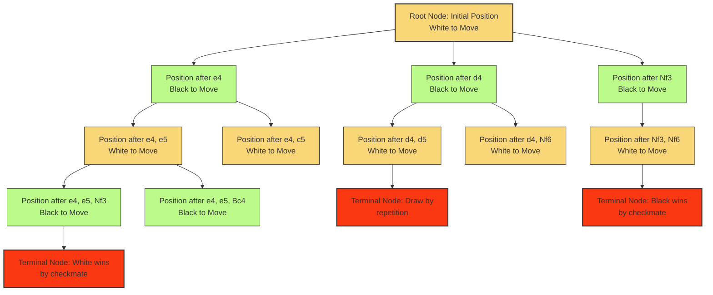
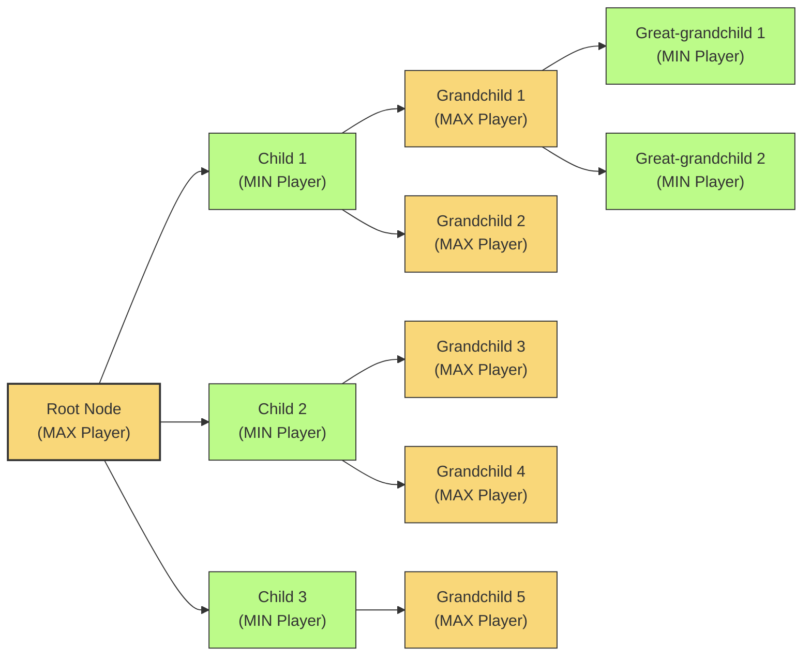
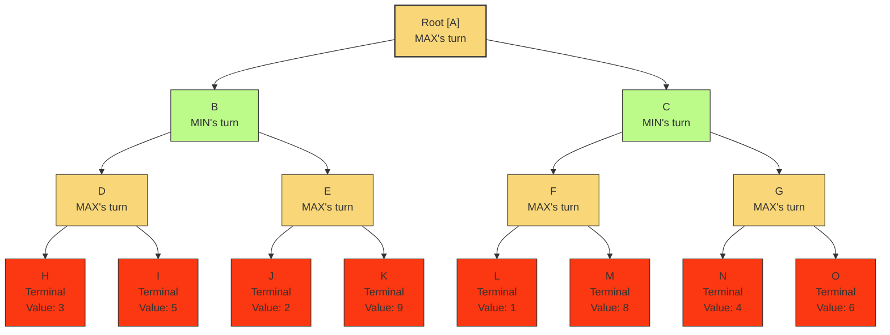
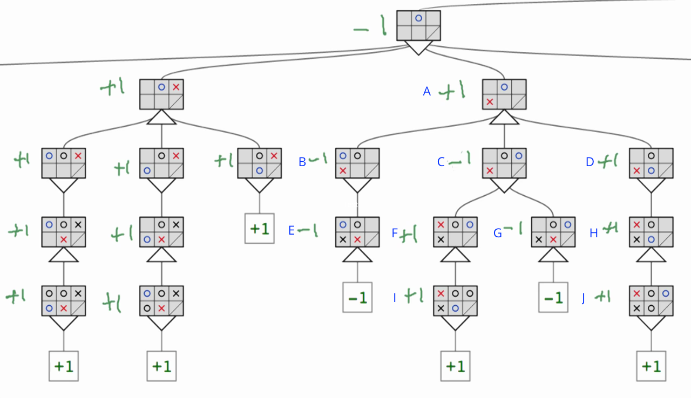
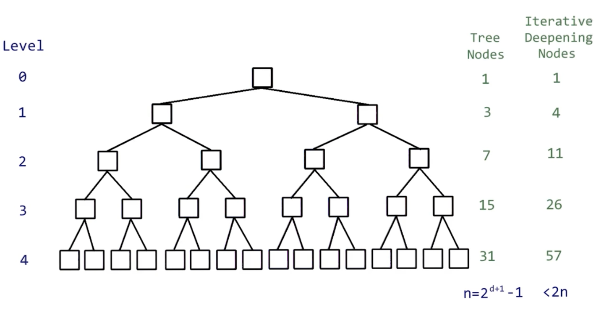

# C-3: Fundamentals of Adversarial Search

1. Introduction to Game Theory
    - Multi-Agent Domain Fundamentals
    - Zero-Sum Games and Perfect Information
    - State Space Representation for Games
    - Utilities and Evaluation Functions
    - AlphaGo and Advanced Game-Playing Agents
2. Minimax Algorithm Basics
    - Core Decision-Making Principles
    - Game Tree Construction and Traversal
    - MAX and MIN Level Alternation
    - Value Propagation Through Trees
    - Choosing the Best Branch
3. Computational Complexity
    - Branching Factor Analysis
    - Depth Considerations
    - Memory Requirements
    - Computational Limitations
    - Formula for Maximum Nodes Evaluation

#### Introduction to Game Theory

##### Multi-Agent Domain Fundamentals

When we move from single-agent search problems to multi-agent domains, we enter a fundamentally different realm of
artificial intelligence. In single-agent environments, an agent makes decisions that affect only its own state and the
environment. However, in multi-agent domains, the outcomes depend on the actions of multiple independent
decision-makers, each with their own objectives.

This shift introduces several critical considerations:

First, agents must reason about the potential actions of other agents. Unlike the predictable dynamics of a purely
physical environment, other agents have agency – they make decisions based on their own reasoning processes, which may
be complex and unpredictable.

Second, strategic thinking becomes essential. An agent must consider not just what actions will lead to its goals in
isolation, but how other agents might respond to those actions. This creates a recursive reasoning pattern: "I think
that you think that I think..." that can theoretically continue indefinitely.

Third, conflict and cooperation dynamics emerge. Agents may have aligned interests (cooperative games), competing
interests (competitive or adversarial games), or some mixture of both (mixed-motive games). These relationships
fundamentally change the nature of optimal decision-making.

The field of game theory provides the mathematical framework for analyzing these multi-agent interactions. Originally
developed by mathematicians John von Neumann and Oskar Morgenstern in the 1940s, game theory has become essential for
understanding strategic decision-making across disciplines including economics, political science, biology, and
artificial intelligence.

In the context of AI, we use game theory to design agents that can make optimal decisions in environments where they
interact with other intelligent entities. These might be other AI systems, human players, or some combination of both.
The foundational concepts of game theory help us formalize what constitutes "rational" behavior in these complex
interactive settings.

##### Zero-Sum Games and Perfect Information

Game theory classifies games along several dimensions, but two particularly important distinctions for AI are whether a
game is zero-sum and whether it features perfect information.

**Zero-Sum vs. Non-Zero-Sum Games**

In a zero-sum game, the total payoff to all players sums to zero (or a constant value). This means that one player's
gain is exactly balanced by other players' losses. Classic examples include:

- Chess: One player wins (+1), one player loses (-1), or they draw (0+0=0)
- Poker: The money won by some players is exactly equal to the money lost by others
- Tic-tac-toe: Either one player wins and the other loses, or they tie

The zero-sum property creates purely competitive dynamics—there's no possibility for cooperation to increase the total
payoff. This simplifies the strategic analysis somewhat, as each player can focus solely on maximizing their own payoff
(which automatically minimizes their opponent's payoff).

In contrast, non-zero-sum games allow for the possibility that all players might benefit or all might lose. Examples
include:

- Business negotiations where both parties can benefit from a deal
- Traffic routing where coordination can reduce congestion for everyone
- Climate change mitigation where global cooperation affects all nations

The strategies for non-zero-sum games can be more complex, as they might involve cooperation, trust, and consideration
of mutual benefit.

**Perfect vs. Imperfect Information**

A game has perfect information if, at any point, all players know the complete state of the game and all moves that have
been made previously. In such games, there is no hidden information and no simultaneous decision-making. Examples
include:

- Chess: Both players can see the entire board and all pieces
- Go: All stones are visible to both players
- Tic-tac-toe: Both players see all moves that have been made

Perfect information games are amenable to complete game tree analysis (as we'll see with minimax search), where it's
theoretically possible to determine the optimal move at any point by exploring all possible future game states.

Games with imperfect information have some aspects hidden from players. Examples include:

- Poker: Players don't know their opponents' cards
- Battleship: Players don't see the location of their opponent's ships
- Simultaneous move games: Players must decide without knowing what the other player will do

Imperfect information adds significant complexity to decision-making, as agents must reason probabilistically about
unknown variables and possibly maintain beliefs about what other agents know.

The algorithms we'll focus on initially, like minimax, are designed for two-player, **zero-sum, perfect information**
games. These form the foundation for understanding more complex adversarial search techniques that can handle imperfect
information or non-zero-sum scenarios.

##### State Space Representation for Games

Representing games as state spaces allows us to apply search techniques similar to those used for single-agent problems,
but with important adaptations for the multi-agent context.

A game state space typically consists of:

1. **States**: Each state represents a complete configuration of the game at a particular point. For a chess game, this
   would include the positions of all pieces on the board, whose turn it is, castling rights, en passant possibilities,
   and move counts.
2. **Initial State**: The starting configuration of the game. In chess, this is the standard arrangement of pieces
   before any moves have been made.
3. **Actions**: The legal moves available to the player whose turn it is in a given state. In chess, these would be all
   valid moves for the pieces of the player currently to move.
4. **Transition Model**: A function that defines the result of applying an action in a state. This maps a state-action
   pair to a successor state.
5. **Terminal States**: States where the game ends. These might represent a win for one player, a loss, or a draw.
6. **Utility Function**: A function that assigns a numeric value to terminal states, indicating the outcome for each
   player. In a zero-sum game, one player's gain is the other's loss.

The critical difference from single-agent search is that the states alternate between different players' turns. This
creates a structure called a game tree, where levels alternate between MAX nodes (where our agent chooses) and MIN nodes
(where the opponent chooses). Each node represents a game state, and the branches represent possible moves.

For example, in a game tree for chess:

- The root node is the initial board position
- If it's White's turn (our agent), this is a MAX node
- The children of this node represent all possible moves White can make
- Each of these children is a MIN node, where Black (opponent) chooses
- The process continues, alternating between MAX and MIN levels

This alternating structure fundamentally changes the search problem. Instead of finding a path to a goal, we're looking
for a strategy that leads to the best outcome regardless of the opponent's actions (assuming they play optimally).

The game tree for even moderately complex games becomes enormous. Chess has an average branching factor of about 35
(meaning each position has about 35 legal moves on average), and games often last 50 moves per player, creating a tree
with roughly 35^100 nodes—far too large to search exhaustively. This necessitates various pruning techniques and
heuristic evaluations, which we'll explore in the minimax algorithm.

###### Understanding the Chess Game Tree

The game tree in chess represents all possible ways a chess game could unfold, mapping every possible move and
countermove. Let's break down this complex structure to understand how it works and why it matters for AI.

###### The Root and First Branches

At the top of the chess game tree sits the root node—the standard starting position with all pieces in their traditional
places. Since White moves first, this is a MAX node (where our AI agent is trying to maximize its advantage).

From this initial position, White has 20 possible first moves:

- 8 pawns that can each move one or two squares forward (16 possibilities)
- 2 knights that can each jump to 2 different squares (4 possibilities)

Each of these 20 moves creates a unique board state, represented as a child node of the root. These 20 nodes represent
all possible chess positions after White's first move.

###### The Second Level: MIN Nodes

After White moves, it's Black's turn. Each of the 20 positions from White's first move now branches into its own set of
possible Black responses. These positions are MIN nodes because they represent the opponent's turn, who is trying to
minimize White's advantage.

Black also has 20 possible responses to each of White's opening moves. This means the second level of the tree contains
20 × 20 = 400 different possible positions after just one move by each player.

###### Exponential Growth

This alternating pattern continues throughout the game:

- Level 3: White's second move (MAX nodes) - approximately 8,000 positions
- Level 4: Black's second move (MIN nodes) - approximately 160,000 positions
- Level 5: White's third move (MAX nodes) - millions of positions

The tree continues to grow exponentially. By move 10 (level 20 in the tree), we would theoretically have more positions
than atoms in the observable universe!

###### Why the Alternating Structure Matters

The alternating MAX-MIN structure fundamentally changes how we search for the best move. In a single-agent search (like
finding a route on a map), we look for any path that reaches our goal. In chess, we need to consider that:

1. At MAX nodes (our turns), we want to choose the move that gives us the highest value
2. At MIN nodes (opponent's turns), we must assume they'll choose the move that gives us the lowest value
3. We need to look several moves ahead, considering this alternating pattern of best plays

This means we're not searching for a single best path, but for the best strategy that protects against the opponent's
best responses. We're searching for a move that guarantees the best possible outcome no matter what the opponent does
(assuming they play optimally).

###### Understanding MAX Nodes and Player Perspectives in Game Trees

The designation of "MAX" or "MIN" nodes in a game tree doesn't necessarily mean that AI plays White or that humans play
Black. Instead, these labels represent the perspective from which the algorithm evaluates the game.

###### What MAX and MIN Actually Mean

When we set up a minimax algorithm for chess (or any two-player game), we define:

- **MAX nodes**: Positions where it's our agent's turn to move. Our agent tries to maximize the evaluation score.
- **MIN nodes**: Positions where it's the opponent's turn to move. We assume the opponent tries to minimize our
  evaluation score.

These designations are completely independent of which color (White or Black) the AI is playing. They simply represent
whose turn it is and what that player is trying to do from the algorithm's perspective.

###### The Typical Scenario in the Document

In the description you quoted, the document assumes a scenario where:

1. Our AI agent is playing White
2. The opponent (human or another AI) is playing Black

Under this assumption, the root node (initial position) is labeled a MAX node because White moves first, and in this
scenario, White is our AI agent. But this is just a conventional example to explain the concept.

###### The Alternative Scenario

If our AI were playing Black instead:

1. The root node (initial position) would be a MIN node (because White, the opponent, moves first)
2. All positions where it's Black's turn would be MAX nodes
3. All positions where it's White's turn would be MIN nodes

###### Why This Matters

Understanding this distinction is important because:

1. The minimax algorithm can be implemented for AI playing either side of any two-player game
2. The algorithm's structure doesn't change based on which side our agent plays - only the labeling of nodes changes
3. The evaluation function still measures positions from our agent's perspective (positive values are good for our
   agent, negative values are bad)

###### The Bottom Line

In short, "MAX" always refers to the player running the algorithm (our agent), and "MIN" always refers to their
opponent. In chess examples, we often assume the AI plays White for simplicity, but in real-world applications, the AI
needs to be able to play both sides, adjusting the MAX/MIN designations accordingly.

The key insight is that the minimax algorithm always thinks from the perspective of the agent using it, regardless of
which side (White or Black) that agent is playing.

###### Practical Limitations

Because the complete chess game tree is astronomically large (estimated at 10^120 positions—more than the atoms in the
observable universe), no computer can search it exhaustively. This is why practical chess AIs use techniques like:

1. Limiting search depth (looking only a certain number of moves ahead)
2. Using heuristic evaluation functions to estimate position quality
3. Employing alpha-beta pruning to eliminate branches that can't affect the final decision
4. Utilizing opening books for the early game and endgame tablebases for positions with few pieces

###### The Value of the Game Tree Model

Despite being impossible to compute fully, the game tree model provides a theoretical framework that:

1. Helps us understand the computational challenges of chess AI
2. Provides a foundation for algorithms like minimax
3. Clarifies why we need evaluation functions and search optimizations
4. Explains why chess-playing programs get stronger as computing power increases

Understanding this alternating MAX-MIN structure is essential for grasping how chess AI works and why certain algorithms
are necessary to make intelligent decisions in the face of an opponent's optimal play.

The "MAX" nodes represent positions where it's your AI agent's turn to move - the agent that you'll be coding. This is a
really important insight to clarify.

When implementing a minimax algorithm for a game-playing AI, you are essentially creating an agent that will:

1. Look at the current game state (a position in chess, for example)
2. Consider all possible moves it could make
3. For each possible move, imagine how the opponent might respond
4. For each possible opponent response, imagine how it would counter-respond
5. And so on, building this tree of possibilities several moves deep

At each level of this tree where it's your agent's turn to move (the MAX nodes), your algorithm will be trying to choose
the move that maximizes its evaluation score - the move that leads to the best possible position for itself.

At each level where it's the opponent's turn (the MIN nodes), your algorithm assumes the opponent will choose the move
that minimizes your agent's evaluation score - the move that leads to the worst possible position for your agent.

This is why the term "minimax" exists - your agent is trying to maximize the minimum value that the opponent could force
upon it. It's assuming the opponent will always choose the move that's worst for your agent (best for the opponent).

So in programming terms, when you implement the minimax algorithm, you'll create functions that handle both cases:

- A "max_value" function that finds the maximum score among all possible moves at your agent's turns
- A "min_value" function that finds the minimum score among all possible moves at the opponent's turns

These functions will call each other recursively as they explore deeper into the game tree, alternating between MAX and
MIN levels, until they reach a terminal state or a predetermined depth limit.

###### The "Perfect Play" Assumption in Minimax

The Minimax assumes the opponent will always make the optimal move (from their perspective). This is certainly a problem
when playing against humans or less sophisticated AI systems who might not play optimally.

###### Why Minimax Makes This Assumption

The minimax algorithm adopts this "perfect play" assumption for several theoretical and practical reasons:

1. **Safety First**: By assuming the opponent will make the best possible moves, minimax develops a conservative
   strategy that can't be exploited. It's preparing for the worst-case scenario.
2. **Mathematical Clarity**: The perfect play assumption gives the algorithm well-defined behavior and provable
   properties about its performance guarantees.
3. **Simplicity**: Assuming rational, optimal play makes the algorithm simpler to implement and understand compared to
   modeling complex, potentially irrational opponent behavior.
4. **Historical Legacy**: Much of game theory developed from a mathematical perspective where proving theorems about
   optimal play was the primary focus.

###### The Problems This Creates

But as you've astutely observed, this assumption has significant drawbacks:

1. **Missed Opportunities**: If the opponent is likely to make mistakes, minimax might choose overly cautious moves when
   more aggressive plays could exploit those mistakes.
2. **Predictability**: A pure minimax player becomes predictable to human opponents who can set traps that look bad in
   the short-term but create winning opportunities several moves later.
3. **Ignoring Psychology**: Chess masters often choose moves that are objectively slightly inferior but create positions
   that are difficult for humans to evaluate correctly.
4. **Wasted Computation**: By deeply analyzing branches that an imperfect opponent would never explore, minimax wastes
   computational resources.

###### How Advanced Systems Address This

Modern game-playing systems have developed several approaches to address this limitation:

1. **Opponent Modeling**: Learning from an opponent's past moves to predict their future behavior. This can involve
   modeling their skill level, typical mistakes, or stylistic preferences.
2. **Expectiminimax**: An extension of minimax that introduces chance nodes to represent probabilistic opponent
   behavior. Instead of assuming the worst move, it weights each possible opponent move by its probability.
3. **Monte Carlo Methods**: Rather than assuming perfect play, these methods simulate many playouts with various
   strategies to find moves that perform well across a range of opponent behaviors.
4. **Hybrid Approaches**: Using minimax as a foundation but incorporating opponent models to adjust the evaluation of
   positions based on the likelihood the opponent will find the optimal counter.
5. **Adaptive Depth**: Searching deeper in positions where the opponent has historically made mistakes, and shallower in
   positions where they typically play optimally.

###### The Trapping Scenario You Described

The scenario about an opponent who intentionally plays suboptimally to set up a trap is particularly interesting. This
is called "speculative play" in chess theory - making a seemingly inferior move to create complications that the
opponent might mishandle.

A pure minimax algorithm would indeed be vulnerable to this if:

1. The trap requires looking beyond the algorithm's search depth
2. The trap involves sacrificing material that looks bad at all depths the algorithm can search

Professional chess engines now incorporate learning mechanisms and pattern recognition that help them recognize common
tactical patterns even beyond their full-depth search horizon, making them less vulnerable to such traps.

###### The Practical Balance

In practice, the most effective approach depends on your opponent:

- Against optimal players: Pure minimax is appropriate
- Against novices: Opponent modeling can exploit predictable weaknesses
- Against unknown opponents: A balanced approach might begin with minimax and adapt as you learn the opponent's
  tendencies

This tension between optimal play theory and practical exploitation of imperfect opponents remains an active area of
research in game-playing AI, leading to systems that can not only play perfect theoretical chess but also adapt to
exploit the specific weaknesses of their human opponents.

##### Utilities and Evaluation Functions

In game theory, utility functions quantify the desirability of different outcomes for each player. For games with
terminal states (like chess or tic-tac-toe), the utility function assigns values to these end states: typically +1 for a
win, -1 for a loss, and 0 for a draw in zero-sum games.

However, most interesting games have too many possible states to search all the way to terminal states. This
necessitates the use of evaluation functions (also called heuristic evaluation functions) that estimate the utility of
non-terminal states.

A good evaluation function should:

1. **Correlate with actual game outcomes**: States that are more likely to lead to wins should receive higher
   evaluations.
2. **Capture important game features**: For chess, this might include material balance (the value of pieces each player
   has), piece positions, king safety, pawn structure, and control of key squares.
3. **Be efficiently computable**: Since the function will be applied to many states during search, it needs to be
   calculated quickly.
4. **Be differentiable across similar states**: Small changes in the game state should generally result in small changes
   in the evaluation.

For example, a simple evaluation function for chess might be:

```
eval(s) = (material_value(WHITE) - material_value(BLACK)) +
          0.1 * (mobility(WHITE) - mobility(BLACK)) +
          0.2 * (king_safety(WHITE) - king_safety(BLACK)) + ...
```

Where material_value counts the value of pieces (pawn=1, knight/bishop=3, rook=5, queen=9), mobility counts legal moves,
king_safety measures protection around the king, and so on.

The coefficients (0.1, 0.2, etc.) weight the importance of different factors and are often determined through extensive
testing or machine learning.

In modern game-playing systems, evaluation functions have grown increasingly sophisticated:

1. **Feature engineering**: Human experts identify relevant patterns and position characteristics.
2. **Pattern recognition**: Systems learn to recognize advantageous and disadvantageous patterns from databases of
   games.
3. **Neural networks**: Deep learning models can learn complex evaluation functions directly from raw board
   representations, discovering features automatically rather than relying on hand-engineered ones.
4. **Lookahead and quiescence**: Evaluation is augmented with limited-depth searches, especially in tactically complex
   positions, to avoid horizon effects where important consequences lie just beyond the search depth.

The quality of the evaluation function dramatically affects the strength of a game-playing agent. Even with
sophisticated search algorithms, an agent with a poor evaluation function will make poor decisions, while one with an
excellent evaluation function can play strongly even with limited search depth.

##### AlphaGo and Advanced Game-Playing Agents

The development of AlphaGo by DeepMind represents a watershed moment in artificial intelligence, demonstrating how
advanced game-playing agents can surpass human capabilities in domains once thought to require human intuition and
creativity.

Go presented a unique challenge for AI because of its enormous state space (approximately $10^{170}$ possible board
positions) and the difficulty of crafting effective evaluation functions. Traditional approaches like those used for
chess were ineffective—the game tree was too large for conventional minimax search, and human experts struggled to
articulate the patterns they recognized.

AlphaGo overcame these challenges through a combination of several techniques:

1. **Neural Networks for Evaluation**: Instead of hand-crafted evaluation functions, AlphaGo used two deep neural
   networks:
    - A policy network that predicted the most promising moves, effectively reducing the branching factor by focusing
      search on likely strong moves
    - A value network that evaluated board positions, trained on millions of expert human games and then refined through
      self-play
2. **Monte Carlo Tree Search (MCTS)**: Rather than exhaustive minimax search, AlphaGo used MCTS, which intelligently
   samples the game tree, focusing on the most promising paths and providing statistical estimates of move quality.
3. **Reinforcement Learning through Self-Play**: After initial training on human games, AlphaGo improved by playing
   against itself, gradually discovering new strategies beyond human knowledge.

AlphaGo's successor, AlphaGo Zero, took this further by learning entirely through self-play, without any human game
data. It developed strategies that surprised human experts and demonstrated new ways of thinking about the game.

These advances have transformed our understanding of what's possible in game-playing AI and have broader implications:

1. **Domain-Independent Learning**: The techniques used don't rely on game-specific knowledge, allowing similar
   approaches to work across different games and problem domains.
2. **Intuition through Computation**: These systems develop what appears to be "intuition" about complex positions
   through massive computation and pattern recognition, challenging our understanding of human expertise.
3. **Discovery over Programming**: Rather than programming strategies directly, these systems discover strategies
   through experience, sometimes finding approaches that human experts hadn't considered.
4. **Hybrid Approaches**: Modern game-playing agents often combine traditional search techniques with machine learning,
   getting the best of both worlds.

The principles demonstrated by AlphaGo have been applied to other games (chess, shogi, poker), as well as to non-game
domains like protein folding (AlphaFold), chemical synthesis planning, and network optimization.

These advanced game-playing agents represent the frontier of adversarial search, going far beyond the classical minimax
and alpha-beta pruning techniques we'll explore next. However, understanding these fundamental algorithms provides the
necessary foundation for appreciating the more sophisticated approaches used in systems like AlphaGo.

#### Minimax Algorithm Basics

##### Core Decision-Making Principles

The minimax algorithm embodies a fundamental principle in game theory: when making decisions in an adversarial setting,
you should assume your opponent will always make the move that is worst for you. This pessimistic outlook leads to a
robust strategy that guarantees the best possible outcome against an optimal opponent.

The algorithm's name—"minimax"—reflects its core operation: the MAX player (typically our agent) tries to maximize their
score, while the MIN player (the opponent) tries to minimize the MAX player's score. In zero-sum games, minimizing your
opponent's score is equivalent to maximizing your own.

This approach models perfect play from both sides, where each player:

1. Considers all possible moves they can make
2. For each move, considers all possible responses by the opponent
3. For each response, considers all their possible counter-responses
4. And so on, until reaching terminal states with defined outcomes

The decision-making process then works backward from these terminal states. The MAX player selects the move that leads
to the highest guaranteed value, assuming the MIN player will always choose the move that leads to the lowest value from
MAX's perspective.

This recursive reasoning reflects the strategic thinking in adversarial games: "I know that you know that I know..."
with each player anticipating the other's optimal choices. By following the minimax strategy, a player ensures they get
the best possible outcome assuming optimal play from both sides.

Consider a simple example: in tic-tac-toe, placing your mark might open up two possible winning lines. A naive approach
might assume the opponent will miss one of these threats. But minimax assumes the opponent will block the most dangerous
threat, so it evaluates the position based on what remains after the best defensive move. This conservative evaluation
ensures the algorithm never overestimates its position.

The minimax principle applies widely beyond games—it appears in economics (for risk-averse decision-making), security
(for defending against worst-case attacks), and robust control systems (that must function even under adversarial
conditions).

##### Game Tree Construction and Traversal

The game tree serves as the conceptual framework for minimax search, representing all possible game states and the moves
that connect them. To understand how minimax navigates this tree, we need to first understand how the tree is structured
and traversed.

A game tree consists of:

- Nodes representing game states
- Edges representing moves (actions) that transition between states
- A root node representing the current game state
- Terminal nodes representing game endings (win, loss, or draw)

The construction of the game tree follows these principles:

1. The root node is the current game state where a decision must be made
2. Each legal move from the current state creates a child node
3. From each child node, all possible opponent responses create grandchild nodes
4. This alternating process continues until reaching terminal states or a predetermined depth limit

For example, in the first move of tic-tac-toe, the root node (empty board) has 9 children (one for each possible first
move). Each of these has 8 children (the opponent's possible responses), and so on.

###### Visualizing a Game Tree with Mermaid

Let me create a Mermaid diagram that visualizes a simple game tree structure with the colors you specified. I'll use a
very simplified version of a game to keep the diagram readable while showing the key concepts.



###### Key Elements of the Game Tree Diagram

This diagram illustrates the fundamental components of a game tree:

1. **Nodes**: Each box represents a game state (a specific configuration of the board)
    - Yellow nodes (with fill:#F9D779) are MAX nodes where our agent (White) is making decisions
    - Green nodes (with fill:#BCFB89) are MIN nodes where the opponent (Black) is making decisions
    - Red terminal nodes (with fill:#FB3811) represent end game states
2. **Edges**: The lines connecting nodes represent moves or actions that transform one game state into another. For
   example, the edge from the root node A to node B represents White's opening move "e4".
3. **Root Node**: The topmost node A represents the starting position of the game with White to move.
4. **Terminal Nodes**: Nodes L, M, and N represent game endings - either wins, losses, or draws. These are the positions
   where we would apply our utility function to determine the value of the outcome.

###### Important Properties Illustrated

The diagram shows several important properties of game trees:

1. **Alternating Turns**: The levels alternate between MAX (our agent) and MIN (opponent) nodes, representing the
   turn-based nature of the game.
2. **Branching Factor**: Different positions have different numbers of possible moves. For example, node A has 3
   children while node D has only 1 child in this simplified example.
3. **Variable Depth**: Some branches may terminate earlier than others. For instance, the branch leading to node N ends
   in a checkmate while other branches could continue.
4. **Path to Terminal States**: The sequence of moves from the root to a terminal node represents a complete game
   playthrough.

In a real chess game tree, this structure would extend much deeper with an enormous number of branches at each level.
The complete chess game tree would contain approximately 10^120 nodes—more than the atoms in the observable universe.
This is why we need algorithms like minimax with optimizations like alpha-beta pruning to navigate this space
efficiently without explicitly representing the entire tree.

Minimax traverses this tree depth-first, starting from the root and exploring one complete path to a terminal node
before backtracking to explore other paths. The traversal follows these steps:

1. Start at the root node (current game state)
2. Recursively explore the first child node, following the same process
3. Continue exploring deeper until reaching a terminal node or maximum depth
4. Evaluate the terminal node or apply an evaluation function
5. Return this value to the parent node
6. After all children of a node are evaluated, determine the node's value:
    - For MAX nodes, take the maximum of children's values
    - For MIN nodes, take the minimum of children's values
7. Return this value to the node's parent
8. Continue until all nodes are evaluated and the root node has a value

This depth-first approach requires relatively little memory (proportional to the maximum depth) while systematically
exploring the entire tree. The process resembles post-order traversal in traditional tree algorithms—we must evaluate
all children before determining a node's value.

In practice, the full game tree for most interesting games is far too large to explore completely. Chess has
approximately $10^{120}$ possible game states—more than the number of atoms in the observable universe. This is why
practical implementations use techniques like depth limits, alpha-beta pruning, and heuristic evaluations, which we'll
explore in subsequent sections.

##### MAX and MIN Level Alternation

A defining characteristic of the minimax algorithm is the alternation between MAX and MIN levels in the game tree. This
structure directly models the turn-taking nature of most games and the opposing objectives of the players.

In the game tree:

- MAX nodes represent states where our agent makes a decision (trying to maximize value)
- MIN nodes represent states where the opponent makes a decision (trying to minimize value)
- The levels alternate: root (MAX) → children (MIN) → grandchildren (MAX) → and so on



This alternation creates a pattern where:

1. At MAX nodes, we select the action with the highest minimax value
2. At MIN nodes, we assume the opponent selects the action with the lowest minimax value
3. This alternating maximizing and minimizing propagates up from the terminal nodes

The pseudo code for Minimax tree showing alternating MAX (triangles pointing up) and MIN (triangles pointing down)
levels is below:

```python
function MINIMAX-DECISION(state) returns an action
    return arg max a ∈ ACTIONS(s) MIN-VALUE(RESULT(state, a))


function MAX-VALUE(state) returns a utility value
    if TERMINAL-TEST(state) then return UTILITY(state)
    v ← -∞
    for each a in ACTIONS(state) do
        v ← MAX(v, MIN-VALUE(RESULT(state, a)))
    return v

function MIN-VALUE(state) returns a utility value
    if TERMINAL-TEST(state) then return UTILITY(state)
    v ← ∞
    for each a in ACTIONS(state) do
        v ← MIN(v, MAX-VALUE(RESULT(state, a)))
    return v
```

Let's visualize this with a concrete example. Imagine a simple game represented by the tree above, where leaf nodes
contain the final scores. The numbers in the nodes represent the minimax values that will be computed.

At the bottom MAX level:

- The leftmost node chooses the maximum of [2, 5] = 5
- The next node chooses the maximum of [11, 4] = 11
- And so on for the other MAX nodes at this level

At the MIN level above:

- The left MIN node chooses the minimum of [5, 11] = 5
- The right MIN node chooses the minimum of [15, 4] = 4

Finally, at the root MAX node:

- MAX chooses the maximum of [5, 4] = 5

This alternating process ensures that at each level, the appropriate player (MAX or MIN) makes the optimal choice from
their perspective. The resulting value at the root represents the best outcome MAX can guarantee against optimal play by
MIN.

The alternation between maximizing and minimizing reflects the fundamental assumption of minimax: both players make
optimal decisions from their perspective. This pessimistic assumption leads to conservative but robust strategies that
avoid being exploited by an intelligent opponent.

In games with more than two players, the alternation extends to multiple player types, each optimizing their own utility
function. However, the standard minimax algorithm is specifically designed for two-player zero-sum games, where one
player's gain is the other's loss.

##### Value Propagation Through Trees

The heart of the minimax algorithm lies in how values propagate upward through the game tree, from terminal nodes to the
root. This bottom-up propagation determines the minimax value of each state and ultimately identifies the optimal move
for the current player.

The propagation process follows these rules:

1. Terminal nodes receive values directly from the game's utility function:
    - +1 for a win for MAX
    - -1 for a win for MIN (loss for MAX)
    - 0 for a draw
    - Or other values in games with varied outcomes
2. For non-terminal nodes at the maximum search depth, an evaluation function estimates the value.
3. For internal MIN nodes, the value is the minimum of its children's values.
4. For internal MAX nodes, the value is the maximum of its children's values.
5. These values propagate upward until the root node receives its minimax value.

###### Value Propagation in Minimax Example

Let’s walk you through a detailed example of how values propagate through a game tree in the minimax algorithm. This is
the core mechanism that allows an AI to make optimal decisions in adversarial games.

Imagine we're playing a simple game (like a simplified version of chess) where the board can be evaluated with numerical
values. Let's create a small game tree with concrete numbers:



In this tree:

- Yellow nodes (A, D, E, F, G) are positions where MAX (our agent) makes decisions
- Green nodes (B, C) are positions where MIN (opponent) makes decisions
- Red nodes (H through O) are terminal positions with known values
- Higher values are better for MAX (our AI)

###### Step 1: Evaluate Terminal Nodes

We start at the bottom with our terminal nodes, which have values assigned by our evaluation function. In a real game,
these might represent actual outcomes (win: +1, loss: -1, draw: 0) or estimated position evaluations for non-terminal
states if we can't search to the end of the game.

Our terminal values are:

- H: 3
- I: 5
- J: 2
- K: 9
- L: 1
- M: 8
- N: 4
- O: 6

###### Step 2: Propagate Values to Their Parents (MAX Level)

Now we move up to the parents of these terminal nodes (D, E, F, G). Since these are MAX nodes (our AI's turn), we take
the maximum value among each node's children:

- Node D chooses the maximum of [3, 5] = 5
- Node E chooses the maximum of [2, 9] = 9
- Node F chooses the maximum of [1, 8] = 8
- Node G chooses the maximum of [4, 6] = 6

This represents our AI making the best possible move in each of these positions.

###### Step 3: Propagate Values to Their Parents (MIN Level)

Moving up another level to nodes B and C. Since these are MIN nodes (opponent's turn), we take the minimum value among
each node's children:

- Node B chooses the minimum of [5, 9] = 5
- Node C chooses the minimum of [8, 6] = 6

This represents our opponent making the move that's worst for us (best for them) in each position.

###### Step 4: Propagate to the Root (MAX Level)

Finally, we move to the root node A. Since this is a MAX node (our AI's turn again), we take the maximum value among its
children:

- Node A chooses the maximum of [5, 6] = 6

This means the minimax value of the root position is 6, and our AI should choose the move that leads to node C, which
guarantees a value of at least 6 assuming optimal play from both sides.

###### Understanding What Happened

Let's analyze what this process means in terms of gameplay strategy:

1. If our AI chooses the move to node B:
    - The opponent will choose the move to node D (minimizing our score to 5)
    - In node D, our AI would choose the move to node I (value 5)
2. If our AI chooses the move to node C:
    - The opponent will choose the move to node G (minimizing our score to 6)
    - In node G, our AI would choose the move to node O (value 6)

Notice that even though node E has a child with value 9 (which is the highest in the entire tree), our AI doesn't choose
the path to node B because it assumes the opponent won't allow us to reach that favorable position. The opponent would
direct us to node D instead, where the best we can achieve is 5.

By choosing the path to node C, our AI guarantees a value of at least 6, which is better than the guaranteed 5 from
choosing the path to node B.

###### Why This Matters

This value propagation process encapsulates the core strategic reasoning of minimax: "If I make this move, my opponent
will make their best response, to which I'll respond optimally..." and so on until reaching a terminal state.

The resulting value at the root tells us which move gives us the best guaranteed outcome against optimal play. This is a
conservative strategy—it assumes the opponent will never make a mistake and always choose the move that's worst for us.

This bottom-up propagation of values, alternating between MAX and MIN at each level, is what allows minimax to find
moves that are robust against optimal opponent play. In a very real sense, minimax is conducting a conversation with
itself, playing both sides optimally to determine the best strategic path.

<div align="center">

<p style="color: #555;">Figure: Value propagation through a minimax tree, showing how values flow upward from terminal nodes</p>
</div>
This propagation assumes that at each level, the player makes the optimal choice for themselves. The minimax value at
the root (-1 in this example) represents the outcome that will occur with optimal play from both sides. Here, it
indicates that the MIN player (starting from the root) can force a win (-1 from MAX's perspective) if both players play
optimally.

This propagation mechanism embodies the core strategic reasoning of minimax: "If I make this move, my opponent will
respond optimally with that move, to which I'll respond optimally with this other move..." and so on until the game
ends. The resulting value tells us the best guaranteed outcome.

##### Choosing the Best Branch

After the minimax values have propagated up through the tree, the final step is selecting the best move to make from the
current state. This corresponds to choosing the best child of the root node.

Since the root is typically a MAX node (representing our agent's turn to move), we select the child with the highest
minimax value. This choice represents the move that maximizes our guaranteed outcome against optimal opponent play.

The selection process works as follows:

1. Compute the minimax value for each legal move (each child of the root)
2. Identify the move(s) with the highest minimax value
3. If multiple moves tie for the highest value, any can be chosen (though some implementations use secondary criteria to
   break ties)
4. Execute the selected move

In the example tree shown above, if we were at node A and it was a MAX node (contrary to the diagram), we would choose
the move leading to node B or D, both with value +1, avoiding the move to node C with value -1.

This selection ensures that we choose the move that leads to the best possible outcome assuming the opponent plays
optimally. The selected move has these guarantees:

1. It maximizes our minimum guaranteed outcome (hence "minimax")
2. If a winning move exists, minimax will find it
3. If the opponent can force a draw or win regardless of our play, minimax will find the move that makes it hardest for
   them (delaying defeat as long as possible)

In practical implementations, the selection process might incorporate additional considerations:

1. **Move ordering**: If multiple moves have the same minimax value, they can be ordered based on secondary criteria
   like simplicity of position or speed of victory/delay of defeat.
2. **Iterative deepening**: If time constraints prevent full-depth search, moves are evaluated based on the deepest
   completed search, with ties broken by lower-depth results.
3. **Opening books**: For the game's early stages, moves might be selected from a pre-computed database of optimal
   opening sequences rather than calculated afresh.
4. **Randomization**: In some applications, slight randomization in choosing between equally valued moves prevents
   predictability.

The minimax algorithm, by systematically exploring the game tree and propagating values based on alternating
maximization and minimization, provides a theoretically sound basis for decision-making in adversarial environments.
While practical implementations must address the algorithm's exponential complexity through various optimizations, the
core principle of choosing the move with the highest minimax value remains the foundation of adversarial search.

#### Computational Complexity

##### Branching Factor Analysis

The branching factor of a game tree represents the average number of legal moves available at each state. This seemingly
simple metric has profound implications for the computational feasibility of minimax search, as it determines how
quickly the tree expands with increasing depth.

In chess, the average branching factor is approximately 35, meaning that from a typical position, a player has about 35
legal moves. However, this varies significantly throughout the game—in the opening, there might be 20 possible moves,
while in complex middle-game positions, there could be 40 or more options. By contrast, the endgame typically has fewer
possibilities, sometimes dropping to just a handful of legal moves.

Games differ dramatically in their branching factors. Tic-tac-toe starts with 9 possible moves and decreases with each
turn. Connect Four has a constant 7 options (the number of columns) until columns fill up. Go begins with 361 possible
moves (the number of intersections on the 19×19 board), creating an enormous initial branching factor that gradually
decreases as the board fills.

The branching factor directly impacts the number of nodes at each level of the game tree:

- Level 0 (root): 1 node
- Level 1: b nodes
- Level 2: b² nodes
- Level 3: b³ nodes
- And so on, with level d containing b^d nodes

This exponential growth means that even modest branching factors can lead to astronomically large trees. For instance,
searching to depth 10 in chess (looking 5 moves ahead for each player) would require examining approximately 35¹⁰ ≈ 2.8
× 10¹⁵ positions—far beyond what can be exhaustively searched, even with modern computing power.

Game designers can sometimes reduce the effective branching factor through rules that restrict available moves in
certain situations. For example, chess rules preventing moves that leave the king in check slightly reduce the branching
factor. In computer implementations, move ordering techniques prioritize exploring promising moves first, which doesn't
reduce the total branching factor but can improve the efficiency of pruning techniques like alpha-beta.

Understanding the branching factor is crucial for designing effective game-playing agents, as it helps determine the
maximum feasible search depth and the necessity of applying heuristics, pruning, and other optimizations to make the
search tractable.

##### Depth Considerations

The search depth in minimax represents how many plies (half-moves, or one move by a single player) ahead the algorithm
looks before evaluating positions. Depth has a profound impact on both the quality of play and the computational
resources required.

Increasing search depth generally leads to stronger play because it allows the algorithm to see further ahead,
anticipating sequences of moves and countermoves that would remain hidden at shallower depths. This improvement follows
what chess players call the "horizon effect"—at any fixed depth, there are consequences that lie just beyond the search
horizon that the algorithm cannot see.

For example, in chess:

- At depth 1, the algorithm can only see immediate captures and threats
- At depth 3, it can recognize simple tactics like forks and pins
- At depth 5, it can discover modest combinations
- At depths 7-9, it can find complex combinations and begin to understand positional play
- At greater depths, strategic understanding improves further

However, the computational cost of increasing depth is severe due to the exponential growth of the tree. If a game has a
branching factor b, then searching to depth d requires examining up to b^d nodes. Increasing the search depth by just
one ply multiplies the workload by approximately the branching factor.

Chess-playing programs illustrate this trade-off vividly:

- In the 1950s, early programs could search 2-3 plies deep
- By the 1980s, dedicated chess computers reached 6-8 plies
- Modern chess engines routinely search 20+ plies in the opening and middlegame, and much deeper in simplified positions

The relationship between depth and playing strength is not linear—each additional ply provides diminishing returns in
terms of improved play. The early plies are crucial for catching immediate tactics, while deeper searches tend to refine
understanding of longer-term consequences.

Various techniques modify how depth is allocated across different branches of the search tree:

- **Quiescence search** extends search in tactically volatile positions
- **Selective deepening** allocates extra depth to promising or critical lines
- **Null-move pruning** skips some moves to search others more deeply
- **Extensions** increase search depth in specific situations like check or capture sequences

These adaptive depth techniques allow search to focus computational resources on the most critical parts of the game
tree, effectively increasing the practical search depth for important variations while keeping the overall computation
manageable.

The appropriate search depth depends on the game's complexity, the available computational resources, and the quality of
the evaluation function. Games with lower branching factors (like Connect Four) can be searched more deeply than those
with higher branching factors (like Go), while games with clearer evaluation criteria allow for shallower searches than
those with subtle positional considerations.

##### Memory Requirements

While the time complexity of minimax receives the most attention, memory requirements also present significant
constraints, particularly for deep searches or implementation on memory-limited systems.

The memory needed for a naive implementation of minimax depends on the search algorithm used. For a depth-first
implementation (the most common approach), the memory requirement is proportional to the maximum search depth:

Memory = O(b × d)

Where:

- b is the branching factor
- d is the search depth

This linear relationship with depth (rather than exponential) occurs because depth-first search only needs to store the
current path from the root to the deepest node being examined, plus a constant amount of information at each level for
tracking which moves have been explored.

For example, in a chess game with branching factor 35 and search depth 10, a basic depth-first minimax implementation
might need to store information for about 35 × 10 = 350 nodes simultaneously. This is quite manageable even on limited
hardware.

However, practical implementations often require additional memory for various optimizations:

1. **Transposition Tables**: These hash tables store previously evaluated positions to avoid redundant computation when
   the same position can be reached through different move sequences. Transposition tables can dramatically improve
   performance but require significant memory—often hundreds of megabytes or even gigabytes in modern chess engines.
2. **Evaluation Caches**: Storing the results of expensive evaluation function calculations can save computation but
   requires memory proportional to the number of unique positions evaluated.
3. **Pattern Databases**: Precomputed tables of pattern evaluations or move sequences require memory that scales with
   the complexity and number of patterns recognized.
4. **Opening Books**: Stored databases of optimal opening moves can require substantial memory depending on their
   coverage and depth.
5. **Endgame Tablebases**: Perfect-play databases for chess positions with few pieces (typically 7 or fewer) require
   gigabytes or terabytes of storage.

The memory-time tradeoff is a fundamental consideration in minimax implementations. Algorithms can often trade increased
memory usage for decreased computation time, or vice versa. For example:

- Iterative deepening searches the tree repeatedly to increasing depths, trading computation time for reduced memory
  requirements
- Transposition tables trade memory for time savings through reuse of previous evaluations
- Memory-bounded search explicitly limits memory usage by discarding less valuable cached information when memory limits
  are reached

In practice, memory considerations are particularly important for:

- Embedded systems with limited RAM
- Parallel implementations where memory bandwidth may become a bottleneck
- Very deep searches where even the linear memory growth of depth-first search becomes significant
- Games with large state representations where storing even a single position requires substantial memory

Modern game-playing systems often use sophisticated memory management techniques to balance these considerations,
dynamically allocating memory resources where they provide the greatest benefit to search performance.

##### Computational Limitations

Despite the theoretical elegance of the minimax algorithm, practical implementations face severe computational
limitations that prevent exhaustive search of most interesting games. Understanding these limitations helps explain why
additional techniques and heuristics are necessary for effective game-playing agents.

The fundamental computational limitation of minimax is its exponential time complexity:

Time = O(b^d)

Where:

- b is the branching factor
- d is the search depth

This exponential growth quickly becomes overwhelming. Consider these examples:

1. **Chess**: With b ≈ 35 and typical game length of 80 plies, the complete game tree contains approximately 35^80 ≈
   10^124 nodes—far more than the number of atoms in the observable universe (estimated at 10^80).
2. **Go**: With initial b ≈ 250 and game length around 150 moves per player, the complete game tree is astronomically
   larger at roughly 250^300 ≈ 10^700 nodes.
3. **Even Tic-tac-toe**: With maximum b = 9 and d = 9, the complete game tree has up to 9! = 362,880 positions—small
   enough to search exhaustively but still illustrating the exponential growth.

These limitations manifest in several practical ways:

**Depth Limits**: Real implementations must restrict search depth to make computation feasible. This creates the
"horizon effect," where important consequences may lie just beyond the search depth and remain invisible to the
algorithm.

**Time Constraints**: In competitive settings or interactive games, moves must be made within time limits, further
restricting search depth. Chess clocks, for instance, force engines to balance depth against time management.

**Hardware Bounds**: Even with modern hardware acceleration (multicore processors, GPUs, specialized hardware), the
exponential nature of the search means that hardware improvements provide only modest increases in achievable search
depth.

**Evaluation Costs**: Complex evaluation functions that capture nuanced positional understanding add computational
overhead to every leaf node evaluation, reducing the feasible search depth.

Various techniques address these limitations:

1. **Alpha-Beta Pruning**: Eliminates branches that cannot influence the final decision, potentially reducing the
   effective branching factor significantly.
2. **Move Ordering**: Examining promising moves first improves the efficiency of pruning techniques.
3. **Iterative Deepening**: Progressively increasing search depth ensures the algorithm always has a valid move to
   return if interrupted by time constraints.
4. **Selective Search**: Focusing computational resources on promising or critical branches rather than searching all
   possibilities equally.
5. **Parallel Search**: Distributing the search across multiple processors, though this introduces challenges in
   maintaining the benefits of pruning.

The success of game-playing AI depends largely on how effectively it manages these computational limitations. Modern
approaches increasingly combine traditional search techniques with machine learning to overcome these barriers—using
learned evaluation functions, move probabilities, or pattern recognition to guide search toward the most promising
regions of the game tree.

##### Formula for Maximum Nodes Evaluation

To precisely quantify the computational workload of minimax search, we can derive formulas for the maximum number of
nodes that must be evaluated. These formulas help us understand how the algorithm scales with different parameters and
compare various optimizations.

For a standard minimax search without pruning, the maximum number of nodes evaluated is given by:

$$n = \sum_{i=0}^{d} b^i = \frac{b^{d+1} - 1}{b - 1}$$

Where:

- n is the total number of nodes
- b is the branching factor
- d is the search depth

This geometric series sums all nodes at each level of the tree, from the root (level 0) to the maximum depth d.

For common branching factors, we can simplify:

- When b = 2: $n = 2^{d+1} - 1$
- When b = 3: $n = \frac{3^{d+1} - 1}{2}$
- For any b: As d increases, $n \approx b^{d+1}/(b-1)$, and for large b, $n \approx b^{d+1}/b = b^d$

<div align="center">

<p style="color: #555;">Figure: Comparison of tree nodes for different branching factors and search techniques</p>
</div>

This formula reveals several important insights:

1. The total number of nodes grows exponentially with depth, approximately as b^d for large b.
2. The vast majority of nodes are at the maximum depth—specifically, b^d of the total nodes are leaf nodes.
3. For even moderate values of b and d, the number of nodes becomes enormous. For chess with b = 35 and d = 8, we get
   approximately 1.4 × 10^13 nodes.

The formula changes when we consider optimizations:

**Iterative Deepening**: When performing iterative deepening to depth d, the total nodes evaluated across all iterations
is:

$$n_{ID} = \sum_{j=1}^{d} \frac{b^{j+1} - 1}{b - 1} \approx \sum_{j=1}^{d} b^j \approx \frac{b^{d+1} - b}{b - 1} \approx \frac{b}{b-1} \cdot b^d$$

For large b, this is approximately (b/(b-1)) times the cost of a single search to depth d, which is only marginally more
expensive—a small price for the benefits iterative deepening provides.

**Alpha-Beta Pruning**: With perfect move ordering (examining the best moves first), alpha-beta pruning reduces the
number of nodes to approximately:

$$n_{α-β} \approx b^{\lceil d/2 \rceil} + b^{\lfloor d/2 \rfloor} - 1$$

This effectively halves the exponent, allowing search to approximately twice the depth for the same computational cost—a
dramatic improvement.

**Practical Considerations**:

1. Real games rarely achieve the theoretical maximum pruning efficiency due to imperfect move ordering.
2. The effective branching factor often varies with depth and game phase.
3. Quiescence search and other extensions can significantly increase the actual number of nodes examined beyond the
   basic formula.
4. Transposition tables reduce the effective number of unique nodes evaluated by avoiding redundant calculations for
   positions reachable via different move sequences.

Understanding these formulas and their implications helps algorithm designers make informed tradeoffs between search
depth, branching factor reduction techniques, and other optimizations. They explain why certain techniques (like
alpha-beta pruning) are standard in game-playing systems while others might be reserved for specific circumstances or
games with particular characteristics.
