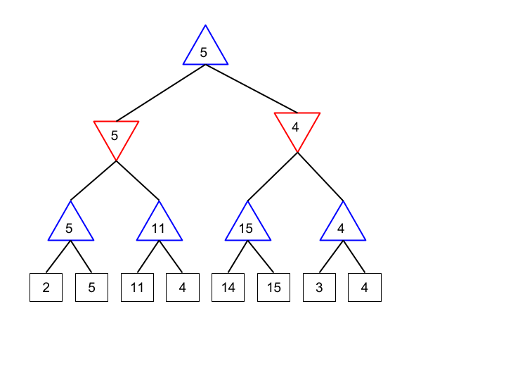

# C-4: Optimizing Minimax Search

1. Depth-Limited Search
    - Implementation Strategy and Pseudocode
    - Handling Non-Terminal Leaf Nodes
    - Evaluation Function Design
    - Testing Evaluation Function Quality
    - Depth Limit Selection Criteria
2. Addressing Search Limitations
    - Quiescent Search Implementation
    - Horizon Effect Problems and Solutions
    - Iterative Deepening Technique
    - Time Management Strategies
    - Varying the Branching Factor
3. Alpha-Beta Pruning
    - Mathematical Foundations and Bounds
    - Algorithm Implementation with Pseudocode
    - MAX Alpha and MIN Beta Value Calculation
    - Pruning Conditions and Branch Elimination
    - Move Ordering Optimization
4. Pruning Efficiency
    - Performance Analysis and Complexity
    - Worked Examples with Tree Visualization
    - Best-Case and Worst-Case Scenarios
    - Impact of Move Ordering
    - Opening Book Implementation

#### Depth-Limited Search

##### Implementation Strategy and Pseudocode

The standard minimax algorithm assumes we can search all the way to terminal states (wins, losses, or draws). However,
for most interesting games, this is computationally infeasible due to the enormous size of the game tree. Depth-limited
search addresses this fundamental limitation by cutting off the search at a predetermined depth and using an evaluation
function to estimate the value of non-terminal positions.

Implementing depth-limited minimax requires a relatively simple modification to the basic algorithm. We add a depth
parameter that decreases as we descend the tree and check if it has reached zero before making recursive calls. When the
depth limit is reached (or a terminal state is encountered), we evaluate the position rather than continuing the search.

Here's the pseudocode for depth-limited minimax:

```
function MINIMAX-DECISION(state) returns an action
    return arg max_a ∈ ACTIONS(state) MIN-VALUE(RESULT(state, a), depth-limit)

function MAX-VALUE(state, depth) returns a utility value
    if TERMINAL-TEST(state) then
        return UTILITY(state)
    if depth = 0 then
        return EVAL(state)
    v ← -∞
    for each a in ACTIONS(state) do
        v ← MAX(v, MIN-VALUE(RESULT(state, a), depth-1))
    return v

function MIN-VALUE(state, depth) returns a utility value
    if TERMINAL-TEST(state) then
        return UTILITY(state)
    if depth = 0 then
        return EVAL(state)
    v ← +∞
    for each a in ACTIONS(state) do
        v ← MIN(v, MAX-VALUE(RESULT(state, a), depth-1))
    return v
```

The key additions to the basic minimax algorithm are:

1. The depth parameter that decreases with each recursive call
2. The depth = 0 check that triggers evaluation rather than further search
3. The EVAL(state) function that estimates the value of non-terminal positions

This simple modification transforms minimax from a theoretically elegant but practically limited algorithm into one that
can be applied to complex games. By controlling the depth parameter, we can balance search thoroughness against
computational feasibility.

It's worth noting that depth-limited search introduces two important changes to the behavior of minimax:

First, the algorithm no longer guarantees finding the optimal move, since important tactical or strategic elements might
lie just beyond the search horizon. This creates what's known as the "horizon effect," where the algorithm might make
suboptimal moves because it can't see their negative consequences beyond the depth limit.

Second, the quality of play becomes heavily dependent on the evaluation function. Since most leaf nodes in the search
will be non-terminal positions evaluated heuristically, the accuracy of these evaluations largely determines the
strength of the resulting decisions.

Despite these limitations, depth-limited minimax forms the foundation of virtually all practical game-playing
algorithms.

##### Handling Non-Terminal Leaf Nodes

In depth-limited search, most leaf nodes are non-terminal game states—positions where the game continues but the search
stops. Properly handling these nodes is crucial for effective play. There are several key considerations when dealing
with non-terminal leaf nodes:

**Evaluation Functions**: The most critical aspect is applying an appropriate evaluation function that estimates the
value of the position. We'll discuss evaluation function design in depth in the next section, but essentially, this
function needs to assess how favorable the position is for the MAX player.

**Quiescence Search**: One serious problem with depth-limited search is that cutting off the search in tactically
volatile positions can lead to severe misjudgments. For example, in chess, if we cut off search in the middle of a
sequence of captures, we might miss crucial tactical consequences. Quiescence search addresses this by selectively
extending the search in tactically active positions, continuing to explore capture sequences and other forcing moves
beyond the nominal depth limit.

The basic approach for quiescence search is:

```
function QUIESCENCE(state, alpha, beta) returns a utility value
    stand_pat ← EVAL(state)  // Evaluation if we stop here
    if stand_pat ≥ beta then
        return beta
    if alpha < stand_pat then
        alpha ← stand_pat

    for each capturing_move in CAPTURE-MOVES(state) do
        value ← -QUIESCENCE(RESULT(state, capturing_move), -beta, -alpha)
        if value ≥ beta then
            return beta
        if value > alpha then
            alpha ← value
    return alpha
```

This selective deepening helps ensure that search doesn't terminate in unstable positions where the evaluation might be
misleading.

**Recognizing Special Positions**: Some non-terminal positions have characteristics that make standard evaluation
inadequate. Examples include:

1. **Zugzwang positions** in chess, where any move worsens the position
2. **Sudden-death situations** in games like shogi, where a king in check must be evaluated differently
3. **Positions requiring long-term planning** where tactical evaluation fails to capture strategic considerations

Specialized evaluation rules or extended search can be triggered when such positions are detected.

**Dealing with Draw Detection**: Many games have positions that result in draws through mechanisms like repetition or
insufficient material. Properly identifying and evaluating such positions at leaf nodes requires special handling. For
instance, in chess, a position with only kings remaining should be evaluated as a draw regardless of other positional
factors.

**Progressive Deepening**: Rather than using a uniform depth limit across the entire tree, modern game-playing engines
often employ progressive deepening, allocating greater depth to more critical or promising lines. This creates an
irregular search frontier that focuses computational resources where they're most valuable.

By thoughtfully handling non-terminal leaf nodes, we can significantly improve the quality of play produced by
depth-limited minimax search, mitigating some of its inherent limitations while maintaining computational feasibility.

##### Evaluation Function Design

The evaluation function serves as the algorithm's "eyes" when it cannot search all the way to terminal states. A
well-designed evaluation function should estimate the value of a position in a way that correlates strongly with the
actual game-theoretic value (the outcome with perfect play from both sides).

Creating effective evaluation functions typically involves several key principles:

**Material Balance**: In many games, the most basic evaluation component is simply counting the value of pieces or
resources controlled by each player. In chess, the standard piece values (pawn=1, knight/bishop=3, rook=5, queen=9) form
the foundation of most evaluation functions. This material balance provides a concrete starting point that correlates
well with winning chances.

**Positional Factors**: Beyond raw material, the evaluation function should consider the quality of piece placement and
overall position. In chess, this includes factors like:

- Control of the center
- Pawn structure
- King safety
- Piece mobility
- Coordination between pieces
- Control of key squares or files

**Pattern Recognition**: Certain configurations of pieces or properties have strategic significance that might not be
captured by simple numerical evaluations. Examples include:

- Recognizing a protected passed pawn in chess
- Identifying strong formations in games like Go
- Detecting threats or tactical motifs

**Phase-Appropriate Evaluation**: Many games progress through distinct phases with different strategic priorities. For
example, chess openings emphasize development and center control, while endgames focus on pawn promotion and king
activity. The evaluation function should adapt to the current game phase, weighting factors differently as appropriate.

**Tempo and Initiative**: In turn-based games, having the move (the initiative) is often valuable. The evaluation
function should account for which player has the initiative and how effectively they can use it.

**Evaluation Granularity**: The function should provide sufficient differentiation between similar positions to guide
search effectively. A common approach is to use centipawns in chess (1/100th of a pawn value) to allow for fine
distinctions between positions.

**Implementation Efficiency**: Since the evaluation function is called for every leaf node, computational efficiency is
crucial. Clever implementation techniques, such as incremental updates and bitboard representations, can dramatically
improve performance.

A typical evaluation function might combine these factors with appropriate weights:

```
function EVAL(state) returns a utility value
    if TERMINAL-TEST(state) then
        return UTILITY(state)

    material_balance ← EVALUATE-MATERIAL(state)
    positional_score ← EVALUATE-POSITION(state)
    mobility ← EVALUATE-MOBILITY(state)
    safety ← EVALUATE-SAFETY(state)

    phase ← DETERMINE-GAME-PHASE(state)

    // Adjust weights based on game phase
    material_weight ← MATERIAL-WEIGHT(phase)
    positional_weight ← POSITIONAL-WEIGHT(phase)
    mobility_weight ← MOBILITY-WEIGHT(phase)
    safety_weight ← SAFETY-WEIGHT(phase)

    total_score ← material_balance * material_weight +
                 positional_score * positional_weight +
                 mobility * mobility_weight +
                 safety * safety_weight

    // Adjust for side to move (tempo bonus)
    if state.to_move = MAX then
        total_score ← total_score + TEMPO_BONUS
    else
        total_score ← total_score - TEMPO_BONUS

    return total_score
```

Modern evaluation functions, especially in commercial game engines, have become extremely sophisticated. They often
incorporate machine learning techniques to optimize the weights of various factors based on analysis of master games or
self-play. Some advanced systems even use neural networks to evaluate positions holistically, learning subtle patterns
that might be difficult to express with explicit features.

Despite their complexity, the fundamental goal remains the same: provide an accurate estimate of position value that
guides the search toward optimal play.

##### Testing Evaluation Function Quality

Developing an effective evaluation function isn't just about incorporating the right features—it's equally important to
validate how well the function performs. Rigorous testing helps identify weaknesses and guide improvements. Several
approaches are commonly used to assess evaluation function quality:

**Correlation with Game Outcomes**: One straightforward approach is to evaluate positions from a large database of games
and measure how well the evaluation correlates with the actual game outcomes. Positions from games between strong
players that led to wins should generally receive positive evaluations for the winning side.

**Tournament Play**: The ultimate test is having the AI play real games, either against other AI systems or human
players. Tournament results provide a practical assessment of the evaluation function's quality when integrated with the
search algorithm.

**Tactical Problem Solving**: Specific test positions with known best moves can assess how well the evaluation function
guides the search algorithm toward correct tactical solutions. These "test suites" often include positions with subtle
winning combinations that test the algorithm's ability to find non-obvious tactical resources.

**Comparative Analysis**: Comparing evaluations with those produced by established strong engines can help identify
discrepancies that might indicate weaknesses. While this doesn't guarantee improvement, significant differences may
highlight areas for investigation.

**Sensitivity Analysis**: Manually adjusting evaluation parameters and observing the effect on play quality helps
understand which factors most strongly influence performance. This can be systematized through techniques like:

- Holding all parameters constant except one to isolate its effect
- Using statistical methods to measure the correlation between parameter changes and performance
- Employing automated tuning approaches like genetic algorithms or Bayesian optimization

**Regression Testing**: When making changes to the evaluation function, it's essential to verify that the modifications
actually improve performance without introducing new weaknesses. A standard set of test positions can help ensure the
changes have the intended effect.

**Decision Analysis**: Examining specific positions where the AI makes questionable moves can provide insights into
evaluation function weaknesses. This typically involves:

1. Identifying the move chosen by the AI
2. Determining what a better move would be
3. Analyzing why the evaluation function failed to properly assess the position
4. Adjusting the evaluation function to address the identified weakness

**Cross-Validation**: For evaluation functions with learned components, standard machine learning validation techniques
apply. The function should be tested on positions it hasn't seen during training to ensure it generalizes well.

A comprehensive testing approach might combine several of these methods. For instance, you might start with correlation
analysis to develop initial parameters, use tactical test suites to refine the function, conduct tournament play to
assess overall performance, and perform decision analysis on games where the AI performs poorly to identify specific
weaknesses.

Modern game-playing systems often employ automated tuning processes that systematically adjust evaluation parameters to
maximize performance against specific metrics. These approaches can fine-tune dozens or even hundreds of parameters more
effectively than manual adjustment could.

Ultimately, the quality of an evaluation function is measured by how well it guides the search algorithm toward strong
moves across a wide range of positions. No evaluation function will be perfect—there will always be positions it
misjudges—but continuous testing and refinement can significantly improve its accuracy and reliability.

##### Depth Limit Selection Criteria

Choosing an appropriate depth limit is a critical decision that balances search thoroughness against computational
constraints. Rather than using a fixed depth for all positions, modern game-playing agents employ dynamic approaches
that adjust the search depth based on various factors.

Several criteria influence depth limit selection:

**Available Computation Time**: In competitive settings, moves must be made within time constraints. Allocating the
available time across moves requires careful planning. Common approaches include:

1. **Fixed Time per Move**: Divide the total remaining time by an estimated number of remaining moves, with adjustments
   for game phase.
2. **Decreasing Time per Move**: Allocate more time for critical early- and mid-game decisions, less for routine endgame
   moves.
3. **Iterative Deepening with Time Management**: Continue deepening search until a predetermined percentage of the
   allocated time is used, ensuring a move is always available if time runs out.

**Position Complexity**: Some positions require deeper search than others. Factors that might indicate the need for
greater depth include:

1. **Tactical Complexity**: Positions with many captures, checks, or threats often benefit from deeper search.
2. **Material Imbalance**: Unusual material configurations may require deeper evaluation to assess accurately.
3. **Dynamic Positions**: Open positions with many possible tactical sequences generally need deeper search than stable,
   closed positions.

**Branching Factor**: The number of legal moves affects how deeply the position can be searched within time constraints.
Positions with fewer legal moves can be searched more deeply. Some engines dynamically adjust depth based on the local
branching factor.

<div align="center">  <p style="color: #555;">Figure: Comparison of regular tree nodes and iterative deepening nodes at different search depths</p> </div>

**Search Stability**: If iterative deepening shows the preferred move changing frequently between depths, this
instability suggests that deeper search may be necessary to resolve tactical complexities.

**Game Phase**: Different phases often warrant different search depths:

1. **Opening**: Shallower search supplemented by opening book knowledge.
2. **Middlegame**: Deepest search where tactical and strategic complexity peak.
3. **Endgame**: Variable depth—simple endgames may need little search, while complex ones might require extreme depth to
   find winning sequences.

**Pattern Recognition**: Recognizing specific patterns can trigger depth adjustments:

1. **Check Extensions**: Many engines search more deeply when kings are in check.
2. **Capture Sequences**: Extending search depth for sequences of captures helps resolve tactical situations.
3. **Promotion Threats**: Pawn promotions often warrant deeper search due to their game-changing potential.

**Selective Deepening**: Rather than applying a uniform depth limit across the entire tree, modern engines selectively
extend the search in promising or critical variations while pruning less interesting lines. This creates an irregular
search frontier that allocates computational resources more effectively.

**Mathematical Approaches**: Theoretical models can provide guidance on optimal depth selection. For example, if each
additional ply of search improves evaluation accuracy by a factor of p, and computation cost increases by factor b (the
branching factor), then optimal depth can be calculated based on available computation time.

In practice, depth limit selection often employs a combination of these criteria, implemented through a system of
extensions and reductions that adjust the nominal search depth based on position characteristics. This adaptive approach
allows the search algorithm to focus computational effort where it's most valuable, significantly improving play quality
compared to fixed-depth search.

The selection criteria must be carefully tuned for each specific game and implementation, as the optimal approach
depends on factors like the game's branching factor, the quality of the evaluation function, and the available
computational resources.

#### Addressing Search Limitations

##### Quiescent Search Implementation

Quiescent search represents one of the most important extensions to the basic depth-limited minimax algorithm. It
addresses a fundamental problem: when search is cut off at an arbitrary depth, the evaluation might occur in the middle
of a tactical sequence, leading to a highly inaccurate assessment of the position.

Imagine a chess position where the depth limit is reached just after a player captures a queen. Without looking any
further, the evaluation would show a massive material advantage for the capturing side. However, if the queen capture is
immediately followed by a forced mate, the actual value of the position is completely different. This phenomenon, where
important consequences lie just beyond the search horizon, is what quiescent search aims to solve.

The core idea of quiescent search is simple but powerful: when the nominal depth limit is reached, instead of
immediately evaluating the position, continue searching selectively for "forcing" moves like captures, checks, or
immediate threats until reaching a "quiet" position where tactical explosions are unlikely.

A typical implementation follows this structure:

```
function MINIMAX-WITH-QUIESCENCE(state, depth) returns a utility value
    if TERMINAL-TEST(state) then
        return UTILITY(state)
    if depth ≤ 0 then
        return QUIESCENCE-SEARCH(state, 0, -∞, +∞)
    // Regular minimax code continues here...

function QUIESCENCE-SEARCH(state, qdepth, alpha, beta) returns a utility value
    // First, evaluate the current position as a lower bound
    stand_pat ← EVALUATE(state)

    // If this position is so good that the opponent won't allow it, return immediately
    if stand_pat ≥ beta then
        return beta

    // Update our best-found value if this position is better than what we've seen
    if stand_pat > alpha then
        alpha ← stand_pat

    // If we've reached maximum quiescence depth, stop here
    if qdepth ≥ MAX_QDEPTH then
        return stand_pat

    // Generate capturing moves (or other tactical moves we want to consider)
    moves ← GENERATE-TACTICAL-MOVES(state)

    // Check each move recursively
    for each move in moves do
        value ← -QUIESCENCE-SEARCH(RESULT(state, move), qdepth+1, -beta, -alpha)
        if value ≥ beta then
            return beta
        if value > alpha then
            alpha ← value

    return alpha
```

Several important details make quiescent search practical:

1. **Move selection**: Quiescent search typically considers only a subset of moves that have high tactical potential. In
   chess, these are usually captures, sometimes checks, and occasionally pawn promotions or moves that create immediate
   threats. By examining only these forcing moves, quiescent search keeps the branching factor manageable.
2. **The stand-pat evaluation**: The "stand_pat" value represents what would happen if the player decides not to make
   any tactical move. This serves as a lower bound on the position's value—if continuing the tactical sequence doesn't
   improve on this initial evaluation, we can return the stand_pat value.
3. **Depth management**: To prevent quiescent search from exploring too deeply, implementations often include a maximum
   quiescence depth (MAX_QDEPTH in the pseudocode). This secondary depth limit ensures the search eventually terminates,
   even in positions with lengthy forcing sequences.
4. **Alpha-beta pruning**: Like the main search, quiescent search benefits from alpha-beta pruning to eliminate
   unpromising branches. This is why the pseudocode includes alpha and beta parameters.
5. **Delta pruning**: A common optimization is to skip evaluating moves that cannot possibly improve alpha enough to
   matter. For example, if capturing a pawn (worth at most 1 point) cannot raise the evaluation above alpha, even with a
   very optimistic assessment, we can skip evaluating that capture.

Quiescent search significantly improves play quality by eliminating tactical blindness at the search boundary. While it
adds computational overhead, the investment pays off in much more accurate evaluations. Most strong chess engines spend
a substantial portion of their computation time in quiescent search—often more than in the main search itself.

The depth and scope of quiescent search represent important tuning parameters. More extensive quiescent search produces
more accurate evaluations but requires more computation. Finding the right balance is a critical aspect of search
algorithm design.

##### Horizon Effect Problems and Solutions

The horizon effect refers to a fundamental limitation of depth-limited search: important consequences may lie just
beyond the search depth, invisible to the algorithm. This can lead to bizarre behavior where the algorithm makes moves
that delay an inevitable negative outcome, pushing it just beyond the search horizon where it cannot be seen.

A classic example from chess illustrates this problem vividly: Imagine a position where the opponent will inevitably
capture a queen in two moves. If the search depth is 3 ply, the algorithm sees this loss. However, if it can find a
sequence where it sacrifices a pawn first, forcing the opponent to capture, and then the queen capture happens at depth
4 (beyond the horizon), the algorithm might choose this objectively worse move because the queen loss is now invisible
to it.

The horizon effect manifests in several ways:

1. **Delaying inevitable losses**: The algorithm might sacrifice material to postpone an unavoidable larger loss.
2. **Missing decisive continuations**: Critical winning tactics might be truncated at the search boundary, leading the
   algorithm to undervalue promising positions.
3. **Misjudging positional sacrifices**: Long-term positional compensation for material might not be fully assessed if
   the benefits materialize beyond the horizon.

While quiescent search addresses tactical aspects of the horizon effect, several additional techniques help mitigate
this problem more broadly:

**Singular Extensions**: When a move appears significantly better than all other moves (a "singular" move), the search
depth is extended for that move. This prevents situations where a critical forced sequence is cut off mid-analysis.

Implementation approach:

```
if SCORE(best_move) > SCORE(second_best_move) + SINGULAR_MARGIN then
    // This move is singular, search it more deeply
    search_depth ← search_depth + EXTENSION_VALUE
```

**Null Move Pruning with Verification**: Null move pruning allows the opponent to make two moves in a row to quickly
detect positions where the advantage is so overwhelming that detailed search is unnecessary. However, this can interact
badly with the horizon effect. Verification searches help ensure the pruning doesn't miss critical threats.

**Recapture Extensions**: When a piece is captured, the search depth is often extended to allow for examining
recaptures, ensuring the full tactical sequence is evaluated.

**Check Extensions**: Positions where kings are in check often involve forced sequences that should be fully explored,
so many engines extend the search in these positions.

**Threat Extensions**: When a move creates a significant threat (like a potential mate or major piece capture on the
next move), the search depth is extended to fully explore the consequences.

**Internal Iterative Deepening**: When facing a critical position but lacking good move ordering information, the
algorithm performs a shallower search first to improve move ordering for the full-depth search. This helps ensure that
the most promising variations are explored more deeply.

**Forward Pruning with Verification**: Techniques like futility pruning, which skip moves unlikely to improve the
position, help focus computation on promising lines but can sometimes interact badly with the horizon effect.
Verification searches at critical nodes help maintain accuracy.

**Static Exchange Evaluation (SEE)**: Before evaluating a capture in depth, quickly assessing the outcome of the full
sequence of potential captures on a square helps identify unpromising captures early, focusing computation on tactically
meaningful sequences.

**Recognition of Special Positions**: Certain position types, like those with passed pawns near promotion or pawn
majorities in the endgame, have consequences that develop over many moves. Recognizing these patterns and adjusting the
evaluation accordingly helps compensate for the horizon effect in strategic positions.

Modern engines combine many of these techniques, applying them selectively based on position characteristics. The
appropriate mix depends on the specific game, the quality of the evaluation function, and the available computational
resources. While these approaches don't completely eliminate the horizon effect, they significantly reduce its impact on
play quality.

##### Iterative Deepening Technique

Iterative deepening is a remarkably elegant search strategy that addresses several fundamental challenges in
game-playing algorithms. Despite its apparent inefficiency—repeatedly searching the same positions at progressively
greater depths—it offers compelling advantages that make it a standard feature in virtually all strong game-playing
systems.

The algorithm works as follows:

1. Start with depth = 1
2. Perform a complete minimax search to this depth
3. Store the best move found
4. Increment depth
5. Repeat the search with the new depth
6. Continue until reaching a predetermined maximum depth or running out of allocated time

Here's a pseudocode implementation:

```
function ITERATIVE-DEEPENING(state, max_depth) returns an action
    best_move ← null
    for depth = 1 to max_depth do
        current_best_move ← MINIMAX-DECISION(state, depth)
        best_move ← current_best_move
        if TIME-ELAPSED() > ALLOCATED-TIME() then
            break
    return best_move
```

This approach offers several key benefits:

**Anytime Operation**: Perhaps the most important advantage is that iterative deepening always has a valid best move
available if interrupted. This property is crucial in competitive settings with strict time controls. If the algorithm
runs out of time during a deep search, it can fall back on the best move found in the previous, completed iteration.

**Improved Move Ordering**: After completing a search at depth d, we know which moves performed best at that depth. When
searching at depth d+1, examining these moves first dramatically improves the efficiency of alpha-beta pruning. This
move ordering information comes "for free" as a byproduct of the previous iterations.

For example, if the best move found at depth 5 was "e4", examining this move first when searching at depth 6 is likely
to produce early cutoffs for many alternative moves, significantly reducing the effective branching factor.

**Efficient Resource Utilization**: Contrary to intuition, iterative deepening is remarkably efficient. For a branching
factor b, the theoretical overhead compared to a direct search to depth d is only about (b/(b-1)), or typically less
than 10-20%. This small overhead is justified by the benefits in move ordering and anytime operation.

The figure above shows that while iterative deepening explores more nodes in total (right column), the difference is
much smaller than one might expect, especially for larger depths.

**Progressive Deepening of Understanding**: As search depth increases, the algorithm develops an increasingly nuanced
understanding of the position. Early iterations quickly identify obvious threats or opportunities, while later
iterations refine this understanding with deeper tactical and strategic insights.

**Transposition Table Efficiency**: When combined with a transposition table (a cache of previously evaluated
positions), iterative deepening helps populate the table with shallow positions first, which are more likely to be
encountered again in deeper searches.

**Search Instability Detection**: By comparing the best moves found at consecutive depths, we can detect unstable
positions where tactical complications require deeper search. If the best move keeps changing as depth increases, this
suggests the position contains tactical elements not fully resolved at the current depth.

Implementation considerations include:

1. **Time Allocation**: Allocating time appropriately between iterations is critical. Since deeper searches take
   exponentially longer, earlier iterations should receive proportionally less time.
2. **Move Ordering Storage**: Efficiently storing and retrieving the best moves or move orderings from previous
   iterations ensures this information improves future searches.
3. **Early Termination Criteria**: Some implementations include criteria for terminating the iterative process early,
   such as when a winning move is found or when successive iterations show the same best move with similar evaluations,
   suggesting further search is unlikely to change the decision.
4. **Aspiration Windows**: To improve efficiency, some implementations use "aspiration windows"—narrow alpha-beta bounds
   centered around the evaluation from the previous iteration, widening the bounds and repeating the search if the true
   value falls outside the initial window.

Iterative deepening forms the backbone of most competitive game-playing systems, providing a robust framework for
time-constrained decision-making while maintaining search efficiency. Its benefits extend beyond game playing to other
areas of AI that require anytime operation, such as real-time planning and decision making under time constraints.

##### Time Management Strategies

In competitive game play, effective time management can be as important as the search algorithm itself. A brilliant
algorithm that runs out of time at a critical moment is of little use. Sophisticated time management strategies help
game-playing agents allocate their computational resources optimally across an entire game.

Several key principles guide effective time management:

**Fixed Time per Move vs. Tournament Time Controls**

Games can have different time control formats:

- Fixed time per move (e.g., 30 seconds per move regardless of position)
- Tournament controls (e.g., 40 moves in 2 hours, followed by 20 moves in 1 hour)
- Increment systems (e.g., 5 minutes for the entire game plus 3 seconds added after each move)

Each format requires different strategies. For fixed time per move, the algorithm simply uses slightly less than the
allocated time to allow for processing overhead. For tournament controls and increment systems, the algorithm must
balance immediate needs against future requirements.

**Time Allocation Based on Game Phase**

Different phases of the game typically warrant different time investments:

1. **Opening**: When playing from a well-studied opening book, moves can be made quickly. Once out of book, some extra
   time might be allocated for the critical transition to middlegame planning.
2. **Middlegame**: Critical decisions that set the strategic direction often justify larger time investments. Positions
   with tactical complications typically require deeper search and thus more time.
3. **Endgame**: Simple endgames with clear evaluations can be played quickly, while complex endgames with important
   strategic decisions may require significant time. Tablebase positions with known perfect play can be executed
   instantly.
4. **Time Pressure**: As the clock runs down, the algorithm must adapt by reducing search depth and relying more heavily
   on heuristic evaluations.

**Position Complexity Factors**

Several characteristics help identify positions deserving extra time:

1. **Tactical Richness**: Positions with many captures, checks, or threats usually contain hidden tactical resources
   that reward deeper search.
2. **Move Quality Differentiation**: When several moves appear similarly valued, additional search time may help
   distinguish the subtle differences between them.
3. **Evaluation Instability**: If the evaluation fluctuates significantly between different search depths, this suggests
   tactical complications that merit deeper investigation.
4. **Critical Decision Points**: Certain moments, like deciding on a significant pawn structure change or piece
   sacrifice, have long-lasting consequences and warrant extra time.

**Implementation Approaches**

Practical time management typically combines several techniques:

```
function ALLOCATE-TIME(position, clock_state) returns allocated_time
    base_time ← BASE-TIME-PER-MOVE(clock_state)

    // Adjust for game phase
    phase_multiplier ← PHASE-MULTIPLIER(position)

    // Adjust for position complexity
    complexity ← ASSESS-COMPLEXITY(position)
    complexity_multiplier ← 1 + (complexity * COMPLEXITY_FACTOR)

    // Adjust for available time
    time_pressure ← ASSESS-TIME-PRESSURE(clock_state)
    pressure_multiplier ← TIME-PRESSURE-ADJUSTMENT(time_pressure)

    // Calculate final allocation
    allocated_time ← base_time * phase_multiplier * complexity_multiplier * pressure_multiplier

    // Apply safety bounds
    allocated_time ← MIN(allocated_time, MAX_TIME_PER_MOVE)
    allocated_time ← MAX(allocated_time, MIN_TIME_PER_MOVE)

    return allocated_time
```

**Dynamic Time Extension**

Modern engines often implement dynamic time adjustment during search:

1. **Search Instability Detection**: If the preferred move changes frequently during iterative deepening, additional
   time may be allocated to resolve the uncertainty.
2. **Surprising Evaluations**: When the evaluation changes dramatically between iterations, this might indicate a tactic
   was just discovered that warrants further investigation.
3. **Critical Line Detection**: If the search identifies a forcing sequence with high stakes (like a potential checkmate
   or significant material gain), time might be extended to fully explore it.

Example implementation:

```
while SEARCH-IN-PROGRESS() and TIME-USED() < ALLOCATED-TIME() do
    if BEST-MOVE-CHANGED() and SIGNIFICANCE-TEST() then
        // Extend time allocation due to important change
        EXTEND-TIME(CHANGE_EXTENSION_FACTOR)
    if |CURRENT-EVAL() - PREVIOUS-EVAL()| > EVAL_THRESHOLD then
        // Extend time due to significant evaluation change
        EXTEND-TIME(EVAL_CHANGE_FACTOR)
```

**Multi-PV Considerations**

Some engines calculate multiple principal variations (PVs), exploring several promising moves rather than just the best
one. This information can inform time management:

1. If the top few moves have very similar evaluations, more time might be allocated to differentiate them.
2. If one move is significantly better than all others, less time might be needed as the decision is clear.

**Opponent Modeling**

Advanced time management systems consider the opponent's time situation and playing style:

- Against time-pressured opponents, playing solid moves quickly might increase pressure on them
- Against opponents known for tactical play, extra time might be allocated for defensive positions

Effective time management represents a delicate balance between immediate accuracy and long-term resource conservation.
The most successful approaches adapt dynamically to both the position characteristics and the overall game situation,
ensuring computational resources are allocated where they provide the greatest benefit.

##### Varying the Branching Factor

The branching factor—the number of moves considered at each position—significantly impacts search efficiency. Rather
than examining all legal moves to the same depth, modern game-playing systems employ various techniques to selectively
reduce the branching factor, allowing deeper search along promising lines while pruning unpromising ones.

This selective deepening creates an irregular search frontier that allocates computational resources more effectively
than a uniform-depth search would. Several approaches help achieve this:

**Move Ordering**

While not directly reducing the branching factor, effective move ordering dramatically improves alpha-beta pruning
efficiency by examining likely-best moves first:

1. **Hash Table Moves**: If the current position was previously searched, use the best move found then as the first
   candidate.
2. **Capture Sorting**: Examine captures in order of Most Valuable Victim - Least Valuable Attacker (MVV-LVA),
   prioritizing captures that gain the most material.
3. **Killer Moves**: Moves that caused cutoffs at the same depth in sibling nodes are likely to be effective again in
   similar positions.
4. **History Heuristic**: Moves that have performed well in earlier parts of the search are tried earlier in similar
   positions.
5. **Static Exchange Evaluation**: Quickly evaluate the outcome of capture sequences to prioritize captures likely to
   gain material.

Proper move ordering can transform alpha-beta pruning from its worst-case performance (examining all nodes) to nearly
optimal behavior (examining approximately the square root of all nodes), effectively doubling the feasible search depth.

**Forward Pruning Techniques**

These methods actually reduce the branching factor by avoiding full evaluation of moves deemed unlikely to be optimal:

1. **Null Move Pruning**: Allow the opponent to make two moves in a row. If the position remains good for us, many moves
   likely lead to good outcomes, and we can reduce search depth for some alternatives.

```
function NULL-MOVE-PRUNING(state, depth, beta)
    if ALLOWS-NULL-MOVE(state) and depth ≥ NULL_MOVE_MIN_DEPTH then
        null_state ← MAKE-NULL-MOVE(state)
        null_value ← -NEGAMAX(null_state, depth-NULL_MOVE_REDUCTION-1, -beta, -beta+1)
        if null_value ≥ beta then
            // Position is so good that even giving opponent an extra move
            // doesn't drop the score below beta; verify with shallow search
            if VERIFY-NULL-MOVE(state, depth, beta) then
                return beta  // Pruning occurs
```

1. **Futility Pruning**: Near leaf nodes, if a move cannot possibly improve alpha given the maximum reasonable
   positional gain, skip searching it.
2. **Late Move Reductions (LMR)**: Moves searched later in the move list (after move ordering) are searched to reduced
   depth first. Only if they show promise is a full-depth search conducted.

```
for each move in ORDERED-MOVES(state) do
    if index > LMR_START_INDEX and depth > LMR_MIN_DEPTH and IS-QUIET-MOVE(move) then
        // Search with reduced depth first
        value ← -NEGAMAX(RESULT(state, move), depth-REDUCTION(depth, index), -alpha-1, -alpha)
        // If promising, re-search at full depth
        if value > alpha then
            value ← -NEGAMAX(RESULT(state, move), depth-1, -beta, -alpha)
    else
        // Search normally
        value ← -NEGAMAX(RESULT(state, move), depth-1, -beta, -alpha)
```

1. **Razoring**: If an evaluation plus a margin is still below alpha, apply a quiescence search instead of a full-depth
   search.
2. **Multi-Cut Pruning**: If a certain number of moves at a node exceed beta, assume the remaining moves will also, and
   skip them.

**Selective Extensions**

While pruning reduces the branching factor in unpromising areas, selective extensions increase search depth in critical
lines:

1. **Check Extensions**: Extend search depth when kings are in check, ensuring the full tactical sequence is evaluated.
2. **Capture Extensions**: Extend when capturing high-value pieces or when a capture creates a passed pawn near
   promotion.
3. **Threat Extensions**: Extend when a move creates a significant threat like a potential mate or major piece capture.
4. **Singular Extensions**: If one move appears significantly better than all alternatives, extend its search depth.

**Adaptive Implementations**

Modern engines dynamically adjust pruning and extension parameters based on position characteristics:

```
function ADAPT-SEARCH-PARAMETERS(position)
    // Adjust pruning aggressiveness based on position type
    if IS-TACTICAL-POSITION(position) then
        NULL_MOVE_REDUCTION ← CONSERVATIVE_NULL_MOVE_REDUCTION
        LMR_REDUCTION_FACTOR ← CONSERVATIVE_LMR_FACTOR
    else
        NULL_MOVE_REDUCTION ← AGGRESSIVE_NULL_MOVE_REDUCTION
        LMR_REDUCTION_FACTOR ← AGGRESSIVE_LMR_FACTOR

    // Adjust extension triggers based on position
    CHECK_EXTENSION ← BASE_CHECK_EXTENSION
    if IS-ENDGAME(position) then
        CHECK_EXTENSION ← ENDGAME_CHECK_EXTENSION
```

The effectiveness of variable-depth search is dramatic. By focusing computational effort where it matters most, these
techniques allow search to reach depths of 20-30 plies in critical variations while maintaining faster overall search
speed than a uniform-depth approach could achieve.

While implementing these techniques adds complexity to the search algorithm, the performance benefits are substantial. A
well-tuned variable-depth search can easily outperform a uniform search that examines more total nodes, as it allocates
those nodes more intelligently across the game tree. This focus on the most critical variations is what enables modern
chess engines to reach their remarkable playing strength.

#### Alpha-Beta Pruning

##### Mathematical Foundations and Bounds

Alpha-beta pruning represents one of the most important optimizations for minimax search, dramatically improving
efficiency without sacrificing the algorithm's ability to find the optimal move. The technique is based on a simple but
powerful insight: if we already know a move is bad, we don't need to figure out exactly how bad it is.

The fundamental mathematical principle behind alpha-beta pruning derives from the properties of the min and max
functions. Consider two key observations:

1. If we know that min(a, b, c, ...) ≤ X, then any value Y where Y > X cannot be the result of the minimization. In
   other words, once we establish an upper bound on a MIN node's value, any branch that exceeds this bound can be
   pruned.
2. Similarly, if we know that max(a, b, c, ...) ≥ X, then any value Y where Y < X cannot be the result of the
   maximization. Once we establish a lower bound on a MAX node's value, any branch that falls below this bound can be
   pruned.

Alpha-beta pruning formalizes these insights by maintaining two bounds during search:

- Alpha (α): The minimum score that the maximizing player is assured of
- Beta (β): The maximum score that the minimizing player is assured of

Initially, alpha is set to negative infinity and beta to positive infinity. As the search progresses, these bounds
narrow. The key pruning condition occurs when alpha ≥ beta, creating what's called an "alpha-beta cutoff." At this
point, we know the current node's true minimax value cannot influence the root decision, so we can stop exploring its
remaining children.

Mathematically, we can express the bounds as follows:

For a MAX node with minimax value v:

- α ≤ v ≤ β is the assumption at the start of evaluating the node
- As children are evaluated, α increases to the maximum value found so far
- If α ≥ β, the remaining children are pruned

For a MIN node with minimax value v:

- α ≤ v ≤ β is the assumption at the start
- As children are evaluated, β decreases to the minimum value found so far
- If β ≤ α, the remaining children are pruned

The theoretical efficiency of alpha-beta pruning depends on move ordering. With perfect move ordering (always examining
the best move first):

- The algorithm examines approximately O(b^(d/2)) nodes, compared to O(b^d) for standard minimax
- This effectively doubles the search depth achievable with the same computational resources

Even with random move ordering, alpha-beta pruning examines O(b^(3d/4)) nodes on average, still a substantial
improvement over minimax. In practice, with good (but not perfect) move ordering, the performance typically falls
between these bounds.

The mathematical optimality of alpha-beta pruning is well-established: it is guaranteed to return the same move as full
minimax while examining the minimum possible number of nodes required to prove the minimax value, assuming the nodes are
examined in the optimal order.

This theoretical foundation explains why alpha-beta pruning has been a cornerstone of game-playing AI for decades and
remains essential even in modern systems that incorporate machine learning and neural networks. The mathematical
guarantees it provides—optimal decisions with significantly reduced computation—make it one of the most elegant and
powerful techniques in adversarial search.

##### Algorithm Implementation with Pseudocode

Implementing alpha-beta pruning requires a relatively straightforward modification to the basic minimax algorithm. The
core change is the addition of two parameters, alpha and beta, that represent the bounds within which a useful result
must fall.

Here's the pseudocode for the alpha-beta pruning algorithm:

```python
function ALPHA-BETA-SEARCH(state) returns an action
    v ← MAX-VALUE(state, -∞, +∞)
    return the action in ACTIONS(state) with value v

function MAX-VALUE(state, α, β) returns a utility value
    if TERMINAL-TEST(state) then
        return UTILITY(state)
    v ← -∞
    for each a in ACTIONS(state) do
        v ← MAX(v, MIN-VALUE(RESULT(state, a), α, β))
        if v ≥ β then
            return v    // β cutoff
        α ← MAX(α, v)
    return v

function MIN-VALUE(state, α, β) returns a utility value
    if TERMINAL-TEST(state) then
        return UTILITY(state)
    v ← +∞
    for each a in ACTIONS(state) do
        v ← MIN(v, MAX-VALUE(RESULT(state, a), α, β))
        if v ≤ α then
            return v    // α cutoff
        β ← MIN(β, v)
    return v
```

Let's break down the key components of this implementation:

1. **Parameter Initialization**: The search begins at the root with alpha = -∞ and beta = +∞, representing the full
   range of possible values. These bounds narrow as the search progresses.
2. **Cutoff Conditions**:
    - In MAX-VALUE, if v ≥ β, we have found a value too large for the MIN player to allow, so we can return immediately.
    - In MIN-VALUE, if v ≤ α, we have found a value too small for the MAX player to accept, so we can return
      immediately.
3. **Bound Updates**:
    - In MAX-VALUE, α is updated to maintain the highest value found so far.
    - In MIN-VALUE, β is updated to maintain the lowest value found so far.

To make this algorithm practical for real games, we need to extend it with depth limits and evaluation functions:

```
function ALPHA-BETA-SEARCH(state, depth) returns an action
    v ← MAX-VALUE(state, -∞, +∞, depth)
    return the action in ACTIONS(state) with value v

function MAX-VALUE(state, α, β, depth) returns a utility value
    if TERMINAL-TEST(state) then
        return UTILITY(state)
    if depth = 0 then
        return EVALUATE(state)
    v ← -∞
    for each a in ACTIONS(state) do
        v ← MAX(v, MIN-VALUE(RESULT(state, a), α, β, depth-1))
        if v ≥ β then
            return v    // β cutoff
        α ← MAX(α, v)
    return v

function MIN-VALUE(state, α, β, depth) returns a utility value
    if TERMINAL-TEST(state) then
        return UTILITY(state)
    if depth = 0 then
        return EVALUATE(state)
    v ← +∞
    for each a in ACTIONS(state) do
        v ← MIN(v, MAX-VALUE(RESULT(state, a), α, β, depth-1))
        if v ≤ α then
            return v    // α cutoff
        β ← MIN(β, v)
    return v
```

A common implementation variant is the negamax formulation, which exploits the fact that min(a,b) = -max(-a,-b) to
combine the MIN-VALUE and MAX-VALUE functions:

```
function NEGAMAX(state, α, β, depth, color) returns a utility value
    if TERMINAL-TEST(state) then
        return color * UTILITY(state)
    if depth = 0 then
        return color * EVALUATE(state)

    v ← -∞
    for each a in ACTIONS(state) do
        v ← MAX(v, -NEGAMAX(RESULT(state, a), -β, -α, depth-1, -color))
        α ← MAX(α, v)
        if α ≥ β then
            break  // β cutoff
    return v
```

Here, `color` is 1 for the maximizing player and -1 for the minimizing player. This formulation makes the code more
concise while maintaining the same pruning behavior.

For practical game-playing systems, alpha-beta pruning is typically combined with numerous enhancements:

1. **Move ordering heuristics** to maximize pruning
2. **Transposition tables** to avoid redundant search
3. **Iterative deepening** to provide good move ordering
4. **Quiescence search** to handle tactical positions
5. **Null move pruning** and other forward pruning techniques

These extensions build upon the basic alpha-beta algorithm, preserving its mathematical guarantees while further
improving its practical efficiency.

##### MAX Alpha and MIN Beta Value Calculation

Understanding how alpha and beta values are calculated and propagated through the game tree is essential for grasping
the full power of alpha-beta pruning. These values represent the current best guaranteed outcomes for the MAX and MIN
players respectively, and their interaction creates the pruning opportunities.

Let's examine exactly how these values are calculated and updated at each node:

**At MAX Nodes:**

The alpha value represents the best (highest) value that the MAX player can guarantee so far along the current path.
Initially set to negative infinity at the root, it increases as better options are discovered.

For a MAX node:

1. Alpha is inherited from the parent (usually a MIN node)
2. As each child is evaluated, alpha is updated to the maximum of the current alpha and the child's value
3. Alpha is passed down to child nodes (which are MIN nodes)
4. Beta remains unchanged from what was passed from the parent

At a MAX node, whenever a child node returns a value v, we compare it with the current alpha:

- If v > alpha, we update alpha to v (we've found a better move)
- If v ≥ beta, we can prune the remaining children (we've found a move too good for MIN to allow)

**At MIN Nodes:**

The beta value represents the best (lowest) value that the MIN player can guarantee so far. Initially set to positive
infinity, it decreases as better options (from MIN's perspective) are found.

For a MIN node:

1. Beta is inherited from the parent (usually a MAX node)
2. As each child is evaluated, beta is updated to the minimum of the current beta and the child's value
3. Beta is passed down to child nodes (which are MAX nodes)
4. Alpha remains unchanged from what was passed from the parent

At a MIN node, whenever a child node returns a value v, we compare it with the current beta:

- If v < beta, we update beta to v (we've found a better move for MIN)
- If v ≤ alpha, we can prune the remaining children (we've found a move too bad for MAX to choose)

**Example Calculation:**

Let's trace the values through a simple example tree:

```
        MAX (α=-∞, β=∞)
       /     \
MIN (α=-∞, β=∞)  MIN (α=3, β=∞)
   /   \          /   \
  3     5        2     1
```

At the left MIN node:

1. First child returns 3
2. Update beta = min(∞, 3) = 3
3. Second child returns 5
4. No update to beta since 5 > 3
5. Return 3 to parent MAX node

At the MAX node:

1. First child returns 3
2. Update alpha = max(-∞, 3) = 3
3. Pass updated alpha=3 to right MIN node

At the right MIN node:

1. First child returns 2
2. Update beta = min(∞, 2) = 2
3. This value 2 is already ≤ alpha (3), so we can prune the second child
4. Return 2 to parent MAX node

At the MAX node (continued):

1. Second child returns 2
2. No update to alpha since 2 < 3
3. Return 3 as the final value (and choose the left branch)

This example illustrates how alpha and beta values narrow the bounds of interest as search progresses, creating
opportunities for pruning. The effectiveness of pruning depends heavily on the order in which moves are examined—when
better moves are evaluated first, more pruning occurs.

In practical implementations, alpha and beta values are sometimes used for additional purposes:

1. **Aspiration Windows**: Searching with narrow initial bounds around the expected value, then widening if the true
   value falls outside those bounds.
2. **Principal Variation Search**: Using null windows (where alpha+1 = beta) to quickly determine if moves are better or
   worse than the current best, without determining their exact values.
3. **Multi-cut Pruning**: Using patterns of alpha-beta cutoffs to identify nodes where many moves are likely to exceed
   beta, allowing earlier termination.

The interplay between alpha and beta values forms the mathematical core of efficient adversarial search. By tracking
these bounds and respecting their implications, we can eliminate large portions of the game tree without sacrificing the
optimality of the final decision.

##### Pruning Conditions and Branch Elimination

Alpha-beta pruning achieves its efficiency by eliminating branches of the game tree that cannot influence the final
decision. Understanding exactly when and why branches can be safely pruned is key to implementing and optimizing the
algorithm.

There are two fundamental pruning conditions, corresponding to the two player types:

**Beta Cutoff (at MAX Nodes):**

A beta cutoff occurs at a MAX node when the value of a child node is greater than or equal to beta (v ≥ β). This means
we've found a move that is too good—the MIN player, who gets to decide at the parent of the current MAX node, would
never allow the game to reach this position because they have a better alternative elsewhere.

When a beta cutoff occurs:

1. We immediately return the current value v without examining any remaining children
2. This value serves as a lower bound on the true minimax value of the node
3. The exact values of unexamined children don't matter—we know they cannot influence the decision at the root

The intuition is: "If I've found a move this good, my opponent will ensure we never reach this position by choosing a
different path earlier, so I don't need to find an even better move here."

**Alpha Cutoff (at MIN Nodes):**

An alpha cutoff occurs at a MIN node when the value of a child node is less than or equal to alpha (v ≤ α). This means
we've found a move that is too bad—the MAX player, who decides at the parent of the current MIN node, would never choose
the branch leading to this position because they have a better alternative elsewhere.

When an alpha cutoff occurs:

1. We immediately return the current value v without examining remaining children
2. This value serves as an upper bound on the true minimax value of the node
3. The exact values of unexamined children don't matter—we know they cannot influence the decision at the root

The intuition here is: "If I've found a move this bad, my opponent will never choose the branch leading here because
they have better options, so I don't need to find an even worse move."

**Understanding Branch Elimination:**

Let's consider a concrete example of how branches are eliminated:

<div align="center">  <p style="color: #555;">Figure: Alpha-beta pruning in action, showing branch elimination</p> </div>

In this tree:

1. We first evaluate the leftmost branch, establishing that the MAX node can achieve at least a value of 5
2. When evaluating the right MIN node, as soon as we find a value of 4, we know this entire branch will be worse than
   what MAX can achieve on the left (since MIN will choose the lowest value)
3. Therefore, we don't need to examine the rightmost leaf node—whatever its value, it cannot affect the final decision

The effectiveness of pruning depends crucially on the order in which nodes are examined. If we had evaluated the right
branch first in this example, no pruning would occur. This is why move ordering is so important for alpha-beta
efficiency.

**Types of Pruning:**

Alpha-beta introduces two types of pruning:

1. **Shallow Pruning**: Occurs when we can prune individual moves at a node because they're provably irrelevant. This is
   the standard alpha-beta pruning described above.
2. **Deep Pruning**: Occurs when an entire subtree can be pruned because we've established bounds on its value from
   elsewhere in the tree. This often happens in conjunction with transposition tables, where we've already searched an
   equivalent position via a different move sequence.

**Fail-Soft vs. Fail-Hard:**

Alpha-beta implementations can be categorized as:

1. **Fail-Hard**: Return exactly alpha if the true value is ≤ alpha, or exactly beta if the true value is ≥ beta. This
   simplifies the algorithm but provides less information.
2. **Fail-Soft**: Return the actual best value found, even if it falls outside the alpha-beta window. This provides more
   information for move ordering and aspiration windows.

Modern implementations typically use fail-soft bounds because the additional information helps with move ordering in
subsequent searches, especially in iterative deepening frameworks.

The mathematical guarantee underlying all these pruning conditions is that they never eliminate a move that could be
optimal at the root. They only prune branches that provably cannot influence the final decision, ensuring that
alpha-beta pruning always returns the same move as full minimax search would.

##### Move Ordering Optimization

The efficiency of alpha-beta pruning depends dramatically on the order in which moves are examined. With optimal move
ordering (always trying the best move first), the algorithm examines only O(b^(d/2)) nodes instead of the O(b^d)
required by standard minimax. This effectively doubles the search depth achievable with the same computational
resources.

However, finding the optimal move order would require knowing the results of the search in advance. Instead, practical
implementations use heuristics to approximate the ideal ordering. Here are the key techniques for optimizing move
ordering:

**1. Transposition Table Moves**

When a position has been previously searched (perhaps at a different depth or via a different move sequence), the best
move found in that search is likely to be strong in the current position as well. Transposition tables store these moves
along with position hashes, providing valuable ordering information.

Implementation approach:

```
// Look up position in transposition table
tt_entry ← TRANSPOSITION-TABLE-LOOKUP(state)
if tt_entry ≠ null and tt_entry.best_move ≠ null then
    // Place the transposition table move first in the ordering
    MOVE-TO-FRONT(moves, tt_entry.best_move)
```

**2. Killer Moves**

Killer moves are non-capturing moves that have caused cutoffs (pruning) at the same search depth in sibling nodes. These
moves are likely to be effective in similar positions at the same depth.

Implementation approach:

```
// Store killers in a depth-indexed array
killers[MAX_DEPTH][2]  // Store two killer moves per depth

function UPDATE-KILLER(move, depth)
    if move ≠ killers[depth][0] then
        killers[depth][1] ← killers[depth][0]
        killers[depth][0] ← move

function ORDER-BY-KILLERS(moves, depth)
    for each move in moves do
        if move = killers[depth][0] then
            move.score ← KILLER_1_SCORE
        else if move = killers[depth][1] then
            move.score ← KILLER_2_SCORE
```

**3. MVV-LVA (Most Valuable Victim - Least Valuable Attacker)**

For capturing moves, ordering based on the value of the captured piece (victim) minus the value of the capturing piece
(attacker) often correlates well with move quality. The intuition is that capturing a queen with a pawn is typically
better than capturing a pawn with a queen.

Implementation approach:

```
function SCORE-CAPTURE(move)
    return PIECE-VALUE(move.captured_piece) - PIECE-VALUE(move.piece) / 10
```

**4. History Heuristic**

The history heuristic maintains a table recording how often each move has caused cutoffs in the past. Moves that
frequently lead to cutoffs are tried earlier in subsequent positions.

Implementation approach:

```
// Initialize history table
history[64][64] ← 0  // For chess: from-square, to-square

function UPDATE-HISTORY(move, depth)
    history[move.from][move.to] ← history[move.from][move.to] + 2^depth

function ORDER-BY-HISTORY(moves)
    for each move in moves do
        move.score ← history[move.from][move.to]
```

**5. Principal Variation Move**

In iterative deepening, the best move sequence (principal variation) from a previous, shallower search provides
excellent ordering information for the current, deeper search.

Implementation approach:

```
function ORDER-MOVES(state, moves, pv_move, depth)
    for each move in moves do
        if move = pv_move then
            move.score ← HIGHEST_PRIORITY
        else if IS-CAPTURE(move) then
            move.score ← SCORE-CAPTURE(move) + CAPTURE_BONUS
        else if move = killers[depth][0] then
            move.score ← KILLER_1_SCORE
        else if move = killers[depth][1] then
            move.score ← KILLER_2_SCORE
        else
            move.score ← history[move.from][move.to]

    SORT-DESCENDING-BY-SCORE(moves)
```

**6. SEE (Static Exchange Evaluation)**

For complex capture sequences, static exchange evaluation performs a quick calculation of the likely outcome of all
possible exchanges on a square, providing more accurate ordering of capturing moves.

Implementation approach:

```
function SEE(state, move)
    gain[0] ← VALUE(move.captured_piece)
    attacker ← move.piece

    for i ← 1 to MAX_SEE_DEPTH do
        // Find least valuable attacker for the defender
        next_attacker ← FIND-LEAST-VALUABLE-ATTACKER(state, move.to)
        if next_attacker = NONE then
            break

        // Capture the current attacker
        gain[i] ← VALUE(attacker) - gain[i-1]
        if gain[i] > 0 then
            gain[i] ← 0  // Defender chooses not to recapture

        attacker ← next_attacker

    // Evaluate the sequence
    for i ← MAX_SEE_DEPTH - 1 down to 0 do
        gain[i] ← -max(-gain[i], gain[i+1])

    return gain[0]
```

**7. Combining Ordering Techniques**

In practice, these techniques are combined into a comprehensive ordering system, often with different priorities for
different types of moves:

1. Transposition table move (highest priority)
2. Captures, ordered by MVV-LVA or SEE
3. Killer moves
4. History heuristic (for quiet moves)

This layered approach produces move ordering that approximates the ideal order well enough to achieve significant
pruning benefits.

**8. Dynamic Move Ordering**

Some advanced implementations adjust ordering priorities based on the current position type, game phase, or search
history:

```
function ADJUST-ORDERING-WEIGHTS(state, depth)
    if IS-ENDGAME(state) then
        HISTORY_WEIGHT ← ENDGAME_HISTORY_WEIGHT
        KILLER_WEIGHT ← ENDGAME_KILLER_WEIGHT
    else if depth > DEEP_SEARCH_THRESHOLD then
        HISTORY_WEIGHT ← DEEP_HISTORY_WEIGHT
        KILLER_WEIGHT ← DEEP_KILLER_WEIGHT
```

The impact of good move ordering cannot be overstated. In chess engines, improving move ordering often provides a
greater performance boost than many other optimizations combined. The difference between random ordering and good
ordering can easily be a factor of 10-100 in the number of nodes examined, translating to 3-6 additional plies of search
depth with the same computational resources.

Modern chess engines achieve ordering that approaches 90% of optimal on average, allowing them to search close to the
theoretical minimum number of nodes required to determine the minimax value. This efficiency is a key factor in their
impressive playing strength.

#### Pruning Efficiency

##### Performance Analysis and Complexity

Alpha-beta pruning dramatically improves the efficiency of minimax search by eliminating branches that cannot influence
the final decision. Understanding the theoretical and practical complexity boundaries helps us appreciate how this
technique transforms game-playing AI.

The standard minimax algorithm examines every node in the game tree, giving it a time complexity of:

$$O(b^d)$$

Where $b$ is the branching factor (average number of legal moves per position) and $d$ is the search depth. This
exponential growth quickly becomes prohibitive—increasing the search depth by just one ply multiplies the workload by
factor $b$.

Alpha-beta pruning reduces this complexity based on move ordering quality. With theoretical perfect move ordering
(always examining the best move first), the complexity becomes:

$$O(b^{\lceil d/2 \rceil})$$

This remarkable improvement effectively doubles the feasible search depth with the same computational resources. We can
understand this mathematically by considering what happens at alternating levels:

At MAX levels, examining the best move first may establish a high alpha value that allows pruning all or most other
moves at sibling MIN nodes.

At MIN levels, examining the best (lowest-value) move first may establish a low beta value that permits pruning at
sibling MAX nodes.

If we consistently examine the best move first at each node, only the "principal variation" (the path corresponding to
optimal play from both sides) needs to be fully explored, plus enough additional nodes to prove that alternative moves
are indeed inferior. The number of nodes along the principal variation is $d$, and the number needed to prove optimality
is roughly $b^{d/2}$.

In practice, we cannot achieve perfect move ordering without knowing the search results in advance. Real-world
performance falls between two boundaries:

**Best case** (perfect move ordering): $O(b^{d/2})$ nodes examined

**Worst case** (worst possible move ordering): $O(b^d)$ nodes examined, no better than standard minimax

For random move ordering, the expected performance is approximately $O(b^{3d/4})$, still a substantial improvement over
minimax.

Modern chess engines with sophisticated move ordering typically achieve performance closer to the best case than the
worst case, examining approximately $O(b^{0.6d})$ to $O(b^{0.7d})$ nodes. This translates to an effective branching
factor of around $b^{0.6}$ to $b^{0.7}$ rather than $b$.

The efficiency of alpha-beta pruning can be quantified using the "effective branching factor" (EBF), which is the
branching factor that a standard minimax search would need to have to examine the same number of nodes. For a search
that examines $N$ nodes to depth $d$, the EBF is:

$$EBF = \sqrt[d]{N}$$

For chess (average $b \approx 35$), good alpha-beta implementations achieve an EBF of around 6-8, a dramatic reduction
from the raw branching factor.

This performance improvement translates directly to deeper search capabilities. While basic minimax might manage 4-5 ply
in chess with reasonable computation time, alpha-beta pruning with good move ordering can reach 10-12 ply or beyond with
the same resources. This depth difference represents an enormous improvement in playing strength.

##### Worked Examples with Tree Visualization

To understand how alpha-beta pruning works in practice, let's walk through a detailed example, tracing the algorithm's
execution on a simple game tree. This will illustrate exactly how pruning eliminates branches and how the alpha and beta
values propagate through the tree.

Consider the following game tree, where square nodes are MAX nodes, triangular nodes are MIN nodes, and leaf nodes
contain their evaluation values:

We'll trace the execution of alpha-beta pruning on this tree, assuming a left-to-right traversal order:

**Step 1:** Start at the root (MAX node A) with α = -∞, β = +∞

- Begin examining leftmost child (MIN node B)

**Step 2:** At MIN node B with α = -∞, β = +∞

- Examine leftmost child (MAX node E)

**Step 3:** At MAX node E with α = -∞, β = +∞

- Examine leftmost child (leaf node with value 3)
- Update α = max(-∞, 3) = 3
- No pruning occurs
- Examine rightmost child (leaf node with value 5)
- Update α = max(3, 5) = 5
- No pruning occurs
- Return value 5 to parent

**Step 4:** Back at MIN node B

- First child returned 5
- Update β = min(+∞, 5) = 5
- Examine next child (MAX node F)

**Step 5:** At MAX node F with α = -∞, β = 5

- Examine leftmost child (leaf node with value 11)
- Update α = max(-∞, 11) = 11
- Since α ≥ β (11 ≥ 5), perform beta cutoff
- Return value 5 to parent (value is capped at β for a fail-soft implementation)

**Step 6:** Back at MIN node B

- Second child was pruned, but would not have improved upon β = 5
- Return value 5 to parent

**Step 7:** Back at MAX node A

- First child returned 5
- Update α = max(-∞, 5) = 5
- Examine next child (MIN node C)

**Step 8:** At MIN node C with α = 5, β = +∞

- Examine leftmost child (MAX node G)

**Step 9:** At MAX node G with α = 5, β = +∞

- Examine leftmost child (leaf node with value 15)
- Update α = max(5, 15) = 15
- No pruning occurs (no more children)
- Return value 15 to parent

**Step 10:** Back at MIN node C

- First child returned 15
- Update β = min(+∞, 15) = 15
- Examine next child (MAX node H)

**Step 11:** At MAX node H with α = 5, β = 15

- Examine leftmost child (leaf node with value 4)
- Update α = max(5, 4) = 5
- No pruning occurs (α < β)
- Return value 5 to parent (no more children)

**Step 12:** Back at MIN node C

- Second child returned 5
- Update β = min(15, 5) = 5
- Return value 5 to parent (no more children)

**Step 13:** Back at MAX node A

- Second child returned 5
- No update to α since max(5, 5) = 5
- Examine next child (MIN node D)

**Step 14:** At MIN node D with α = 5, β = +∞

- Examine leftmost child (MAX node I)

**Step 15:** At MAX node I with α = 5, β = +∞

- Examine leftmost child (leaf node with value 4)
- Update α = max(5, 4) = 5
- No change to α, no pruning
- Return value 5 to parent (no more children)

**Step 16:** Back at MIN node D

- First child returned 5
- Update β = min(+∞, 5) = 5
- Examine next child (MAX node J)

**Step 17:** At MAX node J with α = 5, β = 5

- Examine leftmost child (leaf node with value 1)
- Update α = max(5, 1) = 5
- No pruning (α = β, but we need α > β for pruning)
- Return value 5 to parent (no more children)

**Step 18:** Back at MIN node D

- Second child returned 5
- No update to β since min(5, 5) = 5
- Return value 5 to parent (no more children)

**Step 19:** Back at MAX node A

- Third child returned 5
- No update to α since max(5, 5) = 5
- All children examined, return value 5

In this example, alpha-beta pruning eliminated the exploration of one leaf node (the right child of node F). While this
may seem modest, in larger trees with better move ordering, the pruning effect becomes much more dramatic.

Note several key insights from this trace:

1. The pruning occurs at MAX node F because we've established that MIN node B will select a value ≤ 5, making any
   value > 5 at node F irrelevant.
2. Alpha-beta values get tighter as we descend the tree. By the time we reach node J, the α-β window has narrowed to
   [5,5], meaning we're looking for an exact value.
3. Even though multiple paths lead to the same minimax value (5), the algorithm correctly identifies this optimal value
   while avoiding some unnecessary exploration.

This example demonstrates how alpha-beta pruning maintains the correctness of minimax while potentially reducing the
number of nodes examined. In larger, more complex trees, this efficiency gain becomes critical for achieving practical
search depths.

##### Best-Case and Worst-Case Scenarios

The efficiency of alpha-beta pruning varies dramatically depending on the structure of the game tree and the order in
which moves are examined. Understanding the best and worst cases helps us appreciate the algorithm's potential and
informs strategies for optimization.

**Best-Case Scenario**

The best case for alpha-beta pruning occurs when:

1. The best move is examined first at each node
2. The game has a clear-cut optimal strategy with significant differentiation between move values

Under these conditions, alpha-beta pruning examines approximately $b^{\lceil d/2 \rceil} + b^{\lfloor d/2 \rfloor} - 1$
nodes. For large $b$ and $d$, this is dominated by the term $b^{d/2}$, representing an exponential improvement over
minimax.

Let's visualize why this occurs:

- At the root (depth 0, MAX node), we must examine at least one child.
- At depth 1 (MIN nodes), we examine one child for the first MIN node, but might prune all children for subsequent MIN
  nodes.
- At depth 2 (MAX nodes), we examine one child for the first MAX node under the first MIN node, but might prune all
  others.
- This pattern continues, creating a "principal variation" that we follow to the maximum depth.
- Additionally, we must examine enough nodes at each level to prove that the principal variation is indeed optimal.

The end result is that we examine roughly $b^{d/2}$ nodes, as if we were searching a tree with branching factor
$\sqrt{b}$ to the full depth $d$.

**Worst-Case Scenario**

The worst case for alpha-beta pruning occurs when:

1. The worst move is examined first at each node
2. Move values are structured in the least favorable way for pruning

Under these conditions, alpha-beta pruning degenerates to standard minimax, examining all $b^d$ nodes. This happens
because no pruning opportunities arise—each move exploration fails to establish bounds that would allow pruning in
sibling nodes.

In a worst-case scenario:

- At the root, we examine all $b$ children.
- At depth 1, we examine all $b$ children for each of the $b$ nodes at depth 0, giving $b^2$ nodes.
- This pattern continues without any pruning, resulting in the full $b^d$ nodes.

While this worst case is theoretically possible, it is extremely unlikely in practice, especially with any reasonable
move ordering heuristics.

**Average-Case Analysis**

For random move ordering, the expected performance falls between these extremes, with approximately $O(b^{3d/4})$ nodes
examined. This still represents a substantial improvement over minimax, allowing search about 33% deeper with the same
resources.

The intuition behind this average case is that even with random ordering, we have some chance of examining good moves
early, which creates some pruning opportunities.

**Factors Affecting Pruning Efficiency**

Several game and implementation characteristics influence how close to the best case we can get:

1. **Move quality differentiation**: Games where moves have highly varied qualities offer more pruning opportunities
   than games with many moves of similar quality.
2. **Branching factor**: Higher branching factors create more potential for pruning, making the gap between best and
   worst cases larger.
3. **Search depth**: The benefit of alpha-beta pruning compounds with increased depth, making it increasingly valuable
   for deeper searches.
4. **Game phase**: Different phases of a game may offer different pruning opportunities. For example, tactical positions
   in chess often have clearer move hierarchies than quiet positional ones.
5. **Evaluation function characteristics**: Sharp, discriminating evaluation functions tend to create more pruning
   opportunities than flat ones that assign similar values to different positions.

Understanding these best and worst cases helps guide the development of move ordering heuristics and other
optimizations. By striving to approach the best case, game-playing systems can achieve dramatically better performance
without sacrificing decision quality.

##### Impact of Move Ordering

Move ordering is the single most critical factor in determining alpha-beta pruning efficiency. With perfect move
ordering, the algorithm examines only $O(b^{d/2})$ nodes, effectively doubling the feasible search depth. With poor
ordering, it degenerates to examining all $O(b^d)$ nodes, no better than standard minimax.

Let's quantify the impact of move ordering quality through a concrete example:

Consider a chess position with 30 legal moves and a search depth of 8 ply. With standard minimax, we would examine
approximately $30^8 \approx 6.5 \times 10^{11}$ nodes. With perfect move ordering in alpha-beta pruning, this reduces to
approximately $30^4 \approx 8.1 \times 10^5$ nodes—a reduction by a factor of about 800,000. Even with only moderately
good move ordering achieving 70% of theoretical efficiency, we might examine around $30^{5.6} \approx 2.4 \times 10^8$
nodes—still a reduction by a factor of 2,700.

This efficiency gain directly translates to deeper search capabilities. If examining 10 million nodes is our
computational limit:

- Standard minimax could search only 4 ply deep ($30^4 = 8.1 \times 10^5$ nodes)
- Alpha-beta with excellent move ordering could search 8 ply deep ($30^4 = 8.1 \times 10^5$ nodes)
- Alpha-beta with moderate move ordering could search about 6 ply deep

This depth difference represents an enormous gap in playing strength. A program searching 8 ply deep will consistently
defeat one searching 4 ply deep, often finding tactical combinations completely invisible to the shallower search.

To understand why move ordering has such a profound impact, consider what happens when the best move is examined first
versus last:

**Best move examined first**:

1. This move establishes a high alpha value at MAX nodes or a low beta value at MIN nodes
2. When examining subsequent moves, many will be pruned immediately
3. This creates a cascade of pruning opportunities throughout the tree

**Best move examined last**:

1. We waste computation examining all inferior moves first
2. Only after exploring their full subtrees do we finally examine the best move
3. No pruning opportunities arise because the alpha/beta bounds haven't been tightened effectively

The impact becomes even clearer with a simplified example:

Imagine a root MAX node with 10 children, all MIN nodes. If the best move (with highest minimax value) is examined
first, it might establish an alpha value that allows pruning 80% of the moves in each of the other 9 MIN nodes. This
could reduce the effective branching factor from 10 to approximately 2.8.

If instead the best move is examined last, we must fully explore all 9 inferior moves before finding the best one, and
no pruning occurs. The effective branching factor remains 10.

The difference compounds with depth. After just 6 ply, the first scenario examines about $2.8^6 \approx 463$ nodes,
while the second examines $10^6 = 1,000,000$ nodes—a difference of over 2,000×.

This exponential relationship between move ordering quality and search efficiency explains why game-playing systems
invest significant effort in move ordering heuristics. Even modest improvements in ordering can translate to
substantially deeper search and stronger play.

In practice, top chess engines achieve move ordering that is approximately 80-90% of theoretical optimal. This allows
them to search typically 12-15 ply deep in middlegame positions (and much deeper in simpler positions) within reasonable
time constraints. Without alpha-beta pruning and good move ordering, these search depths would be completely
unattainable.

##### Opening Book Implementation

Opening books provide game-playing systems with pre-computed, expert knowledge about the early phases of the game.
Rather than searching the game tree from scratch for every move, systems can draw on this database of proven opening
sequences. This technique complements alpha-beta search by effectively extending the search horizon far beyond what
would be computationally feasible.

Opening books address a fundamental limitation of alpha-beta pruning: even with optimal pruning, the exponential nature
of the game tree means we can only search to a limited depth. Opening theory in games like chess has been refined over
centuries, exploring lines 20-30 moves deep—far beyond what even the most efficient search algorithms can compute in
real time.

**Opening Book Structures**

Modern opening books typically use one of several data structures:

1. **Move Sequence Representation**: The simplest structure stores specific move sequences. For example:

    ```
    e4 e5 Nf3 Nc6 Bb5 (Spanish Opening)
    e4 e5 Nf3 Nc6 Bc4 (Italian Game)
    ```

    This approach is simple but inflexible, as it cannot handle transpositions (reaching the same position via different
    move sequences).

2. **Position-Based Representation**: More sophisticated books store positions as keys (usually using Zobrist hashing)
   with associated moves and statistics:

    ```
    hash(position) → {move1: {frequency: 1000, score: 55%},
                      move2: {frequency: 500, score: 52%}}
    ```

    This structure handles transpositions naturally and allows storing richer data about each move.

3. **Tree Representation**: Some books organize positions in a tree structure, with each node containing a position and
   its evaluations, and edges representing moves:

    ```
    RootPosition
    ├── e4
    │   ├── e5
    │   │   ├── Nf3 [+0.2]
    │   │   └── Nc3 [+0.1]
    │   └── c5
    │       ├── Nf3 [+0.3]
    │       └── d4 [+0.4]
    └── d4
        ├── Nf6 [+0.3]
        └── d5 [+0.2]
    ```

**Implementation Components**

A comprehensive opening book implementation typically includes:

1. **Storage and Retrieval System**: Efficient database structures (often memory-mapped files) for storing and accessing
   millions of positions. B-trees or custom hash tables are common choices.

```
function LOOKUP-POSITION(position)
    hash ← COMPUTE-ZOBRIST-HASH(position)
    return opening_book[hash]
```

1. **Position Evaluation Metadata**: Beyond just moves, books store useful metadata:
    - Win/draw/loss statistics for each position
    - Player ratings associated with specific lines
    - Tournament significance of games in the database
    - Recency of theory (favoring newer games)
2. **Selection Strategies**: Logic for choosing among multiple book moves:
    - Weighted randomization based on success rates
    - Repertoire preferences for particular styles
    - Tournament situation considerations (needing a win vs. a draw)
    - Opponent-specific preparation

```
function SELECT-BOOK-MOVE(position, context)
    book_entry ← LOOKUP-POSITION(position)
    if book_entry = null then
        return null  // Position not in book

    // Filter moves based on minimum criteria
    candidates ← []
    for each move, stats in book_entry do
        if stats.frequency > MIN_FREQUENCY and stats.score > MIN_SCORE then
            candidates.append({move: move, weight: CALCULATE-WEIGHT(stats, context)})

    if candidates.empty() then
        return null

    // Select move based on weighted probability
    return WEIGHTED-RANDOM-SELECTION(candidates)
```

1. **Book Building Tools**: Utilities for creating and maintaining the book:
    - Importing games from databases (like PGN files)
    - Filtering games based on player ratings, dates, or results
    - Automated pruning of dubious lines
    - Integration of engine analysis to verify book lines
2. **Learning and Adaptation**: Advanced implementations include:
    - Tracking the system's own results with book lines
    - Adjusting weights based on performance
    - Gradually phasing out poorly performing variations

**Integration with Alpha-Beta Search**

Opening books integrate with the alpha-beta framework at several points:

1. **Move Selection Process**: Before initiating search, check if the current position is in the opening book:

    ```
    function GET-MOVE(position)
        book_move ← SELECT-BOOK-MOVE(position, context)
        if book_move ≠ null then
            return book_move
        else
            return ALPHA-BETA-SEARCH(position, depth)
    ```

2. **Book Exit Strategies**: Criteria for transitioning from book play to search:

    - When no book moves are available
    - When book moves have low confidence scores
    - When the opponent plays a move not covered in the book
    - At a predetermined depth (e.g., move 15)
    - Based on position evaluation (e.g., avoiding book lines that lead to disadvantageous positions)

3. **Learning Feedback Loop**: Results from games where alpha-beta search takes over from book play can inform future
   book refinements.

**Practical Considerations**

Several factors influence opening book design decisions:

1. **Memory Constraints**: Comprehensive books can require gigabytes of storage. Systems must balance coverage against
   memory limitations.
2. **Specialization vs. Generalization**: Books can be general (covering diverse openings) or specialized (focused on a
   specific repertoire).
3. **Dynamic vs. Static**: Some implementations allow the book to evolve based on experience, while others remain fixed.
4. **Transparency**: In competitive play, predictable book play can be exploited by opponents who prepare specific
   counter-strategies.
5. **Engine Strengths**: Books should guide play toward positions that align with the engine's strengths. For example,
   engines that excel in tactical complexity might prefer sharp, open positions.

Opening books significantly enhance alpha-beta search by providing expert knowledge that would take impractical amounts
of computation to discover. They effectively extend the search horizon by 10-20 plies in the opening phase, allowing the
search algorithm to focus its computational resources on the complex middlegame and endgame positions where its
lookahead capabilities provide the greatest advantage.
