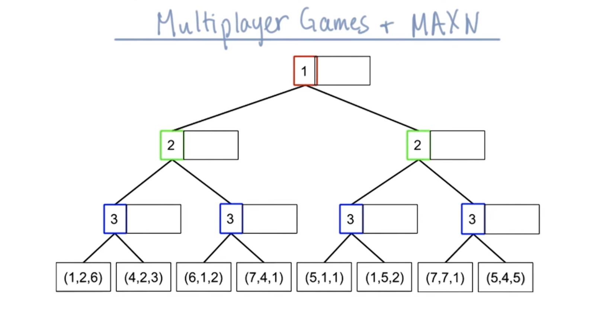
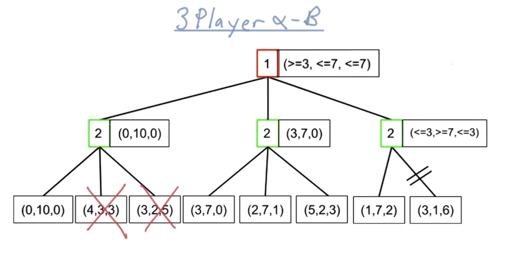
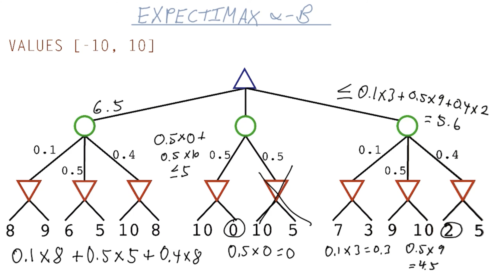
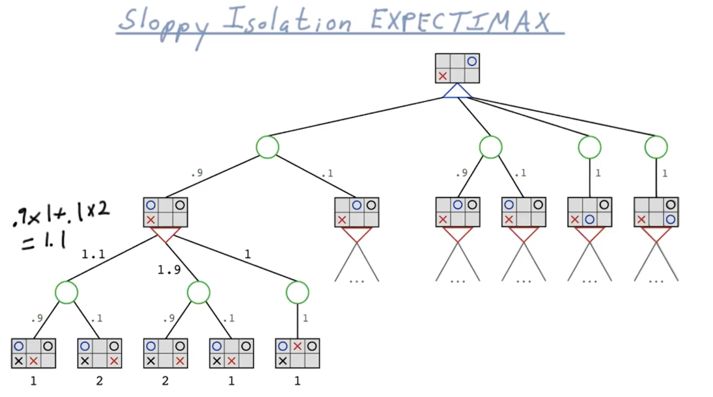
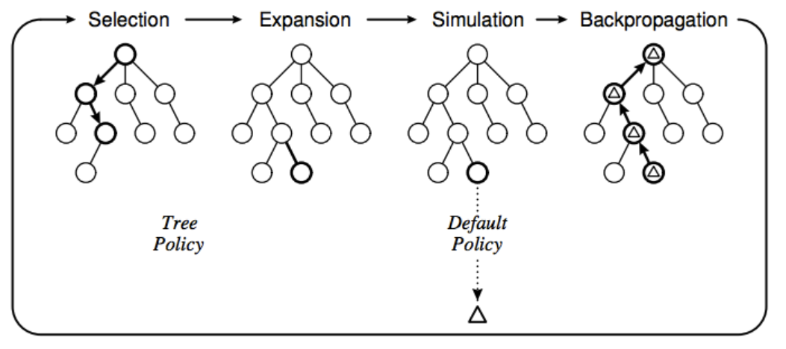
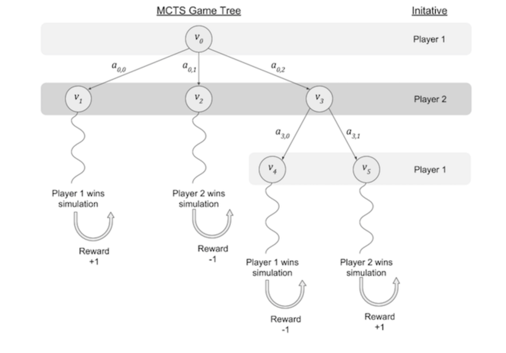

# C-5: Advanced Game AI Techniques

1. Multi-Player Game Extensions
    - Games with More Than Two Players
    - Adaptation of Minimax Algorithm
    - Handling Multiple Opponents
    - Implementation Challenges
    - Real-World Examples
2. Expectimax and Uncertainty
    - Stochastic Games Implementation
    - Handling Uncertainty and Probabilities
    - Sloppy Isolation Example
    - Expected Value Calculation
    - Probabilistic Alpha-Beta Pruning
3. Monte Carlo Tree Search
    - Algorithm Components and Structure
    - Selection, Expansion, Simulation, Backpropagation
    - Upper Confidence Bounds for Trees (UCT)
    - MCTS Reward Function Implementation
    - Comparison with Minimax Approaches
4. Partially Observable Games
    - Hidden Information Representation
    - Belief States in Games
    - Information Sets
    - Perfect vs. Imperfect Recall
    - Opponent Modeling Techniques
    - Poker and Card Game Applications
5. Limitations and Challenges

    - Computational Complexity Barriers
    - Horizon Effects and Traps
    - Evaluation Function Limitations
    - Multiplayer Equilibrium Issues
    - Handling Super-Exponential Branching
    - Approaches to Overcome Limitations

6. Applications and Future Directions
    - Complex Game Environments
    - Opening Books and Endgame Databases
    - Learning Evaluation Functions
    - Current Research Frontiers
    - Hybrid Approaches and Ensemble Methods

#### Multi-Player Game Extensions

##### Games with More Than Two Players

While two-player zero-sum games form the foundation of classic game theory, many real-world games involve three or more
players, introducing significant additional complexity. Multi-player games fundamentally transform the strategic
landscape by creating alliance dynamics, balance-of-power considerations, and more complex utility evaluations.

In multi-player environments, several key characteristics distinguish them from two-player settings:

First, players often face coalition dynamics where temporary alliances may form to counter a leading player. Unlike
two-player games where players' interests are strictly opposed, multi-player games create situations where cooperation
between some players against others can be mutually beneficial. For example, in a four-player board game, three trailing
players might coordinate their actions to prevent a fourth player from reaching victory.

Second, the strict zero-sum property typically disappears. While some multi-player games maintain a constant-sum
property (the total payoff across all players remains fixed), many introduce variable-sum scenarios where different
outcome combinations produce different total utilities. This means that players must not only consider relative
advantages but also opportunities for outcomes that increase absolute utility.

Third, the concept of optimal play becomes significantly more ambiguous. In two-player zero-sum games, minimax provides
a clear definition of optimal strategy against a rational opponent. With multiple players, no single definition of
optimality exists since each player's best action depends on complex expectations about all other players' strategies.

Examples of multi-player games include:

- Card games like poker, hearts, or bridge (typically 3-5 players)
- Board games like Risk, Monopoly, or Settlers of Catan (3-6 players)
- Strategy video games like Civilization or Starcraft (multiple independent entities)
- Economic or political simulations with multiple stakeholders

The mathematical representation of multi-player games typically employs N-player normal form or extensive form. In
normal form, a multi-player game consists of:

- A set of players N = {1, 2, ..., n}
- For each player i, a set of possible actions Ai
- For each player i, a utility function ui(a1, a2, ..., an) that specifies the payoff to player i for each possible
  combination of actions by all players

This structure creates an n-dimensional payoff matrix, contrasting with the 2-dimensional matrix of two-player games.
The exponential increase in the strategy space makes exhaustive analysis computationally infeasible for all but the
simplest multi-player games.

<div align="center">  <p style="color: #555;">Figure: A three-player game tree showing alternating player turns and utility values</p> </div>

The figure above illustrates how a game tree expands with three players. Each level represents a different player's
turn, requiring algorithms to track and evaluate three different perspectives rather than just two.

##### Adaptation of Minimax Algorithm

Extending minimax to handle multi-player games requires fundamental adaptations to its core assumptions and
implementation. The traditional minimax algorithm relies on the zero-sum property of two-player games, where one
player's gain is exactly balanced by the other's loss. This property enables the elegant alternation between maximizing
and minimizing levels in the game tree. In multi-player settings, this strict opposition no longer applies,
necessitating new approaches.

Several methods have been developed to adapt minimax for multi-player environments:

**The Maxn Algorithm**

The most straightforward extension is the Maxn algorithm, which generalizes minimax to n players. Instead of alternating
between MAX and MIN levels, each level of the game tree corresponds to a different player's turn. Rather than returning
a single value, Maxn returns a vector of utilities, one for each player.

The pseudocode for Maxn looks like this:

```
function MAXN(state, player) returns a utility vector
    if TERMINAL-TEST(state) then
        return UTILITY-VECTOR(state)
    v ← [−∞, −∞, ..., −∞]  // Initialize with worst possible value for each player
    for each a in ACTIONS(state) do
        v' ← MAXN(RESULT(state, a), NEXT-PLAYER(player))
        if v'[player] > v[player] then
            v ← v'
    return v
```

At each node, the current player selects the action that maximizes their own utility, regardless of how it affects other
players. This approach maintains the assumption that each player acts rationally to maximize their own payoff.

<div align="center">  <p style="color: #555;">Figure: Maxn algorithm showing utility vectors propagating through a multi-player game tree</p> </div>

The key distinctions from standard minimax include:

1. Each node in the game tree is associated with a specific player
2. Utility is represented as a vector rather than a scalar
3. Each player optimizes only their own component of the utility vector
4. The algorithm maintains n-way branching throughout the tree

**Paranoid Algorithm**

The paranoid algorithm provides an alternative approach by transforming an n-player game into a 2-player game under a
specific assumption: all other players are forming a coalition against the root player. This reduces to a minimax search
where:

1. The root player (at MAX levels) tries to maximize their utility
2. At all other levels (MIN levels), the coalition of opponents tries to minimize the root player's utility

This pessimistic assumption often leads to conservative play, as the algorithm assumes worst-case coordination among
opponents. The paranoid approach greatly simplifies the search process, allowing the use of traditional alpha-beta
pruning, but may sacrifice strategic opportunities that exploit opponents' conflicts of interest.

**Max^n Algorithm with Coalition Formation**

More sophisticated adaptations incorporate dynamic coalition modeling, where different coalitions are considered at
different game states based on players' relative positions:

```
function MAX-COALITION(state, player) returns a utility vector
    if TERMINAL-TEST(state) then
        return UTILITY-VECTOR(state)
    v ← [−∞, −∞, ..., −∞]
    coalitions ← IDENTIFY-LIKELY-COALITIONS(state)
    for each a in ACTIONS(state) do
        v' ← MAX-COALITION(RESULT(state, a), NEXT-PLAYER(player))
        // Decision based on player's position and coalition dynamics
        if COALITION-UTILITY(v', player, coalitions) > COALITION-UTILITY(v, player, coalitions) then
            v ← v'
    return v
```

This approach attempts to model the complex alliance dynamics that characterize many multi-player games, where players
might temporarily cooperate against a leader before reverting to competition.

Regardless of the specific adaptation, multi-player minimax variants face significant computational challenges. The
branching factor in the game tree is typically larger than in two-player games, and the need to track multiple utility
values increases memory requirements. These challenges often necessitate shallower search depths or more aggressive
pruning compared to two-player implementations.

##### Handling Multiple Opponents

Effectively modeling multiple opponents presents one of the most significant challenges in multi-player game AI. Unlike
two-player games where the opponent's objectives are clear, multi-player environments introduce complex and dynamic
opponent motivations that must be accounted for. Several approaches have been developed to address this challenge:

**Independent Opponent Modeling**

This approach treats each opponent as an independent agent with their own utility function and strategy. The AI develops
separate models for each opponent and uses these models to predict their likely actions:

```
function PREDICT-OPPONENT-MOVES(state, opponents)
    predictions ← {}
    for each opponent in opponents do
        opponent_model ← RETRIEVE-MODEL(opponent)
        likely_move ← APPLY-MODEL(opponent_model, state)
        predictions[opponent] ← likely_move
    return predictions
```

These predictions can then be incorporated into the search algorithm to anticipate how the game state will evolve.
Independent modeling works well when opponents have stable, distinct strategies but may struggle to capture interaction
effects between opponents.

**Threat Assessment**

Rather than modeling full opponent strategies, this approach focuses on identifying and responding to threats from
multiple opponents. For each game state, the AI evaluates:

1. Which opponents pose the greatest immediate threat
2. Which opponents are likely to threaten in the future
3. How opponents' actions might interact to create compound threats

This assessment informs a defensive strategy that prioritizes counteracting the most significant threats:

```
function EVALUATE-WITH-THREATS(state, player)
    basic_evaluation ← STANDARD-EVALUATION(state, player)

    total_threat ← 0
    for each opponent in OPPONENTS(player) do
        threat_level ← ASSESS-THREAT(state, opponent, player)
        total_threat ← total_threat + threat_level * OPPONENT-WEIGHT(opponent)

    return basic_evaluation - total_threat
```

Threat assessment can be particularly effective in games where preventing others from winning is as important as
advancing one's own position.

**Balance of Power Heuristics**

This approach explicitly considers the relative strength of all players and adjusts strategy based on the current
balance of power. For example:

- When significantly ahead, adopt a conservative strategy that maintains the lead
- When multiple players are close behind, play to create divisions among them
- When a single opponent is ahead, coordinate with other trailing players

These heuristics can be implemented through evaluation functions that consider relative player positions:

```
function EVALUATE-BALANCE(state, player)
    player_score ← SCORE(state, player)
    max_opponent_score ← MAX(SCORE(state, opponent) for each opponent)
    second_opponent_score ← SECOND-HIGHEST(SCORE(state, opponent) for each opponent)

    if player_score > max_opponent_score + SAFE_MARGIN then
        return player_score - RISK_PENALTY * VULNERABILITY(state, player)
    else if max_opponent_score > player_score + DANGER_THRESHOLD then
        return player_score + COOPERATION_BONUS * OPPONENT-VULNERABILITY(state, leading_opponent)
    else
        return player_score + STANDARD-EVALUATION(state, player)
```

This approach attempts to capture the dynamic coalition behaviors that characterize human play in multi-player games.

**Probabilistic Opponent Modeling**

To address the uncertainty inherent in multi-player games, probabilistic approaches model opponent actions as
probability distributions rather than deterministic choices:

```
function EXPECTIMAX-MULTI(state, player, depth) returns a utility vector
    if TERMINAL-TEST(state) or depth = 0 then
        return UTILITY-VECTOR(state)
    if player is MAX-PLAYER then
        // MAX player chooses best action deterministically
        best_value ← [−∞, −∞, ..., −∞]
        for each a in ACTIONS(state) do
            new_value ← EXPECTIMAX-MULTI(RESULT(state, a), NEXT-PLAYER(player), depth-1)
            if new_value[player] > best_value[player] then
                best_value ← new_value
        return best_value
    else
        // Opponent actions modeled probabilistically
        return WEIGHTED-AVERAGE of EXPECTIMAX-MULTI(RESULT(state, a), NEXT-PLAYER(player), depth-1)
                for each a in ACTIONS(state) with weights P(a|state, player)
```

<div align="center">  <p style="color: #555;">Figure: Expectimax search tree for a probabilistic multi-player scenario</p> </div>

This approach can effectively handle the uncertainty in opponent behavior but requires good probability estimates for
opponent actions. These might be derived from historical data, domain knowledge, or learned through self-play.

**Meta-Strategy Selection**

Some advanced systems employ meta-reasoning to dynamically select the most appropriate strategy based on the current
game context:

```
function SELECT-STRATEGY(state, player, opponents)
    if IDENTIFIED-COALITION-AGAINST(player, opponents, state) then
        return DEFENSIVE_STRATEGY
    else if EXISTS-VULNERABLE-OPPONENT(opponents, state) then
        return AGGRESSIVE_STRATEGY
    else if LEADING-BY-SIGNIFICANT-MARGIN(player, opponents, state) then
        return CONSERVATIVE_STRATEGY
    else
        return BALANCED_STRATEGY
```

This flexibility allows the AI to adapt to the changing dynamics of multi-player interactions throughout the game.

Regardless of the specific approach, handling multiple opponents effectively requires balancing computational
tractability with strategic sophistication. Most practical implementations combine elements from several of these
approaches, possibly switching between them as the game progresses through different phases.

##### Implementation Challenges

Implementing effective AI for multi-player games presents numerous challenges beyond those encountered in two-player
settings. These challenges span algorithmic, computational, and design considerations, each requiring careful attention
to create robust and effective game-playing agents.

**Exponential Complexity Growth**

The most fundamental challenge is the exponential increase in complexity:

1. **Game Tree Size**: With n players each having an average of b legal moves, the branching factor effectively becomes
   b^n when considering all possible combinations of player actions. This multiplicative effect severely limits the
   feasible search depth.
2. **State Space Expansion**: The number of possible game states grows exponentially with the number of players, making
   exhaustive analysis impractical and requiring more aggressive state evaluation approximations.
3. **Utility Representation**: Storing and propagating n-dimensional utility vectors (rather than single values)
   increases memory requirements and computational overhead.

**Solution approaches** include:

- Imposing stricter depth limits
- More aggressive pruning techniques
- Abstract state representations that group similar positions
- Sampling-based search methods that explore only a subset of possible futures

**Pruning Difficulties**

Alpha-beta pruning becomes significantly less effective in multi-player settings:

1. **Pruning Conditions**: The standard alpha-beta pruning condition relies on the strict alternation between MAX and
   MIN players. In multi-player games, this clean alternation disappears, complicating pruning conditions.
2. **Non-Zero-Sum Effects**: When games aren't zero-sum, scenarios that appear irrelevant for one player might be
   critical for balancing other players, making safe pruning more difficult.
3. **Coalition Dynamics**: The possibility of dynamic coalitions means that branches cannot be pruned based solely on
   immediate utility considerations.

**Solution approaches** include:

- Modified pruning algorithms specifically designed for multi-player settings
- Paranoid pruning (assuming all opponents form a coalition against the root player)
- Bounds-based pruning using upper and lower bounds on achievable utilities

**Evaluation Function Complexity**

Designing effective evaluation functions becomes more challenging:

1. **Multi-Dimensional Evaluation**: Functions must assess position quality from multiple perspectives simultaneously,
   increasing the number of features that must be considered.
2. **Relative Position Assessment**: Beyond absolute strength, evaluation must consider relative positions among all
   players, which affects strategic considerations.
3. **Temporal Dynamics**: Evaluation criteria may change throughout the game as different players take lead positions or
   form coalitions.

**Solution approaches** include:

- Decomposing evaluation into player-specific components plus interaction terms
- Machine learning techniques to discover effective evaluation features
- Dynamically adjusting evaluation weights based on game phase and player standings

**Non-Transitive Game Dynamics**

Many multi-player games exhibit non-transitive relations among strategies:

1. **Rock-Paper-Scissors Effects**: Strategy A might beat B, B might beat C, but C might beat A, creating circular
   preference structures.
2. **Kingmaker Scenarios**: Players without a winning chance may still determine which of the remaining contenders wins,
   creating complex incentive structures.
3. **Bandwagon Dynamics**: As one player pulls ahead, others might coordinate against them, creating oscillating
   advantage patterns.

**Solution approaches** include:

- Modeling explicit coalition formation and dissolution
- Incorporating game theory concepts like Nash equilibrium for strategy selection
- Using simulation to predict emergent dynamics rather than relying on static evaluation

**Implementation Complexity**

The practical implementation challenges include:

1. **Search Algorithm Structure**: The code structure becomes more complex when tracking multiple players, requiring
   careful design to avoid errors.

```
function SEARCH-CONTROLLER(game_state)
    current_player ← game_state.current_player

    // Track data for all players
    player_data ← {}
    for each player in game_state.players do
        player_data[player] ← {
            "evaluation": EVALUATE-POSITION(game_state, player),
            "threats": IDENTIFY-THREATS(game_state, player),
            "opportunities": IDENTIFY-OPPORTUNITIES(game_state, player),
            "alliances": DETECT-ALLIANCES(game_state, player)
        }

    // Use multi-player search algorithm with player-specific context
    return MULTI-PLAYER-SEARCH(game_state, current_player, player_data)
```

1. **Testing Challenges**: Verifying the correctness of multi-player AI is difficult due to the combinatorial explosion
   of possible interactions and the lack of clear "optimal" play standards.
2. **Tuning Difficulties**: With more parameters and complex interactions, tuning the AI's performance becomes a
   challenging multi-objective optimization problem.

**Solution approaches** include:

- Modular design with clear separation of player-specific and general game logic
- Extensive automated testing using simplified game scenarios
- Tournament-style evaluation against various opponent types
- Adaptive parameter tuning through self-play

Despite these challenges, successful multi-player game AI implementations can be created by carefully addressing each
obstacle. Practical systems often employ hybrid approaches that combine theoretical insights from game theory with
pragmatic engineering solutions to manage complexity.

##### Real-World Examples

Multi-player game AI has been implemented across various domains, from classic board games to modern video games and
strategic simulations. These real-world examples demonstrate both the diverse approaches to multi-player AI and the
domain-specific adaptations needed for effective performance.

**Poker AI**

Poker represents one of the most well-studied multi-player games with imperfect information. Recent breakthroughs like
Pluribus (developed by Carnegie Mellon University and Facebook AI) have demonstrated superhuman performance in
six-player no-limit Texas Hold'em.

Key implementation features:

1. **Counterfactual Regret Minimization**: Rather than minimax, Pluribus uses an iterative self-play algorithm that
   minimizes "regret" (the difference between actual performance and the best possible performance in hindsight).
2. **Abstraction Techniques**: To manage the enormous state space, Pluribus groups similar hands and betting sequences
   into abstracted states.
3. **Search Space Pruning**: Instead of considering all possible futures, the AI builds a limited-depth "blueprint"
   strategy offline, then refines it during play with real-time search.
4. **Opponent Modeling**: The system implicitly models opponents by tracking how their strategies deviate from the AI's
   own computed equilibrium strategy.

The success of Pluribus demonstrated that multi-player game AI can reach superhuman levels even in games with complex
information structures and strategic depth.

**Real-Time Strategy Games**

StarCraft and similar RTS games present multi-player challenges with continuous action spaces, imperfect information,
and real-time decision making. AlphaStar (developed by DeepMind) achieved Grandmaster level in StarCraft II.

Key implementation features:

1. **Multi-agent Reinforcement Learning**: Rather than traditional game tree search, AlphaStar uses reinforcement
   learning with a population of diverse agents.
2. **League Training**: The system trains against a league of agents with different strategies, creating a form of
   multi-player self-play that prevents overfitting to specific opponent types.
3. **Hierarchical Decision Making**: Actions are organized hierarchically to manage the enormous action space, with
   strategic decisions at the top and tactical micro-management at lower levels.
4. **Attention Mechanisms**: Neural network attention mechanisms help the system focus on relevant parts of the game
   state when making decisions.

The RTS domain demonstrates how multi-player AI can succeed even when traditional search-based approaches are
impractical due to continuous state and action spaces.

**Political/Economic Simulation Games**

Games like Civilization, Diplomacy, and similar strategy games involve complex multi-player dynamics with diplomacy,
trade, and conflict. These games typically employ a mix of techniques:

1. **Utility-Based Decision Making**: AI players evaluate actions based on composite utility functions that consider
   multiple objectives (military strength, economic growth, etc.).

```
function EVALUATE-ACTION(action, player_state, game_state)
    military_impact ← MILITARY-UTILITY(action, player_state) * player_state.military_focus
    economic_impact ← ECONOMIC-UTILITY(action, player_state) * player_state.economic_focus
    diplomatic_impact ← DIPLOMATIC-UTILITY(action, player_state, game_state) * player_state.diplomatic_focus

    // Consider relationships with other players
    for each other_player in game_state.players do
        if other_player ≠ player_state.id then
            diplomatic_impact ← diplomatic_impact +
                RELATIONSHIP(player_state, other_player) *
                ACTION-IMPACT-ON-PLAYER(action, other_player)

    return military_impact + economic_impact + diplomatic_impact
```

1. **Personality-Driven Behavior**: AIs are assigned different personality profiles that influence their decision
   weights and tendencies, creating varied and predictable opponents.
2. **Dynamic Alliance Systems**: Explicit modeling of alliances, treaties, and diplomatic relations that evolve based on
   game state and player actions.
3. **Look-ahead Planning**: Limited-depth planning for key decisions like war declarations or technology investments,
   with shallower evaluation for routine actions.

These games showcase how multi-player AI can incorporate rich domain knowledge and personality modeling to create
engaging and diverse opponents.

**Board Games**

Modern digital implementations of multi-player board games like Risk, Settlers of Catan, and Ticket to Ride employ
various AI approaches:

1. **Probabilistic Evaluation**: Many incorporate uncertainty modeling for dice rolls, card draws, and opponent actions.
2. **Pattern-Based Play**: Some use pattern recognition to identify and execute common strategic patterns rather than
   pure search.
3. **Tiered Decision Making**: Complex turns are broken down into sequential decisions (e.g., in Settlers of Catan:
   where to build, what to trade, when to use development cards).
4. **Mixed Strategy Nash Equilibrium**: For trading and negotiation aspects, some implementations approximate
   game-theoretic equilibrium strategies.

**Commercial Video Games**

Mass-market video games implement multi-player AI with a focus on entertainment value rather than optimal play:

1. **Difficulty Scaling**: AI is often intentionally weakened or strengthened to match player skill levels.
2. **Transparent Decision Making**: Actions are designed to be understandable and predictable rather than optimal,
   helping players learn the game.
3. **Personality-Driven Behavior**: Characters exhibit distinctive playing styles that align with their in-game persona,
   even when suboptimal.
4. **Rubber-Banding**: Many games implement catch-up mechanisms where AI players who fall behind receive advantages to
   keep the game competitive.

These examples demonstrate how the implementation of multi-player game AI varies tremendously based on the specific
domain, computational constraints, and design goals. The most successful implementations typically combine theoretical
approaches (like adaptations of minimax or reinforcement learning) with domain-specific heuristics and pragmatic
engineering solutions.

While academic research often focuses on achieving optimal play, commercial implementations frequently prioritize
creating engaging, diverse, and appropriately challenging opponents. This tension between theoretical optimality and
practical design goals remains a central theme in the development of multi-player game AI.

#### Expectimax and Uncertainty

##### Stochastic Games Implementation

Stochastic games introduce an element of chance or randomness not present in deterministic games like chess. In these
games, the outcome of actions isn't fully determined by player choices—random events like dice rolls, card draws, or
probability-based outcomes affect the game state. This randomness fundamentally changes how we must approach
game-playing algorithms.

The standard minimax algorithm assumes that players have complete control over outcomes following their moves. When
chance enters the picture, we need to extend our approach to handle the probabilistic nature of the game. This is where
the expectimax algorithm comes in.

Expectimax adds a new type of node to the game tree: chance nodes. While minimax alternates between max nodes (where our
agent selects the action that maximizes value) and min nodes (where the opponent selects the action that minimizes
value), expectimax introduces expectation nodes that represent chance events.

The core structure of the expectimax algorithm looks like this:

```
function EXPECTIMAX(state) returns an action
    return the action a in ACTIONS(state) that maximizes EXPECTED-VALUE(state, a)

function EXPECTED-VALUE(state, action) returns a value
    return expected utility of taking action in state

function MAX-VALUE(state) returns a value
    if TERMINAL-TEST(state) then
        return UTILITY(state)
    v ← -∞
    for each a in ACTIONS(state) do
        v ← MAX(v, EXPECTED-VALUE(RESULT(state, a)))
    return v

function MIN-VALUE(state) returns a value
    if TERMINAL-TEST(state) then
        return UTILITY(state)
    v ← +∞
    for each a in ACTIONS(state) do
        v ← MIN(v, EXPECTED-VALUE(RESULT(state, a)))
    return v

function CHANCE-VALUE(state) returns a value
    if TERMINAL-TEST(state) then
        return UTILITY(state)
    v ← 0
    for each outcome in POSSIBLE-OUTCOMES(state) do
        v ← v + PROBABILITY(outcome) * VALUE(RESULT(state, outcome))
    return v
```

Where `VALUE` is either MAX-VALUE, MIN-VALUE, or CHANCE-VALUE depending on whose turn it is or if it's a chance event.

<div align="center">  <p style="color: #555;">Figure: An expectimax tree with MAX, MIN, and chance nodes</p> </div>

Implementing stochastic games involves several key components:

1. **State Representation with Chance Elements**: The game state must capture not just player positions and board
   configurations, but also any state relevant to chance events (e.g., which cards have been drawn, whose turn it is to
   roll dice).
2. **Outcome Enumeration**: For each chance node, we need to enumerate all possible outcomes and their associated
   probabilities. For example, in a dice game, there are six possible outcomes for a single die, each with 1/6
   probability.
3. **Expected Value Calculation**: Instead of taking the maximum or minimum value at chance nodes, we compute the
   expected value—the probability-weighted average of all possible outcomes.

The most challenging aspect of implementing expectimax is managing computational complexity. If a chance node has b
possible outcomes, and there are c chance nodes between the root and leaves at depth d, then the number of nodes in the
full game tree is approximately b^c times larger than the corresponding deterministic game tree.

To handle this explosion in complexity, practical implementations often:

1. **Use depth limits**: Cut off search at a fixed depth and apply an evaluation function, just as in depth-limited
   minimax.
2. **Sample outcomes**: Rather than considering all possible chance outcomes, sample a representative subset based on
   their probabilities.
3. **Prune low-probability branches**: Ignore chance outcomes with very low probabilities to focus computation on more
   likely scenarios.
4. **Use state abstraction**: Group similar states together to reduce the effective size of the state space.

These techniques help manage the additional complexity introduced by randomness while still allowing the algorithm to
make reasonable decisions in stochastic environments.

##### Handling Uncertainty and Probabilities

Uncertainty in games comes in several forms, each requiring specific handling in AI systems:

**Types of Uncertainty**

1. **Inherent Randomness**: Games with explicit random elements like dice rolls, card draws, or random event generators.
   Examples include backgammon, poker, and many modern board games.
2. **Opponent Action Uncertainty**: Even in deterministic games, we may be uncertain about what action an opponent will
   take, especially if their strategy is unknown or they don't play optimally.
3. **Hidden Information**: Games where players can't observe the complete game state, such as hidden cards in poker or
   fog of war in strategy games.
4. **Execution Uncertainty**: In some real-time games, there may be uncertainty about whether actions will be executed
   exactly as intended.

Handling these forms of uncertainty requires mathematical frameworks for representing and reasoning about probabilities
and expected values.

**Probability Distribution Representation**

There are several ways to represent probability distributions over possible states or outcomes:

1. **Discrete Distributions**: For events with a finite number of outcomes (like dice rolls), we enumerate each outcome
   and its probability:

```
function ROLL-DISTRIBUTION()
    distribution ← {}
    for i ← 1 to 6 do
        distribution[i] ← 1/6
    return distribution
```

1. **Parametric Distributions**: For continuous outcomes or large discrete spaces, we might represent distributions
   parametrically (e.g., normal distribution with mean μ and standard deviation σ).
2. **Sampling-Based Representation**: Sometimes distributions are represented implicitly through sampling functions that
   generate outcomes according to the distribution.

**Expected Value Calculation**

The core operation in expectimax is calculating expected values across uncertain outcomes. For discrete distributions,
this is:

```
function EXPECTED-VALUE(values, probabilities)
    expected ← 0
    for i ← 0 to LENGTH(values) - 1 do
        expected ← expected + values[i] * probabilities[i]
    return expected
```

For example, if rolling a 1 leads to a position worth 5 points, rolling a 2 is worth 3 points, and so on, the expected
value would be:

```
E[Value] = 5 * (1/6) + 3 * (1/6) + ... = Σ (value_i * probability_i)
```

**Handling Sequential Uncertainty**

Games often involve sequences of uncertain events. When calculating expected values in expectimax, this sequential
uncertainty is handled naturally by the recursive structure of the algorithm:

```
function MAX-VALUE(state, depth)
    if TERMINAL-TEST(state) or depth = 0 then
        return EVALUATE(state)
    v ← -∞
    for each a in ACTIONS(state) do
        next_state ← RESULT(state, a)
        if IS-CHANCE-NODE(next_state) then
            v ← MAX(v, CHANCE-VALUE(next_state, depth-1))
        else  // MIN node
            v ← MAX(v, MIN-VALUE(next_state, depth-1))
    return v

function CHANCE-VALUE(state, depth)
    v ← 0
    for each outcome in POSSIBLE-OUTCOMES(state) do
        prob ← PROBABILITY(outcome)
        next_state ← RESULT(state, outcome)
        if IS-MAX-NODE(next_state) then
            v ← v + prob * MAX-VALUE(next_state, depth-1)
        else  // MIN node
            v ← v + prob * MIN-VALUE(next_state, depth-1)
    return v
```

**Pruning with Uncertainty**

Traditional alpha-beta pruning doesn't directly apply to chance nodes, since we must consider all outcomes to calculate
the expected value. However, we can still use alpha-beta pruning at MAX and MIN nodes, and there are probabilistic
extensions that can prune some chance outcomes under certain conditions.

**Handling Opponent Action Uncertainty**

When opponents don't play optimally or follow mixed strategies, we can model their behavior probabilistically:

```
function OPPONENT-VALUE(state, depth)
    if TERMINAL-TEST(state) or depth = 0 then
        return EVALUATE(state)
    v ← 0
    for each a in ACTIONS(state) do
        prob ← OPPONENT-ACTION-PROBABILITY(state, a)
        v ← v + prob * MAX-VALUE(RESULT(state, a), depth-1)
    return v
```

This replaces the MIN-VALUE function with a probabilistic expectation over the opponent's likely actions.

**Hidden Information Management**

Games with hidden information require tracking belief states—probability distributions over possible true states
consistent with the observed information:

```
function UPDATE-BELIEF-STATE(belief_state, observation, action)
    new_belief ← {}
    for each state in KEYS(belief_state) do
        prob ← belief_state[state]
        for each possible_true_state consistent with state and observation after action do
            if possible_true_state not in new_belief then
                new_belief[possible_true_state] ← 0
            new_belief[possible_true_state] ← new_belief[possible_true_state] +
                prob * P(observation | possible_true_state, action)

    // Normalize probabilities
    total ← SUM(new_belief.values())
    for each state in KEYS(new_belief) do
        new_belief[state] ← new_belief[state] / total

    return new_belief
```

By effectively handling these various forms of uncertainty, expectimax and its variants allow AI systems to make optimal
decisions even in environments where outcomes aren't deterministic. The key insight is to reason about expected values
rather than assuming worst-case (minimax) or best-case scenarios.

##### Sloppy Isolation Example

The "Sloppy Isolation" game provides an excellent example for understanding expectimax in practice. This variation of
the deterministic game Isolation introduces an element of uncertainty: moves aren't guaranteed to succeed. When a player
attempts to move to a square, there's a probability (typically less than 100%) that the move will be executed as
intended. If the move fails, the player loses their turn without changing position.

Let's examine how expectimax handles this uncertainty through a concrete example.

<div align="center">  <p style="color: #555;">Figure: A Sloppy Isolation game state with probability-based move outcomes</p> </div>

In the standard game of Isolation, players take turns moving a single piece on a grid, marking each visited square as
unusable. Players lose when they can no longer move. In Sloppy Isolation, the mechanics remain the same, but moves
succeed with some probability p (often 90%), and fail with probability 1-p (often 10%).

Let's trace through an expectimax analysis of a simple Sloppy Isolation position:

Consider a 3×3 grid where:

- Player O (MAX) is at position (1,1) - the center
- Player X (MIN) is at position (0,0) - the top-left corner
- Squares (0,1) and (1,0) have already been marked as unusable
- It's player O's turn

Player O has four potential moves: up, down, right, or diagonal down-right. Let's analyze one branch of the expectimax
tree in detail.

**Step 1: MAX node (Player O's turn)** Player O considers each of the four possible moves and will select the one with
the highest expected value.

Let's focus on the move to the right, to position (2,1):

**Step 2: Chance node (Move success/failure)** The move succeeds with probability 0.9 and fails with probability 0.1.

If the move fails:

- Player O remains at (1,1)
- No square is marked
- It becomes Player X's turn

If the move succeeds:

- Player O moves to (2,1)
- Square (1,1) is marked as unusable
- It becomes Player X's turn

**Step 3a: MIN node (Player X's turn after move failure)** If O's move failed, X has several options from their position
at (0,0): down-right to (1,1), right to (0,2), or down to (2,0). Let's say the evaluations of these positions (from
deeper in the tree) are:

- Down-right to (1,1): Value = -5 (bad for O)
- Right to (0,2): Value = -3
- Down to (2,0): Value = -4

As a MIN node, X would choose the move with value -5.

**Step 3b: MIN node (Player X's turn after move success)** If O's move succeeded, X has fewer options from their
position at (0,0), since (1,1) is now marked: right to (0,2) or down to (2,0). Let's say the evaluations of these
positions are:

- Right to (0,2): Value = +2 (good for O)
- Down to (2,0): Value = +1

As a MIN node, X would choose the move with value +1.

**Step 4: Expected value calculation** Now we calculate the expected value of O's move to the right:

```
E[Value] = P(success) * Value(success) + P(failure) * Value(failure)
E[Value] = 0.9 * (+1) + 0.1 * (-5)
E[Value] = 0.9 - 0.5 = 0.4
```

This expected value of 0.4 would be compared with the expected values of O's other possible moves (up, down, diagonal)
to determine the best action.

The key insight in this example is that expectimax accounts for both the success and failure outcomes, weighted by their
probabilities. Even though the move success scenario leads to a positive outcome (+1), the potential for failure
introduces risk that reduces the overall expected value.

In contrast, a different move might have a lower success-case value but also a less punishing failure case, potentially
resulting in a higher expected value overall. For instance, a move with values (+0.5) for success and (-1) for failure
would have an expected value of 0.35 with 90% success probability, which is only slightly worse than our example move
despite having a much lower success value.

This example illustrates how expectimax navigates the tradeoff between move potential and risk in stochastic
environments, leading to decisions that maximize expected outcomes rather than focusing solely on best-case or
worst-case scenarios.

##### Expected Value Calculation

Expected value calculation forms the mathematical foundation of decision-making under uncertainty. In expectimax and
other probabilistic search algorithms, expected values quantify the average outcome we can anticipate when random events
affect game progression. Understanding how to calculate and use expected values is essential for implementing effective
AI for stochastic games.

The general formula for expected value is:

$$E[X] = \sum_{i} x_i \cdot P(x_i)$$

Where:

- $x_i$ represents each possible outcome value
- $P(x_i)$ represents the probability of that outcome
- The sum is taken over all possible outcomes

In expectimax, we apply this formula at chance nodes to compute the weighted average of all possible random outcomes.

**Implementing Expected Value Calculation**

Let's examine how to implement expected value calculations in several common gaming scenarios:

**Discrete Chance Events (e.g., Dice Rolls)**

For discrete events with clear probabilities, the calculation is straightforward:

```
function EXPECTED-VALUE-DISCRETE(state, values, probabilities)
    expected ← 0
    for i ← 0 to LENGTH(values) - 1 do
        expected ← expected + values[i] * probabilities[i]
    return expected
```

For example, when rolling a standard six-sided die with utilities [3, 1, 4, 6, 2, 5] for each outcome:

```
E[Value] = (3 * 1/6) + (1 * 1/6) + (4 * 1/6) + (6 * 1/6) + (2 * 1/6) + (5 * 1/6)
         = (3 + 1 + 4 + 6 + 2 + 5) / 6
         = 21 / 6
         = 3.5
```

**Multiple Sequential Chance Events**

When multiple chance events occur in sequence, we calculate the expected value recursively:

```
function SEQUENTIAL-CHANCE-VALUE(state, depth)
    if TERMINAL-TEST(state) or depth = 0 then
        return EVALUATE(state)

    // First chance event
    expected ← 0
    for each outcome1 in POSSIBLE-OUTCOMES(state) do
        prob1 ← PROBABILITY(outcome1)
        next_state ← RESULT(state, outcome1)

        // Second chance event
        inner_expected ← 0
        for each outcome2 in POSSIBLE-OUTCOMES(next_state) do
            prob2 ← PROBABILITY(outcome2)
            final_state ← RESULT(next_state, outcome2)
            inner_expected ← inner_expected + prob2 * EVALUATE(final_state)

        expected ← expected + prob1 * inner_expected

    return expected
```

For example, if we roll two dice in sequence, the expected value combines the probabilities of all possible
combinations.

**Mixed Chance and Strategic Nodes**

In full expectimax, expected value calculations interleave with MAX and MIN decisions:

<div align="center">  <p style="color: #555;">Figure: Expectimax tree showing the interleaving of strategic decisions and chance events</p> </div>

```
function EXPECTIMAX-VALUE(state, player, depth)
    if TERMINAL-TEST(state) or depth = 0 then
        return EVALUATE(state)

    if player = MAX then
        value ← -∞
        for each action in ACTIONS(state) do
            next_state ← RESULT(state, action)
            value ← MAX(value, EXPECTIMAX-VALUE(next_state, CHANCE, depth-1))
        return value

    else if player = CHANCE then
        value ← 0
        for each outcome in POSSIBLE-OUTCOMES(state) do
            prob ← PROBABILITY(outcome)
            next_state ← RESULT(state, outcome)
            value ← value + prob * EXPECTIMAX-VALUE(next_state, MIN, depth-1)
        return value

    else if player = MIN then
        value ← +∞
        for each action in ACTIONS(state) do
            next_state ← RESULT(state, action)
            value ← MIN(value, EXPECTIMAX-VALUE(next_state, CHANCE, depth-1))
        return value
```

**Optimizing Expected Value Calculations**

Several techniques can make expected value calculations more efficient:

1. **Pruning Low-Probability Events**: Ignore outcomes with probabilities below a certain threshold, adjusting the
   remaining probabilities to still sum to 1.

```
function PRUNED-EXPECTED-VALUE(values, probabilities, threshold)
    filtered_values ← []
    filtered_probs ← []
    total_prob ← 0

    for i ← 0 to LENGTH(values) - 1 do
        if probabilities[i] > threshold then
            APPEND(filtered_values, values[i])
            APPEND(filtered_probs, probabilities[i])
            total_prob ← total_prob + probabilities[i]

    // Renormalize remaining probabilities
    for i ← 0 to LENGTH(filtered_probs) - 1 do
        filtered_probs[i] ← filtered_probs[i] / total_prob

    return EXPECTED-VALUE-DISCRETE(filtered_values, filtered_probs)
```

1. **Sampling-Based Approximation**: For distributions with many possible outcomes, use sampling to approximate the
   expected value.

```
function SAMPLING-EXPECTED-VALUE(state, num_samples)
    total ← 0
    for i ← 1 to num_samples do
        outcome ← SAMPLE-OUTCOME(state)
        total ← total + EVALUATE(RESULT(state, outcome))
    return total / num_samples
```

1. **Memoization**: Cache expected values for states to avoid redundant calculations.

```
function MEMOIZED-EXPECTED-VALUE(state, memo_table)
    if state in memo_table then
        return memo_table[state]

    expected ← CALCULATE-EXPECTED-VALUE(state)
    memo_table[state] ← expected
    return expected
```

**Practical Considerations**

Several practical issues arise when implementing expected value calculations:

1. **Numerical Stability**: When dealing with very small probabilities or large state spaces, numerical precision can
   become an issue. Using logarithmic representations or specialized libraries for arbitrary-precision arithmetic may be
   necessary.
2. **Distribution Representation**: For complex distributions, choosing the right representation is crucial. Options
   include explicit enumeration (for discrete cases), parametric models (for continuous distributions), or
   sampling-based approaches.
3. **Dynamic Probabilities**: In many games, the probabilities themselves can change based on game state. The
   implementation must account for these dynamic probabilities.

```
function DYNAMIC-PROBABILITY(state, outcome)
    // Example: In a card game, probability depends on cards remaining
    if IS-CARD-DRAW(outcome) then
        card ← GET-CARD(outcome)
        return COUNT(card, state.deck) / SIZE(state.deck)
    // Other cases...
```

1. **Expected Utility vs. Expected Value**: In some cases, the utility of outcomes may not be linearly related to their
   value. Expected utility theory addresses this by applying a utility function to outcomes before calculating the
   expectation.

```
function EXPECTED-UTILITY(values, probabilities, utility_function)
    utility_values ← MAP(utility_function, values)
    return EXPECTED-VALUE-DISCRETE(utility_values, probabilities)
```

By carefully implementing expected value calculations and selecting appropriate optimizations, we can build
expectimax-based AI systems that make optimal decisions even in environments with significant uncertainty and
randomness.

##### Probabilistic Alpha-Beta Pruning

Traditional alpha-beta pruning dramatically improves minimax search efficiency by eliminating branches that cannot
influence the final decision. When we move to stochastic games using expectimax, our pruning options become more
limited—we typically cannot prune chance nodes since we need to consider all outcomes to calculate the expected value
correctly. However, modified forms of alpha-beta pruning can still provide significant benefits in stochastic games
under certain conditions.

**Star1 Pruning (Ballard's Algorithm)**

One of the most effective pruning techniques for expectimax is Star1 pruning, which applies to both MAX/MIN nodes and
certain chance nodes. The key insight is that we can sometimes establish bounds on the expected value of a chance node
without evaluating all possible outcomes.

The algorithm maintains alpha and beta bounds just like standard alpha-beta pruning, but handles chance nodes specially:

```
function STAR1-MAX-VALUE(state, α, β, depth)
    if TERMINAL-TEST(state) or depth = 0 then
        return EVALUATE(state)
    v ← -∞
    for each a in ACTIONS(state) do
        v ← MAX(v, STAR1-CHANCE-VALUE(RESULT(state, a), α, β, depth-1))
        if v ≥ β then
            return v  // Beta cutoff
        α ← MAX(α, v)
    return v

function STAR1-MIN-VALUE(state, α, β, depth)
    if TERMINAL-TEST(state) or depth = 0 then
        return EVALUATE(state)
    v ← +∞
    for each a in ACTIONS(state) do
        v ← MIN(v, STAR1-CHANCE-VALUE(RESULT(state, a), α, β, depth-1))
        if v ≤ α then
            return v  // Alpha cutoff
        β ← MIN(β, v)
    return v

function STAR1-CHANCE-VALUE(state, α, β, depth)
    if TERMINAL-TEST(state) or depth = 0 then
        return EVALUATE(state)

    outcomes ← POSSIBLE-OUTCOMES(state)
    probabilities ← [PROBABILITY(o) for o in outcomes]
    current_prob ← 0
    current_exp ← 0
    max_possible ← 0
    min_possible ← 0

    // Process outcomes one by one
    for i ← 0 to LENGTH(outcomes) - 1 do
        outcome ← outcomes[i]
        prob ← probabilities[i]
        current_prob ← current_prob + prob

        // Determine who moves next
        next_state ← RESULT(state, outcome)
        if IS-MAX-NODE(next_state) then
            child_value ← STAR1-MAX-VALUE(next_state, α, β, depth)
        else
            child_value ← STAR1-MIN-VALUE(next_state, α, β, depth)

        // Update running expected value
        current_exp ← current_exp + prob * child_value

        // Update bounds on possible final value
        max_possible ← current_exp + (1 - current_prob) * MAX_UTILITY
        min_possible ← current_exp + (1 - current_prob) * MIN_UTILITY

        // Check for pruning opportunity
        if min_possible ≥ β then
            return min_possible  // Beta cutoff
        if max_possible ≤ α then
            return max_possible  // Alpha cutoff

    return current_exp
```

The key pruning condition occurs at chance nodes. We track:

- The total probability of outcomes processed so far
- The running expected value based on those outcomes
- The maximum and minimum possible final expected values

Pruning occurs when:

1. If the minimum possible value exceeds beta, we return (beta cutoff)
2. If the maximum possible value is below alpha, we return (alpha cutoff)

<div align="center">  <p style="color: #555;">Figure: Stochastic game tree showing opportunities for probabilistic pruning</p> </div>

**Pruning Example**

Let's consider a concrete example in "Sloppy Isolation":

Imagine we're in a MAX node evaluating moves, with α = 5 and β = 10:

- First move leads to a chance node (90% success, 10% failure)
- For the success case, after recursive evaluation, the result is 12
- For the failure case, we haven't evaluated yet

At this point, our expected value calculation is:

- Current probability processed: 0.9
- Current expected value: 0.9 × 12 = 10.8
- Minimum possible: 10.8 + 0.1 × MIN_UTILITY (let's say -100) = 10.8 - 10 = 0.8
- Maximum possible: 10.8 + 0.1 × MAX_UTILITY (let's say +100) = 10.8 + 10 = 20.8

Since the minimum possible value (0.8) is less than β (10), and the maximum possible (20.8) is greater than α (5), we
cannot prune yet and must evaluate the failure case.

But if we had α = 21 instead, we could perform an alpha cutoff because the maximum possible value (20.8) is less than α
(21).

**Expected Outcome Pruning**

Another approach focuses on pruning within the chance node itself, by processing outcomes in descending order of
probability and using bounds to sometimes avoid evaluating low-probability outcomes:

```
function EO-CHANCE-VALUE(state, α, β, depth)
    outcomes ← POSSIBLE-OUTCOMES(state)
    probs ← [PROBABILITY(o) for o in outcomes]

    // Sort outcomes by descending probability
    SORT-BY-PROBABILITY(outcomes, probs)

    expected ← 0
    remaining_prob ← 1.0

    for i ← 0 to LENGTH(outcomes) - 1 do
        outcome ← outcomes[i]
        prob ← probs[i]
        remaining_prob ← remaining_prob - prob

        if IS-MAX-NODE(RESULT(state, outcome)) then
            child_value ← MAX-VALUE(RESULT(state, outcome), α, β, depth)
        else
            child_value ← MIN-VALUE(RESULT(state, outcome), α, β, depth)

        expected ← expected + prob * child_value

        // Check if remaining outcomes cannot affect decision
        if expected + remaining_prob * MAX_UTILITY ≤ α then
            return expected  // Even best case won't exceed alpha
        if expected + remaining_prob * MIN_UTILITY ≥ β then
            return expected  // Even worst case won't go below beta

    return expected
```

**Move Ordering for Probabilistic Pruning**

For probabilistic pruning to be effective, move ordering becomes even more critical than in standard alpha-beta. Several
strategies can improve pruning efficiency:

1. **Process High-Probability Outcomes First**: By examining the most likely outcomes early, we establish tighter bounds
   on the expected value.
2. **Evaluate Extreme-Value Outcomes Early**: Processing outcomes likely to produce very high or very low values can
   establish tight bounds quickly.
3. **Use Transposition Tables**: Cache the results of previously evaluated states to guide move ordering and potentially
   allow immediate returns without evaluation.

**Practical Implementation Considerations**

Several practical considerations affect the implementation of probabilistic alpha-beta pruning:

1. **Dynamic Probability Adjustment**: As outcomes are processed, probabilities of remaining outcomes should be
   renormalized to maintain a valid probability distribution.
2. **Sparse Outcome Representation**: For chance nodes with many possible outcomes but most having very low probability,
   sparse representations can improve efficiency.
3. **Progressive Deepening with Probabilistic Bounds**: Combining iterative deepening with probabilistic bounds from
   shallower searches can further improve pruning efficiency.
4. **Approximate Pruning**: In some applications, it may be acceptable to use approximate bounds that occasionally prune
   branches that could marginally affect the expected value, trading perfect accuracy for greater efficiency.

While probabilistic alpha-beta pruning cannot achieve the same level of efficiency as standard alpha-beta pruning in
deterministic games, it can still provide substantial performance improvements for expectimax search in stochastic
games. By carefully implementing these pruning techniques and combining them with effective move ordering strategies, we
can build AI systems that make optimal decisions under uncertainty while managing computational complexity.

#### Monte Carlo Tree Search

##### Algorithm Components and Structure

Monte Carlo Tree Search (MCTS) represents a paradigm shift in game AI, offering a powerful alternative to traditional
minimax-based approaches. Unlike minimax, which relies on exhaustive exploration of the game tree to a fixed depth, MCTS
selectively explores promising regions of the search space, balancing exploration of new strategies with exploitation of
known good moves. This approach has proven remarkably effective for games with high branching factors like Go, where
traditional search methods struggle.

The key insight behind MCTS is the combination of tree search with random sampling. Instead of evaluating positions with
a heuristic function, MCTS estimates position values through many randomized playouts (simulations) from that position
to the end of the game. This eliminates the need for domain-specific evaluation functions, making MCTS more adaptable
across different games.

At its core, MCTS maintains a gradually expanding search tree where each node represents a game state and edges
represent moves. The tree starts with just the root node (current game position) and grows asymmetrically, focusing on
the most promising branches. Outside the tree, MCTS uses random playouts to estimate the value of newly encountered
positions.

The fundamental structure of MCTS consists of four primary phases that are repeated until a computational budget (time
or iteration limit) is exhausted:

1. **Selection**: Starting from the root, the algorithm navigates through the existing tree using a tree policy that
   balances exploration and exploitation, selecting child nodes until reaching a leaf node (a position not fully
   expanded in the tree).
2. **Expansion**: Once a leaf node is reached, the algorithm expands the tree by adding one or more child nodes
   representing possible next moves.
3. **Simulation**: From the newly added node(s), the algorithm performs a playout—a simulation of the remainder of the
   game using a default policy (often random play) until reaching a terminal state.
4. **Backpropagation**: The result of the simulation is propagated back up the tree, updating statistics (visit counts
   and win rates) for each node traversed during selection.

<div align="center">  <p style="color: #555;">Figure: Illustration of the four phases of the Monte Carlo Tree Search algorithm</p> </div>

The algorithm can be implemented with this high-level structure:

```
function MONTE-CARLO-TREE-SEARCH(root, budget)
    while within computational budget do
        leaf ← SELECTION(root)
        child ← EXPANSION(leaf)
        result ← SIMULATION(child)
        BACKPROPAGATION(child, result)
    return best child of root
```

The power of MCTS comes from several key properties:

1. **Asymmetric Tree Growth**: Unlike minimax which explores all branches to a fixed depth, MCTS grows the tree
   unevenly, allocating more resources to promising branches. This focuses computation where it matters most.
2. **Anytime Algorithm**: MCTS can be stopped at any point and still provide a meaningful result, with quality improving
   as computation time increases. This makes it suitable for real-time settings with fixed time constraints.
3. **Aheuristic Evaluation**: By using playouts to estimate position value rather than a static evaluation function,
   MCTS reduces the need for domain-specific knowledge. This makes it more adaptable across different games.
4. **Implicit Minimax Behavior**: As the number of simulations increases, MCTS converges toward optimal minimax play.
   With infinite simulations, it would find the game-theoretic optimal move.
5. **Handling Uncertainty**: MCTS naturally accommodates stochastic elements and partial observability, making it
   suitable for a wider range of games than traditional search methods.

The computational complexity of MCTS depends primarily on the number of simulations performed. Each simulation typically
has complexity O(L) where L is the average game length. If N simulations are performed, the overall complexity is
O(N·L). This makes MCTS particularly effective for games where the branching factor is large but game length is
manageable.

In practice, implementing MCTS requires careful attention to several components that we'll explore in subsequent
sections: the selection strategy that balances exploration and exploitation, the expansion policy that determines which
nodes to add to the tree, the simulation policy that guides random playouts, and the backpropagation method that updates
node statistics.

##### Selection, Expansion, Simulation, Backpropagation

Let's explore each of the four phases of MCTS in detail, examining their implementation considerations and how they
contribute to the algorithm's effectiveness.

**1. Selection**

The selection phase navigates from the root node to a leaf node using a tree policy that balances exploration (trying
moves with few visits) and exploitation (focusing on moves with high win rates). The most common selection policy is UCT
(Upper Confidence Bound for Trees), which we'll discuss in depth in the next section.

A typical selection implementation looks like:

```
function SELECTION(node)
    while node is fully expanded and not terminal do
        node ← SELECT-BEST-CHILD(node, exploration_parameter)
    return node
```

During selection, we're repeatedly choosing child nodes based on their UCT values until we reach a node that either:

- Has unexplored children (not fully expanded)
- Represents a terminal game state (game over)

The selection process creates a path from the root to a leaf node, identifying where the tree should be expanded next.
This path is crucial because it determines which branches receive additional computational resources.

**2. Expansion**

The expansion phase grows the tree by adding one or more new nodes as children of the selected leaf node. Typically,
just one child is added per iteration, though some implementations add all possible children at once.

```
function EXPANSION(node)
    if node is terminal then
        return node  // No expansion possible at terminal states

    if node is not fully expanded then
        action ← SELECT-UNEXPLORED-ACTION(node)
        new_state ← APPLY-ACTION(node.state, action)
        child ← CREATE-NODE(new_state, parent=node)
        ADD-CHILD(node, child, action)
        return child
    else
        return node  // Should not happen if selection works correctly
```

Expansion requires tracking which moves have been explored from each position. This is typically implemented with a set
of explored actions for each node, or by maintaining an explicit list of unexplored actions.

Key considerations for the expansion phase include:

- How many children to add per iteration (one vs. all)
- Whether to apply any domain knowledge to prioritize certain expansions
- How to handle positions with very large branching factors (e.g., in Go)

**3. Simulation**

The simulation phase (also called playout or rollout) estimates the value of the newly expanded node by playing out the
game from that position to a terminal state using a default policy. The simplest default policy is random play, though
many successful MCTS implementations use lightweight heuristics to guide these simulations.

```
function SIMULATION(node)
    state ← node.state
    while not TERMINAL(state) do
        action ← SELECT-ACTION-BY-DEFAULT-POLICY(state)
        state ← APPLY-ACTION(state, action)
    return RESULT(state)  // Return outcome from perspective of player at node
```

The simulation policy significantly impacts MCTS performance. While random play requires no domain knowledge, even
simple heuristics can dramatically improve effectiveness. For example, in Go, a policy that prefers moves that capture
stones or avoid immediate capture performs much better than purely random play.

<div align="center">  <p style="color: #555;">Figure: MCTS simulation starting from various nodes in the game tree</p> </div>

Important considerations for simulation include:

- Balancing simulation speed against simulation quality
- Whether to use domain knowledge to guide playouts
- How many simulations to perform from each expanded node
- When to terminate simulations (e.g., early termination based on strong indicators)

**4. Backpropagation**

The backpropagation phase updates statistics for all nodes along the path from the newly expanded node back to the root,
incorporating the result of the simulation. These statistics typically include:

- Visit count: How many simulations have passed through this node
- Win count/value: The cumulative result of all simulations through this node

```
function BACKPROPAGATION(node, result)
    while node is not null do
        node.visits ← node.visits + 1
        node.value ← node.value + RESULT-FOR-PLAYER(result, node.player_to_move)
        node ← node.parent
```

In two-player zero-sum games, the win value is often +1 for a win, 0 for a draw, and -1 for a loss. However, MCTS can
accommodate any reward scheme, making it flexible for various game types. The result is adjusted based on which player
is to move at each node, as a win for one player is a loss for the opponent.

<div align="center">  <p style="color: #555;">Figure: Backpropagation updating statistics along a path in the search tree</p> </div>

Key considerations for backpropagation include:

- How to normalize results (binary win/loss vs. continuous values)
- How to handle moves with different variance in outcomes
- Whether to use weighted updates that prioritize more recent information
- Specialized schemes for multi-player or non-zero-sum games

**Integration of the Four Phases**

These four phases work in concert to gradually improve the search tree's representation of the game. The complete MCTS
algorithm cycles through these phases repeatedly until the computational budget is exhausted:

```
function MONTE-CARLO-TREE-SEARCH(root_state, iterations)
    root ← CREATE-NODE(state=root_state, parent=null)

    for i ← 1 to iterations do
        // Phase 1: Selection
        node ← root
        while node is fully expanded and not terminal do
            node ← SELECT-BEST-CHILD(node, exploration_parameter)

        // Phase 2: Expansion
        if not TERMINAL(node.state) then
            node ← EXPAND(node)

        // Phase 3: Simulation
        result ← SIMULATE(node.state)

        // Phase 4: Backpropagation
        BACKPROPAGATE(node, result)

    // Return best move
    return action leading to child with highest visit count
```

The final move selection from the root typically uses the child with the highest visit count rather than the highest win
rate, as visit count is often more robust to statistical noise. However, this choice can vary based on the specific
application.

Through this iterative process, MCTS builds a progressively more accurate representation of the game tree, concentrating
resources on the most promising lines of play while maintaining sufficient exploration to discover overlooked
strategies.

##### Upper Confidence Bounds for Trees (UCT)

The UCT (Upper Confidence Bounds applied to Trees) algorithm provides an elegant solution to the
exploration-exploitation dilemma in MCTS. This algorithm determines which nodes to visit during the selection phase,
effectively deciding how to allocate computational resources across the search tree.

UCT adapts the Upper Confidence Bound (UCB1) algorithm from the multi-armed bandit problem to the tree search context.
The key insight is treating each child of a node as a separate "arm" of a bandit, where "pulling" an arm means selecting
that child for further exploration.

The UCT formula balances two competing objectives:

1. **Exploitation**: Prefer nodes with high win rates (promising moves)
2. **Exploration**: Ensure that less-visited nodes receive sufficient attention

The standard UCT formula for selecting a child node is:

$$UCT(v_i) = \frac{w_i}{n_i} + C \times \sqrt{\frac{\ln{N}}{n_i}}$$

Where:

- $v_i$ is the child node being evaluated
- $w_i$ is the number of wins (or total reward) from simulations through $v_i$
- $n_i$ is the number of visits to node $v_i$
- $N$ is the number of visits to the parent node
- $C$ is the exploration parameter (typically $\sqrt{2}$ for theoretical guarantees, but often tuned empirically)

The first term ($\frac{w_i}{n_i}$) represents exploitation—the observed win rate of the node. The second term
($C \times \sqrt{\frac{\ln{N}}{n_i}}$) represents exploration—a bonus that decreases as the visit count increases,
giving priority to less-explored nodes.

Implementation of the UCT selection policy looks like this:

```
function SELECT-BEST-CHILD(node, C)
    best_value ← -∞
    best_child ← null

    for each child in node.children do
        // Calculate UCT value
        exploitation ← child.wins / child.visits
        exploration ← C * SQRT(LN(node.visits) / child.visits)
        uct_value ← exploitation + exploration

        // Update best if this child has higher UCT
        if uct_value > best_value then
            best_value ← uct_value
            best_child ← child

    return best_child
```

Several practical considerations must be addressed when implementing UCT:

**1. Handling Unvisited Nodes**

When a node has unvisited children, they have undefined UCT values (division by zero). A common solution is to always
select unvisited children first:

```
function SELECT-BEST-CHILD(node, C)
    // First check for unvisited children
    for each child in node.children do
        if child.visits = 0 then
            return child

    // If all children visited, use UCT
    // ... (standard UCT calculation as above)
```

**2. Tuning the Exploration Parameter**

The exploration parameter $C$ significantly affects MCTS performance:

- Higher values prioritize exploration, encouraging broader search
- Lower values prioritize exploitation, focusing on the most promising lines

While $C = \sqrt{2}$ provides theoretical guarantees of asymptotic convergence, in practice, the optimal value depends
on the specific game and implementation details. Values between 0.1 and 2.0 are common, with many implementations using
$C \approx 1.4$.

Some advanced implementations dynamically adjust $C$ based on factors like:

- Current game phase (e.g., higher early, lower late)
- Available computation time
- Observed variance in outcomes

**3. Variants and Enhancements**

Several variants of UCT have been developed to address specific challenges:

**UCB1-Tuned** adjusts the exploration term based on the variance of observed rewards:

$$UCT(v_i) = \frac{w_i}{n_i} + C \times \sqrt{\frac{\ln{N}}{n_i} \times \min\left(0.25, V_i\right)}$$

Where $V_i$ is an estimate of the variance for child $i$.

**RAVE (Rapid Action Value Estimation)** incorporates the "all-moves-as-first" heuristic, using data from all
simulations containing a move, not just those where it was played immediately:

$$UCT_{RAVE}(v_i) = (1-\beta) \times \frac{w_i}{n_i} + \beta \times \frac{w_i^{AMAF}}{n_i^{AMAF}} + C \times \sqrt{\frac{\ln{N}}{n_i}}$$

Where $w_i^{AMAF}$ and $n_i^{AMAF}$ are the AMAF statistics, and $\beta$ decreases as $n_i$ increases.

**First Play Urgency (FPU)** addresses the cold start problem by giving unvisited nodes a predetermined initial value
rather than treating them as having infinite UCT values:

```
function SELECT-BEST-CHILD-WITH-FPU(node, C, fpu_value)
    best_value ← -∞
    best_child ← null

    for each child in node.children do
        if child.visits = 0 then
            uct_value ← fpu_value
        else
            // Regular UCT calculation
            uct_value ← child.wins / child.visits + C * SQRT(LN(node.visits) / child.visits)

        if uct_value > best_value then
            best_value ← uct_value
            best_child ← child

    return best_child
```

**4. Theoretical Properties**

UCT has several valuable theoretical properties:

- It is an **anytime algorithm** that can be stopped at any point and return a meaningful result
- With sufficient iterations, it **converges to the minimax optimal solution**
- The probability of selecting a suboptimal move approaches zero as the number of simulations increases
- It effectively balances exploration and exploitation, focusing computation on promising branches while still exploring
  less-visited areas

In practice, the UCT algorithm enables MCTS to efficiently navigate complex game trees by focusing resources where they
are most needed. This selective exploration allows MCTS to handle games with very high branching factors, like Go or
Hex, where traditional minimax search would be infeasible.

The elegance of UCT lies in its simplicity and adaptability—it requires minimal domain knowledge yet performs remarkably
well across a wide variety of games and problem domains. As we'll see in subsequent sections, this core algorithm can be
enhanced and extended to address specific challenges or incorporate domain-specific knowledge.

##### MCTS Reward Function Implementation

The reward function in MCTS determines how simulation outcomes are valued and propagated back through the tree. This
component significantly influences the algorithm's behavior and effectiveness. While conceptually simple, implementing
an appropriate reward function requires careful consideration of the game's properties and the desired agent behavior.

**Basic Reward Schemes**

The simplest reward scheme for two-player zero-sum games uses binary outcomes:

```
function BINARY-REWARD(terminal_state, perspective_player)
    winner ← GET-WINNER(terminal_state)
    if winner = perspective_player then
        return 1  // Win
    else if winner = OPPONENT(perspective_player) then
        return 0  // Loss
    else
        return 0.5  // Draw
```

However, this basic approach can be refined in several ways to improve performance:

**1. Reward Scaling and Normalization**

Different scaling approaches can emphasize or de-emphasize certain outcomes:

```
function SCALED-REWARD(terminal_state, perspective_player)
    winner ← GET-WINNER(terminal_state)
    if winner = perspective_player then
        return 1.0  // Win
    else if winner = OPPONENT(perspective_player) then
        return -1.0  // Loss (negative reinforcement)
    else
        return 0.0  // Draw (neutral)
```

Using -1 for losses (rather than 0) provides stronger negative reinforcement, while using 0 for draws (rather than 0.5)
creates more separation between wins and non-wins.

**2. Perspective Adjustment**

A critical aspect of MCTS reward functions is adjusting the perspective as rewards propagate up the tree. Since players
alternate turns, a win for one player is a loss for the other:

```
function BACKPROPAGATE(node, result)
    while node is not null do
        node.visits ← node.visits + 1
        // Adjust result based on perspective
        if node.player_to_move = result.perspective_player then
            node.wins ← node.wins + result.value
        else
            node.wins ← node.wins + (1 - result.value)  // Invert for opponent
        node ← node.parent
```

<div align="center">  <p style="color: #555;">Figure: MCTS reward function with perspective adjustment during backpropagation</p> </div>

This adjustment ensures that win rates are always calculated from the perspective of the player to move at each node.

**3. Non-Terminal Rewards**

Some implementations incorporate rewards for non-terminal states to guide the search toward promising regions:

```
function ENHANCED-REWARD(state, perspective_player)
    if TERMINAL(state) then
        // Terminal state rewards as before
        return TERMINAL-REWARD(state, perspective_player)
    else
        // Non-terminal evaluation
        position_value ← EVALUATE-POSITION(state, perspective_player)
        return position_value * NON_TERMINAL_WEIGHT
```

Non-terminal rewards can incorporate domain knowledge (like piece values in chess) but should be used cautiously, as
they can bias the search away from MCTS's natural exploration patterns.

**Advanced Reward Considerations**

Beyond these basic implementations, several advanced considerations can enhance MCTS reward functions:

**1. Progressive Unpruning/Widening**

For games with very large branching factors, progressive unpruning gradually expands the subset of moves considered as
more simulations are performed:

```
function SELECT-UNEXPLORED-ACTION(node)
    // Determine how many actions to consider based on visit count
    num_actions_to_consider ← BASE_ACTIONS + SQRT(node.visits)

    // Get legal actions ordered by prior knowledge
    ordered_actions ← ORDER-ACTIONS-BY-HEURISTIC(LEGAL-ACTIONS(node.state))

    // Return first unexplored action within the considered set
    for i ← 0 to MIN(num_actions_to_consider, LENGTH(ordered_actions)) - 1 do
        if ordered_actions[i] not in node.explored_actions then
            return ordered_actions[i]
```

This technique helps manage complexity while ensuring that promising moves are considered early.

**2. Reward Decay**

Some implementations apply temporal discounting to rewards, valuing outcomes that occur sooner more highly than those
that take longer to achieve:

```
function DISCOUNTED-REWARD(terminal_state, perspective_player, steps)
    base_reward ← BINARY-REWARD(terminal_state, perspective_player)
    return base_reward * (DISCOUNT_FACTOR ^ steps)
```

This encourages the agent to prefer quicker wins and longer losses, which is often strategically sound.

**3. Multi-player Reward Schemes**

For games with more than two players, reward functions become more complex. Options include:

- **Winner-takes-all**: Only the winner receives a positive reward
- **Rank-based**: Rewards are distributed based on finishing position
- **Score-based**: Rewards are proportional to final scores

```
function MULTI-PLAYER-REWARD(terminal_state, perspective_player)
    scores ← GET-SCORES(terminal_state)
    ranks ← RANK-PLAYERS(scores)

    // Option 1: Winner-takes-all
    if WINNER(terminal_state) = perspective_player then
        return 1
    else
        return 0

    // Option 2: Rank-based
    // return 1 - (ranks[perspective_player] / (NUM-PLAYERS - 1))

    // Option 3: Score-based (normalized)
    // return (scores[perspective_player] - MIN(scores)) / (MAX(scores) - MIN(scores))
```

**4. Statistical Improvements**

Several statistical enhancements can improve reward estimation:

- **Move groups**: Tracking statistics for move categories rather than individual moves
- **Online variance calculation**: Tracking variance to give more weight to consistent moves
- **Thompson sampling**: Using Bayesian approaches to balance exploration and exploitation

**Implementation Challenges**

Several practical challenges arise when implementing MCTS reward functions:

**1. Reward Representation in the Game Engine**

The reward function must align with how the game engine represents outcomes:

```
function EXTRACT-REWARD(game_result, perspective_player)
    // Handle different game result formats
    if TYPEOF(game_result) = "Winner" then
        if game_result.winner = perspective_player then return 1
        else if game_result.winner = null then return 0.5  // Draw
        else return 0
    else if TYPEOF(game_result) = "Score" then
        if game_result[perspective_player] > game_result[OPPONENT(perspective_player)] then
            return 1
        else if game_result[perspective_player] = game_result[OPPONENT(perspective_player)] then
            return 0.5
        else
            return 0
    // Other formats...
```

**2. Handling Incomplete Simulations**

When simulations are cut off before reaching terminal states (due to depth limits or time constraints), the reward
function must estimate the outcome:

```
function ESTIMATE-REWARD(state, perspective_player, max_steps)
    current_state ← state
    steps ← 0

    while not TERMINAL(current_state) and steps < max_steps do
        action ← SELECT-ACTION-BY-DEFAULT-POLICY(current_state)
        current_state ← APPLY-ACTION(current_state, action)
        steps ← steps + 1

    if TERMINAL(current_state) then
        return TERMINAL-REWARD(current_state, perspective_player)
    else
        return HEURISTIC-EVALUATION(current_state, perspective_player)
```

**3. Balancing Win Rate vs. Visit Count for Final Selection**

After MCTS completes, selecting the final move requires balancing win rate against visit count:

```
function SELECT-FINAL-MOVE(root)
    best_score ← -∞
    best_move ← null

    for each child in root.children do
        // Option 1: Highest visit count (most robust)
        score ← child.visits

        // Option 2: Highest win rate (potentially higher quality but less stable)
        // score ← child.wins / child.visits

        // Option 3: Weighted combination
        // score ← (child.wins / child.visits) * SQRT(child.visits)

        if score > best_score then
            best_score ← score
            best_move ← action leading to child

    return best_move
```

Most implementations use visit count for the final selection, as it's more robust against statistical noise.

Through careful implementation of these reward function considerations, MCTS can be effectively adapted to a wide range
of games and problem domains. The right reward function designs guide the algorithm toward promising areas of the search
space while maintaining appropriate exploration, ultimately leading to stronger play and more efficient search.

##### Comparison with Minimax Approaches

MCTS and minimax represent fundamentally different approaches to game-playing AI, each with distinct strengths and
limitations. Understanding these differences helps determine which approach is more suitable for specific games and
computational contexts.

**Fundamental Philosophical Differences**

At their core, minimax and MCTS embody different philosophical approaches to decision-making:

1. **Minimax** takes a pessimistic, worst-case reasoning approach: "What's the best I can guarantee regardless of my
   opponent's play?" It assumes optimal play from both sides and explores the full game tree to a fixed depth.
2. **MCTS** takes a statistical, average-case reasoning approach: "What move has the best average outcome based on my
   sampling?" It uses randomized simulations to estimate move values and focuses computation on promising branches.

These philosophical differences manifest in several key areas:

**1. Tree Exploration Pattern**

Minimax with alpha-beta pruning explores the game tree in a depth-first manner with consistent depth, while MCTS grows
an asymmetric tree that's deeper in promising regions:

```
// Minimax tree exploration (full width to fixed depth)
function MINIMAX(state, depth, alpha, beta, maximizing_player)
    if depth = 0 or TERMINAL(state) then
        return EVALUATE(state)

    if maximizing_player then
        value ← -∞
        for each action in LEGAL-ACTIONS(state) do
            value ← MAX(value, MINIMAX(APPLY-ACTION(state, action), depth-1, alpha, beta, false))
            alpha ← MAX(alpha, value)
            if alpha ≥ beta then break  // Beta cutoff
        return value
    else
        value ← +∞
        for each action in LEGAL-ACTIONS(state) do
            value ← MIN(value, MINIMAX(APPLY-ACTION(state, action), depth-1, alpha, beta, true))
            beta ← MIN(beta, value)
            if beta ≤ alpha then break  // Alpha cutoff
        return value
// MCTS tree exploration (selective deepening based on promise)
function MONTE-CARLO-TREE-SEARCH(root, iterations)
    for i ← 1 to iterations do
        // Traverse tree based on UCT to find promising leaf
        leaf ← TRAVERSE-TO-LEAF(root)

        // Expand and evaluate through random simulation
        child ← EXPAND(leaf)
        result ← SIMULATE(child)
        BACKPROPAGATE(child, result)

    return best child of root
```

This fundamental difference makes MCTS better suited for games with high branching factors, where minimax cannot search
deep enough to find meaningful patterns.

**2. Position Evaluation Approach**

Minimax relies on a heuristic evaluation function to assess non-terminal positions:

```
function EVALUATE-POSITION(state)
    // Typical chess evaluation function (simplified)
    material_score ← EVALUATE-MATERIAL(state)
    positional_score ← EVALUATE-PIECE-POSITIONS(state)
    mobility_score ← EVALUATE-MOBILITY(state)
    king_safety_score ← EVALUATE-KING-SAFETY(state)

    return material_score + positional_score + mobility_score + king_safety_score
```

MCTS, by contrast, evaluates positions through random playouts to terminal states:

```
function SIMULATE(state)
    current ← state
    while not TERMINAL(current) do
        action ← SELECT-RANDOM-ACTION(current)
        current ← APPLY-ACTION(current, action)
    return RESULT(current)  // Terminal state outcome
```

This difference means minimax requires substantial domain knowledge to create effective evaluation functions, while MCTS
can work reasonably well with minimal domain knowledge.

**3. Performance Characteristics**

The algorithms show distinctive strengths and weaknesses across different game properties:

|                         | Minimax + Alpha-Beta                           | MCTS                                         |
| ----------------------- | ---------------------------------------------- | -------------------------------------------- |
| Branching Factor        | Strong with low branching factor (e.g., chess) | Strong with high branching factor (e.g., Go) |
| Terminal Depth          | Better for shallow games                       | Better for deep games                        |
| Domain Knowledge        | Requires strong evaluation function            | Requires minimal domain knowledge            |
| Playing Style           | Conservative, robust                           | Exploratory, creative                        |
| Handling Uncertainty    | Poorly handles chance elements                 | Naturally accommodates randomness            |
| Tactical Strength       | Strong tactical play                           | Can miss tactical combinations               |
| Strategic Understanding | Limited by evaluation function                 | Emergent strategic understanding             |
| Computation Scaling     | Limited by depth                               | Scales well with more time/iterations        |

<div align="center">  <p style="color: #555;">Figure: Visual comparison of minimax tree (balanced) vs. MCTS tree (asymmetric)</p> </div>

**4. Implementation Complexity**

Minimax with alpha-beta pruning typically requires more game-specific knowledge to implement effectively:

```
// Key components needed for effective minimax
1. Strong evaluation function (domain-specific)
2. Move ordering heuristics (domain-specific)
3. Transposition table implementation
4. Quiescence search for tactical positions
5. Various pruning enhancements
```

MCTS can achieve reasonable performance with less game-specific tuning:

```
// Key components needed for effective MCTS
1. UCT implementation (domain-independent)
2. Fast random simulation (can be domain-independent)
3. Basic tree node structure
4. Backpropagation mechanism
```

This difference in implementation complexity makes MCTS more adaptable across different games, while minimax
implementations tend to be highly specialized.

**5. Practical Game Results**

The most telling comparison comes from practical results in different games:

- In chess, engines using minimax with alpha-beta pruning (like Stockfish) remain competitive with newer approaches
- In Go, MCTS-based systems (like AlphaGo) revolutionized play, achieving what minimax approaches never could
- In general game playing competitions, MCTS tends to outperform minimax approaches across diverse games

**6. Hybrid Approaches**

Modern game AI often combines elements of both approaches:

```
function HYBRID-SEARCH(state, mcts_iterations, minimax_depth)
    // Use MCTS to identify promising moves
    mcts_root ← CREATE-NODE(state)
    for i ← 1 to mcts_iterations do
        MCTS-ITERATION(mcts_root)

    // Select top K moves by visit count
    candidates ← TOP-K-MOVES-BY-VISITS(mcts_root)

    // Evaluate these moves more deeply with minimax
    best_value ← -∞
    best_move ← null
    for each move in candidates do
        value ← MINIMAX(APPLY-ACTION(state, move), minimax_depth, -∞, +∞, false)
        if value > best_value then
            best_value ← value
            best_move ← move

    return best_move
```

These hybrids leverage MCTS for strategic exploration and minimax for tactical precision, getting the best of both
approaches.

**7. Modern Developments**

Recent advances have further developed both approaches:

- **AlphaZero** combines MCTS with deep neural networks, replacing random playouts with learned evaluations
- **Leela Chess Zero** applies similar principles to chess, achieving superhuman play
- **Stockfish NNUE** enhances traditional alpha-beta search with efficiently updatable neural networks

These developments demonstrate that both paradigms remain relevant, with each absorbing innovations from the other.

**8. Computational Resource Utilization**

Minimax and MCTS differ significantly in how they utilize computational resources:

Minimax with alpha-beta pruning is depth-limited, with exponential growth in computation as depth increases. This
creates clear breakpoints in performance—depth 8 might play reasonably well, but depth 10 might be dramatically
stronger. This means minimax implementations often struggle to effectively use additional time when it becomes
available.

MCTS scales more gracefully with additional computation time. Each additional simulation marginally improves decision
quality without exponential cost increases. This anytime property makes MCTS particularly suitable for settings with
variable or uncertain time constraints.

In memory usage, minimax typically requires substantial transposition tables to avoid redundant computation, while MCTS
requires memory proportional to the number of unique nodes explored, which grows more gradually.

**9. Learning and Adaptation**

Both approaches differ in their ability to learn and adapt:

Minimax relies on fixed evaluation functions, typically hand-crafted or trained offline. Adapting to new opponents or
game variants requires explicit reprogramming or retraining of the evaluation function.

MCTS naturally adapts to opponent play patterns through the statistics gathered during search. As more games are played
against a specific opponent, the search tree can retain information about successful strategies, effectively learning
from experience.

**Conclusion: When to Choose Each Approach**

The choice between minimax and MCTS should be guided by game characteristics and implementation goals:

Choose minimax with alpha-beta when:

- The game has a low branching factor (≤35)
- Deep tactical calculation is essential
- Domain expertise is available for creating evaluation functions
- Deterministic, perfect information games are being played
- Conservative, theoretically sound play is desired

Choose MCTS when:

- The game has a high branching factor (>35)
- Long-term strategic planning matters more than tactical precision
- Limited domain knowledge is available
- Games involve chance or hidden information
- Adaptability across multiple games is required
- Additional computation time should yield better decisions

In practice, the most successful game-playing systems often incorporate elements of both approaches, using MCTS for
strategic exploration and minimax-style tactical calculation for critical positions. This hybridization leverages the
complementary strengths of each algorithm to create stronger overall play.

The theoretical elegance of minimax and the practical flexibility of MCTS represent two fundamentally different but
equally important perspectives on game-playing AI, both of which continue to evolve and contribute to advances in
artificial intelligence.

#### Partially Observable Games

The game-playing techniques we've explored so far—minimax, alpha-beta pruning, and Monte Carlo Tree Search—assume
perfect information, where both players can see the complete game state. However, many compelling games involve hidden
information: concealed cards in poker, fog of war in strategy games, or private objectives in board games. These
partially observable games present unique challenges that require specialized AI approaches.

##### Hidden Information Representation

In partially observable games, certain aspects of the game state remain hidden from some or all players. This hidden
information fundamentally changes how we represent and reason about game states.

Unlike perfect information games where a single game state exists, partially observable games require distinguishing
between:

1. **The actual game state**: The complete, objective state including all hidden information
2. **The observable game state**: What a particular player can directly observe
3. **The inferred game state**: What a player believes about the complete state

For example, in a card game like poker, the actual game state includes all players' cards. Player 1's observable state
includes only their own cards and community cards, while their inferred state incorporates beliefs about what cards
other players might hold based on their betting behavior.

Several approaches exist for representing hidden information:

**Information State Variables**

The game state can be divided into public and private components:

- Public state variables: Visible to all players (e.g., community cards, visible game board)
- Private state variables: Visible to only one player (e.g., hole cards in poker)

This separation allows algorithms to reason explicitly about what information is known versus unknown.

In mathematical terms, we might represent a game state as a tuple:
$$(S_{public}, S_{private}^1, S_{private}^2, ..., S_{private}^n)$$

Where $S_{public}$ is visible to all players, and $S_{private}^i$ is visible only to player $i$.

**Determinized Sampling**

Rather than tracking all possible states consistent with a player's observations, determinization involves sampling
specific instances of the hidden information.

For example, in a card game, the algorithm might generate multiple concrete scenarios by sampling possible card
distributions consistent with the observed play. Each sampled scenario is then analyzed as if it were a perfect
information game.

This approach transforms the partially observable game into multiple perfect information games, allowing the application
of familiar techniques like minimax or MCTS to each determinization.

**Formal Game Representations**

More formal representations for partially observable games include:

- **Extensive Form Games with Imperfect Information**: These extend game trees with information sets (groups of nodes
  that a player cannot distinguish between)
- **Bayesian Games**: These model games where players have incomplete information about aspects like other players'
  payoffs or available strategies
- **Partially Observable Stochastic Games (POSGs)**: These combine partial observability with stochastic transitions

These formal models provide rigorous foundations for analyzing partially observable games, though practical
implementations often use more computationally efficient approximations.

##### Belief States in Games

A belief state represents a player's probabilistic assessment of the possible actual game states given their
observations. Maintaining and updating belief states is central to effective play in partially observable games.

**Belief State Representation**

Belief states can be represented in several ways:

1. **Probability Distributions**: The most comprehensive approach assigns a probability to each possible game state
   consistent with observations.

    For example, in poker after observing the flop, a belief state might assign probabilities to all possible hands the
    opponent could hold, based on their pre-flop betting behavior.

2. **Parametric Models**: Rather than storing full distributions, compact parametric models can represent beliefs more
   efficiently.

    For instance, rather than tracking probabilities for all possible card combinations, a model might track parameters
    like "opponent aggression factor" or "bluffing tendency."

3. **Scenario Sampling**: Maintain a collection of sample scenarios (possible game states) that are consistent with
   observations.

    This approach works well with Monte Carlo methods, as each sample can be used for simulation.

**Belief State Updates**

As the game progresses and new information becomes available, belief states must be updated. This update process follows
Bayesian principles:

1. **Prior Belief**: The initial belief state before new observations
2. **Likelihood**: The probability of observing the new information given different possible states
3. **Posterior Belief**: The updated belief state after incorporating the new information

Mathematically, this update follows Bayes' rule:

$$P(s | o) = \frac{P(o | s) \times P(s)}{\sum_{s' \in S} P(o | s') \times P(s')}$$

Where:

- $P(s | o)$ is the probability of state $s$ given observation $o$
- $P(o | s)$ is the probability of observing $o$ in state $s$
- $P(s)$ is the prior probability of state $s$

For example, if an opponent in poker makes an unusually large bet, this observation updates our belief about their hand
strength—increasing the probability of strong hands and possibly bluffs, while decreasing the probability of
medium-strength hands.

In practice, exact Bayesian updates can be computationally intensive, so approximate methods are often used:

- Particle filtering: Update a collection of sample states
- Variational inference: Approximate the posterior with a simpler distribution
- Monte Carlo sampling: Estimate the posterior through random sampling

**Strategic Implications of Belief States**

Belief states influence strategic decisions in several ways:

1. **Information-Gathering Actions**: Players may take actions primarily to gain information and refine their belief
   states.

    For example, making a small bet in poker partly to see how opponents react, thereby gaining information about their
    hands.

2. **Deception**: Players may take actions specifically to manipulate opponents' belief states.

    For instance, playing a weak hand aggressively to create the impression of strength.

3. **Exploitation**: Identifying inaccuracies in an opponent's likely belief state creates opportunities for
   exploitation.

    If you detect that an opponent underestimates the strength of your hand, you might extract more value through
    aggressive betting.

Effective play in partially observable games requires reasoning not just about the game state, but about the beliefs of
all players—including beliefs about others' beliefs, creating potentially complex recursive reasoning.

##### Information Sets

Information sets provide a formal way to represent a player's inability to distinguish between certain game states. An
information set groups together all the game states that appear identical from a particular player's perspective.

**Definition and Properties**

For a player taking action at a particular point in the game:

- An information set contains all nodes in the game tree that the player cannot distinguish between given their
  observations.
- The player must select the same action at all nodes within an information set, since they cannot tell which specific
  node they are at.

Information sets have several key properties:

- They partition the nodes at each player's decision points.
- They respect the chronology of the game—nodes in an information set must be at the same depth in the game tree.
- The available actions must be the same at all nodes in an information set.

**Example: Card Game Information Sets**

Consider a simplified poker scenario where player 1 is dealt one of two possible cards (High or Low), and then player 2
must bet or fold without seeing player 1's card.

The game tree includes two possible initial states (player 1 has High or Low), but from player 2's perspective, these
states are indistinguishable—they form a single information set. Player 2 must choose the same action (bet or fold)
regardless of player 1's actual card.

**Imperfect Information Extensive Form**

Information sets are foundational to the imperfect information extensive form representation of games, which extends the
perfect information game tree by grouping indistinguishable nodes.

In visualizations, information sets are typically represented by drawing a dashed line connecting the nodes in the same
information set, indicating that the player cannot distinguish between them.

**Strategic Implications**

Information sets have profound implications for strategic play:

1. **Mixed Strategies**: Players often need to adopt mixed strategies (probabilistic action selection) at information
   sets to avoid being predictable.

    For example, in poker, a player might need to occasionally bluff with weak hands and sometimes slow-play strong
    hands to avoid being exploited.

2. **Information Asymmetry**: Different players have different information sets, creating asymmetries that can be
   strategically exploited.

3. **Sequential Rationality**: Optimal play requires making the best decision at each information set, considering all
   possible game states within that set.

The concept of information sets provides the mathematical foundation for analyzing imperfect information games and
developing strategies that account for partial observability.

##### Perfect vs. Imperfect Recall

The concept of recall in game theory refers to whether players remember all of their previous observations and actions.
This distinction leads to different classes of games with varying computational properties.

**Perfect Recall Games**

In games with perfect recall, players remember all their previous observations and actions. Formally, if two nodes are
in the same information set, then the sequence of actions and observations leading to those nodes must be identical from
the player's perspective.

Perfect recall is a reasonable assumption for most strategic games since human players typically remember what they've
observed and done previously.

Properties of perfect recall games include:

- Every mixed strategy can be implemented as a behavioral strategy (specifying probabilities for each action at each
  information set).
- The sequence form can be used for efficient computation of Nash equilibria.
- Dynamic programming approaches can be applied within information sets.

Examples include poker and most standard card games, where players remember their cards and previous betting actions.

**Imperfect Recall Games**

In games with imperfect recall, players may forget some of their previous observations or actions. This creates
information sets that group nodes with different player histories.

Imperfect recall can model:

- Memory limitations (a player forgets what they observed earlier)
- Abstraction (deliberately ignoring some historical details to simplify the game model)
- Team play with limited communication (where team members don't share all their observations)

Properties of imperfect recall games include:

- They can be more computationally tractable due to the smaller number of information sets.
- Mixed and behavioral strategies are not always equivalent.
- Finding optimal strategies can be significantly harder (PSPACE-complete in general).

Examples include games with simplified player modeling or games with deliberate abstraction for computational reasons.

**Abstraction in Game-Playing AI**

For computational reasons, game-playing AI systems often use abstractions that introduce elements of imperfect recall:

1. **State Aggregation**: Grouping similar states together to reduce the state space.

    For example, in poker, grouping hands with similar strength rather than treating each hand individually.

2. **Action Abstraction**: Limiting the available actions to a manageable subset.

    For instance, allowing only certain bet sizes in poker rather than any arbitrary amount.

3. **Information Abstraction**: Deliberately forgetting some historical information to reduce the strategy space.

    For example, ignoring the exact sequence of bets in earlier rounds of poker.

These abstractions create imperfect recall models that approximate the full perfect recall game. The challenge is
creating abstractions that preserve the strategic essence of the game while making computation tractable.

**Computational Considerations**

The recall properties of a game significantly impact algorithm selection:

1. **Perfect Recall Games**: Algorithms like Counterfactual Regret Minimization (CFR) work well and have strong
   theoretical guarantees.
2. **Imperfect Recall Games**: Approximation methods and specialized algorithms may be needed, as standard methods can
   fail to converge or find suboptimal solutions.

The choice between perfect and imperfect recall models involves a fundamental trade-off between computational
tractability and solution quality.

##### Opponent Modeling Techniques

In partially observable games, understanding your opponents' strategies becomes critically important. Opponent modeling
techniques aim to predict how opponents will act, allowing for more effective counter-strategies.

**Types of Opponent Models**

Opponent models vary in complexity and sophistication:

1. **Static Models**: Assume opponents follow fixed, pre-defined strategies.

    For example, classifying poker opponents as "tight-aggressive," "loose-passive," etc., with predefined
    characteristics.

2. **Adaptive Models**: Update beliefs about opponents' strategies based on observed actions.

    These models maintain probability distributions over possible opponent strategies and update them using
    observations.

3. **Recursive Models**: Consider that opponents are also modeling you and adapting their strategies accordingly.

    This approach models higher-order beliefs: "What does the opponent think that I think they will do?"

**Model Representation Approaches**

Several approaches exist for representing opponent strategies:

1. **Rule-Based Models**: Use predefined rules to characterize opponent behavior.

    For instance, "If opponent raised pre-flop and bet on the flop, they likely have a strong hand."

2. **Statistical Models**: Track frequencies of actions in different contexts.

    These might record conditional probabilities like P(raise | holding top pair) for different opponents.

3. **Feature-Based Models**: Extract meaningful features from game history and use machine learning to predict opponent
   actions.

    Features might include aggression factor, showdown win rate, or positional tendencies.

4. **Neural Network Models**: Use deep learning to recognize complex patterns in opponent behavior.

    These can automatically discover relevant features and intricate behavioral patterns from raw gameplay data.

**Online Adaptation Techniques**

Adapting opponent models during gameplay is essential for handling opponents whose strategies evolve:

1. **Bayesian Updates**: Maintain a probability distribution over opponent strategy types and update it based on
   observed actions.

    $$P(T | a) = \frac{P(a | T) \times P(T)}{\sum_{T'} P(a | T') \times P(T')}$$

    Where $T$ represents a strategy type, and $a$ is the observed action.

2. **Fictitious Play**: Assume opponents play a mixed strategy based on their historical action frequencies.

    This approach works well for opponents who play relatively stable strategies.

3. **Pattern Matching**: Identify recurrent patterns in opponent behavior and predict future actions based on similar
   historical situations.

4. **Regret-Based Approaches**: Model an opponent as minimizing their regret over time, similar to how reinforcement
   learning algorithms improve.

**Strategic Exploitation**

Once an opponent model is constructed, it can be used for strategic exploitation:

1. **Best Response Computation**: Calculate the strategy that maximizes expected value against the modeled opponent
   strategy.

    For example, if you model an opponent as playing too conservatively, your best response might involve bluffing more
    frequently.

2. **Counter-Strategy Adaptation**: Continuously adjust your strategy to exploit observed weaknesses in the opponent's
   play.

3. **Exploitability Control**: Balance between exploiting the current opponent model and protecting against potential
   adaptation by the opponent.

**Challenges in Opponent Modeling**

Several challenges complicate opponent modeling in practice:

1. **Limited Observations**: In many games, you observe only a small sample of opponent actions, making it difficult to
   build accurate models.
2. **Strategic Concealment**: Skilled opponents deliberately conceal information and may vary their strategies to avoid
   being modeled effectively.
3. **Model Complexity Trade-offs**: More complex models can capture nuanced strategies but require more data to fit
   accurately.
4. **Computational Constraints**: Maintaining and updating sophisticated opponent models during gameplay requires
   significant computational resources.

Despite these challenges, opponent modeling is essential for achieving strong performance in partially observable games,
particularly against human opponents whose strategies may differ significantly from theoretically optimal play.

##### Poker and Card Game Applications

Poker provides a canonical example of partially observable games and has driven much of the research in this area. The
techniques developed for poker have broader applications in other card games and partially observable domains.

**Poker as a Research Domain**

Several characteristics make poker an ideal research domain for partially observable games:

1. **Hidden Information**: Players see only their own cards, creating fundamental uncertainty about the game state.
2. **Sequential Decision-Making**: Players make multiple decisions as more information becomes available.
3. **Stochastic Elements**: Random card draws introduce uncertainty beyond the hidden information.
4. **Strategic Depth**: The game rewards sophisticated reasoning about probabilities, psychology, and deception.
5. **Well-Defined Rules**: Despite its complexity, poker has precise rules that can be computationally modeled.

**Major Poker AI Milestones**

The development of poker AI systems has marked several important milestones:

1. **Poki (2002)**: One of the first effective poker bots, using opponent modeling and simulation-based decision-making.
2. **Polaris (2007-2008)**: The first program to compete successfully against top human players in limit Texas Hold'em.
3. **Cepheus (2015)**: Essentially solved heads-up limit Texas Hold'em through counterfactual regret minimization.
4. **Libratus (2017)**: Defeated top human professionals in heads-up no-limit Texas Hold'em using a combination of
   abstraction, offline solving, and real-time solving.
5. **Pluribus (2019)**: Mastered six-player no-limit Texas Hold'em, defeating professional human players in a
   multiplayer setting.

**Key Algorithmic Approaches**

Several specialized algorithms have been developed or refined through poker research:

1. **Counterfactual Regret Minimization (CFR)**: A family of iterative algorithms that converge to Nash equilibrium in
   two-player zero-sum games with imperfect information.

    CFR works by minimizing regret—the difference between the utility of the actual strategy and the best possible
    strategy in hindsight—across all information sets.

    The algorithm iteratively updates strategy profiles:

    $$\sigma^{t+1}(I,a) = \frac{\max(R^t(I,a), 0)}{\sum_{a' \in A(I)} \max(R^t(I,a'), 0)}$$

    Where $R^t(I,a)$ is the cumulative regret for action $a$ at information set $I$ after $t$ iterations.

2. **Monte Carlo Counterfactual Regret Minimization (MCCFR)**: Samples game trajectories rather than traversing the
   entire game tree, making it feasible for larger games.

3. **Depth-Limited Solving**: Computes approximate solutions for subgames encountered during play, particularly useful
   for enormous game trees like no-limit poker.

4. **Abstraction Techniques**: Methods for reducing the game size by grouping similar hands or betting actions, making
   computation tractable.

**Information Abstraction in Poker**

Computational poker algorithms employ various abstractions to manage complexity:

1. **Card Abstractions**: Group similar hands together to reduce the number of distinct states.

    For example, treating 9♠8♠ and 9♥8♥ as equivalent since they have the same rank pattern and suit relationship.

2. **Betting Abstractions**: Limit the possible betting actions to a manageable set.

    For instance, allowing only bets of certain sizes (0.5x pot, 1x pot, 2x pot) rather than any arbitrary amount.

3. **Round Abstractions**: Simplify the game by combining rounds or ignoring certain decision points.

These abstractions involve careful trade-offs—too much abstraction introduces errors that skilled opponents can exploit,
while too little abstraction makes computation infeasible.

**Transferable Techniques**

Several techniques developed for poker have been successfully applied to other partially observable domains:

1. **Public Belief States**: Tracking common knowledge shared by all players, which forms the basis for individual
   beliefs.

    This approach has applications in security games, negotiation systems, and multi-agent coordination.

2. **Counterfactual Value Calculation**: Evaluating "what if" scenarios to determine optimal strategies in partially
   observable settings.

    This technique transfers to domains like automated negotiation, auctions, and strategic resource allocation.

3. **Information Set Monte Carlo Tree Search (IS-MCTS)**: Adapting MCTS to information sets for decision-making with
   partial information.

    This has been applied to partially observable board games, real-time strategy games, and card games beyond poker.

4. **Restricted Nash Response**: Computing effective counter-strategies against specific opponent models while
   maintaining robustness.

    This approach is valuable in any adversarial setting with partially observable information.

**Real-World Impact**

The techniques developed for poker and card games have implications beyond entertainment:

1. **Security Applications**: Strategies for airport security, coast guard patrols, and wildlife protection use similar
   mathematical foundations.
2. **Business Negotiation**: Automated negotiation systems employ related techniques for reasoning under partial
   information.
3. **Healthcare Decision Support**: Sequential decision-making under uncertainty appears in treatment planning and
   resource allocation.
4. **Financial Trading**: Algorithmic trading systems face similar challenges of hidden information and strategic
   opponents.

Poker and card games continue to drive innovation in AI techniques for partially observable environments. The
mathematical frameworks and algorithms developed in these domains provide foundations for addressing complex real-world
problems involving hidden information, uncertainty, and strategic interaction.

Partially observable games represent a frontier where AI must reason about knowledge, beliefs, and strategic
deception—capabilities that extend far beyond perfect information settings. The techniques developed for these games are
increasingly relevant as AI systems tackle complex real-world domains where complete information is rarely available.

#### Limitations and Challenges

Despite remarkable achievements in game-playing AI, from Deep Blue's chess victory to AlphaGo's mastery of Go,
fundamental limitations and challenges remain. Understanding these barriers helps us recognize when standard approaches
might fail and guides the development of more robust game-playing systems. This section explores the key challenges
facing game AI and examines approaches for addressing them.

##### Computational Complexity Barriers

Game-playing algorithms face several fundamental computational barriers that limit their applicability to complex games.

The most significant complexity challenge comes from the size of game trees. For a game with an average branching factor
b and game length d, the number of possible game states is approximately b^d. In chess, with b ≈ 35 and d ≈ 80, this
yields approximately 35^80 states—far more than the number of atoms in the observable universe. For Go, with b ≈ 250 and
d ≈ 150, the situation is even more extreme.

This exponential growth creates several specific computational barriers:

**Time Complexity Barriers**

Even with alpha-beta pruning's substantial efficiency improvements, the time required for exhaustive search grows
exponentially with depth. The best-case time complexity of alpha-beta search is O(b^(d/2)), which still becomes
prohibitive for deep games with high branching factors.

Consider a concrete example: In a game with branching factor 20, searching to depth 10 requires examining up to 20^5 ≈
3.2 million nodes (with optimal pruning). Doubling the depth to 20, which might be necessary for strong play,
potentially requires examining 20^10 ≈ 10 trillion nodes—a 3-million-fold increase in computation.

This exponential relationship creates a hard barrier that faster hardware alone cannot overcome. Even if computing speed
doubles every two years following Moore's Law, a depth increase of just 2 plies would negate this advantage in a
high-branching-factor game.

**Space Complexity Barriers**

Memory limitations create additional barriers, particularly for algorithms that store positions or evaluations.
Transposition tables, which dramatically improve search efficiency by avoiding redundant evaluations, require
substantial memory. For complex games, storing evaluations for even a small fraction of potential positions exceeds
practical memory limits.

For instance, a competitive chess engine might use a transposition table with billions of entries, each requiring
several bytes of storage. This already pushes memory limits for chess—a relatively modest game compared to Go or
StarCraft.

**Theoretical Complexity Limits**

Beyond practical limitations, theoretical results show that many game-related problems are computationally intractable:

- Determining whether a player has a winning strategy in generalized chess and Go is EXPTIME-complete
- Finding Nash equilibria in most games with imperfect information is PPAD-complete
- For partially observable stochastic games, computing optimal strategies is undecidable in the general case

These theoretical barriers indicate that no algorithm can efficiently solve all instances of these problems, regardless
of hardware advances or algorithmic improvements.

**Approaches to Address Complexity Barriers**

Several approaches help manage these complexity barriers:

1. **Selective Search**: Rather than exploring all branches equally, focus computational resources on promising
   variations. Techniques like null-move pruning, futility pruning, and late move reductions dramatically reduce the
   effective branching factor.
2. **Hierarchical Search**: Decompose complex decisions into a hierarchy of simpler problems. For example, in RTS games,
   separate strategic decisions (build economy vs. attack) from tactical decisions (specific unit movements).
3. **Knowledge-Based Approaches**: Incorporate domain knowledge to replace search in certain situations. Opening books
   in chess and joseki patterns in Go effectively substitute expert knowledge for computation.
4. **Sampling-Based Methods**: Monte Carlo approaches like MCTS estimate position values through sampling rather than
   exhaustive evaluation, offering more gradual degradation with problem size increases.
5. **Learning-Based Heuristics**: Use machine learning to develop evaluation functions or policies that reduce the need
   for deep search. AlphaZero demonstrates that learned models can provide powerful guidance that reduces the effective
   branching factor.

While these approaches mitigate complexity barriers, they do not eliminate them. The exponential nature of game trees
means that even sophisticated methods eventually encounter games too complex for complete analysis.

##### Horizon Effects and Traps

Horizon effects occur when a search algorithm fails to see important consequences that lie just beyond its search depth.
This limitation can lead to severe tactical errors and is one of the most persistent challenges in game-playing AI.

**The Horizon Problem**

The classic horizon effect occurs when an algorithm makes a move that appears beneficial within its search horizon but
has negative consequences beyond that horizon. The most notorious example is the "horizon effect" in chess, where an
algorithm might push back an inevitable material loss just beyond its search horizon, creating the illusion that the
loss has been avoided.

For example, consider this simplified situation:

1. The algorithm sees it will lose a queen in 5 moves
2. It finds a sequence where it can sacrifice a rook, forcing the opponent to capture, delaying the queen loss to 7
   moves
3. If the search depth is 6, this appears beneficial because the queen loss is now "over the horizon"
4. In reality, the algorithm has traded a rook for a temporary reprieve, worsening its position

This fundamental limitation arises because any depth-limited search creates an artificial boundary between what the
algorithm can and cannot see.

**Traps and Search Instability**

A related problem is search instability, where the evaluation of a position fluctuates dramatically as search depth
increases. This typically occurs in tactically complex positions where crucial tactical sequences require looking
several moves deeper.

For instance, in a sacrificial attack, the material balance might appear negative at one depth, strongly positive at a
slightly greater depth (after seeing the tactical justification), and then negative again at an even greater depth (if
the opponent has a subtle defensive resource).

This instability makes it difficult to trust evaluations and can lead to oscillating behaviors where the algorithm
repeatedly changes its assessment of a position as the search depth changes.

**Extended Horizon Problems in Complex Games**

In more complex games, horizon effects take even more subtle forms:

1. **Strategic Horizon Effects**: The algorithm misses long-term strategic consequences beyond its planning horizon,
   such as weakened pawn structures in chess or territorial influence in Go.
2. **Resource Horizon Effects**: In resource management games, the algorithm might make short-term resource gains while
   missing their long-term opportunity costs.
3. **Positional Horizon Effects**: The algorithm might evaluate pieces based on their current utility without seeing how
   their mobility or potential will change several moves later.

**Approaches to Mitigate Horizon Effects**

Several techniques help address horizon effects:

1. **Quiescence Search**: Continue searching beyond the nominal depth limit in tactically volatile positions (those
   involving captures, checks, or immediate threats). This prevents the most blatant horizon effects by ensuring that
   evaluations occur only in relatively "quiet" positions.
2. **Singular Extensions**: When a move appears significantly better than alternatives, extend the search depth for that
   particular move, allowing deeper exploration of critical variations.
3. **Null Move Pruning**: Use null move heuristics to identify potential zugzwang positions (where any move worsens the
   position) that might otherwise create horizon effects.
4. **Forward Pruning**: Prune unpromising branches early, allowing resources to be redirected toward deeper analysis of
   critical lines.
5. **Progressive Deepening**: Iteratively increase search depth, comparing evaluations between depths to detect
   potential horizon effects. Significant changes in evaluation as depth increases often signal tactical complexities
   requiring further exploration.
6. **Machine Learning Approaches**: Train evaluation functions to recognize patterns that typically lead to horizon
   effects, allowing the algorithm to flag suspicious evaluations for deeper analysis.

While these techniques mitigate horizon effects, they cannot eliminate them entirely. Any bounded search will
necessarily have a horizon, and the fundamental challenge is determining when that horizon might be hiding important
consequences.

##### Evaluation Function Limitations

Evaluation functions approximate the value of non-terminal positions, serving as the foundation for search-based game
AI. However, they face several inherent limitations that impact the quality of game play.

**Challenges in Function Design**

Designing effective evaluation functions presents several fundamental challenges:

1. **Knowledge Representation**: Translating domain expertise into quantitative parameters is difficult. In chess, how
   exactly does one quantify concepts like "king safety" or "pawn structure quality"?
2. **Feature Interaction**: Features in an evaluation function often interact in complex, non-linear ways. For example,
   a bishop's value depends on pawn structure, mobility, and game phase, creating intricate interdependencies.
3. **Position Type Recognition**: Different position types require different evaluation approaches. An attacking
   position with sacrificial opportunities requires different evaluation criteria than a closed positional game or a
   technical endgame.
4. **Strategic Depth**: Many important strategic concepts involve long-term planning that transcends simple feature
   evaluation. For instance, the value of a temporary initiative or the long-term potential of a passed pawn requires
   understanding that spans many moves.

**Statistical Limitations**

Evaluation functions also face statistical challenges:

1. **Training Data Bias**: Functions trained on human games inherit human biases and blindspots. If humans
   systematically undervalue certain positional elements, the learned function will likely share this flaw.
2. **Generalization Issues**: Evaluation functions might perform well on positions similar to their training data but
   fail on unusual or creative positions outside the training distribution.
3. **Overfitting**: Complex evaluation functions with many parameters risk overfitting to specific position types,
   performing poorly on positions with different characteristics.

**Evaluation in Complex Games**

As games become more complex, evaluation challenges multiply:

1. **High-Dimensional State Spaces**: Games like StarCraft or Civilization have state spaces with thousands of relevant
   features, making comprehensive evaluation extremely difficult.
2. **Temporal Dependence**: In real-time games, the value of a state depends not just on the configuration but on timing
   and execution capabilities.
3. **Multi-Objective Evaluation**: Complex strategy games involve balancing multiple objectives (economy, technology,
   military, etc.), creating fundamental challenges in combining these into a single evaluation metric.
4. **Opponent-Dependent Evaluation**: A position's value may depend heavily on the opposing strategy—a build order in
   StarCraft might be strong against one strategy but weak against another.

**Neural Network Approaches and Their Limitations**

Modern systems increasingly use neural networks for evaluation, exemplified by AlphaZero and its descendants. While
these approaches show remarkable performance, they have their own limitations:

1. **Interpretability**: Neural evaluations are typically black boxes, making it difficult to understand why a position
   receives a particular evaluation.
2. **Training Requirements**: Deep neural evaluators require massive computational resources for training, limiting
   their application to organizations with substantial computing infrastructure.
3. **Domain Transfer**: Networks trained for one game or variant typically require complete retraining for different
   games, showing limited transfer learning capabilities.
4. **Data Efficiency**: Neural approaches generally require millions of games for effective training, making them
   impractical for games without efficient simulators.

**Approaches to Improve Evaluation**

Several approaches help address evaluation function limitations:

1. **Hybrid Evaluations**: Combine traditional feature-based evaluation with neural components, getting the best of both
   approaches. This provides interpretability where needed while leveraging the pattern recognition strengths of neural
   networks.
2. **Dynamic Evaluation**: Use different evaluation components depending on position type, game phase, or material
   balance. This addresses the context specificity of accurate evaluation.
3. **Uncertainty-Aware Evaluation**: Include uncertainty estimates with evaluations, allowing search algorithms to
   allocate more resources to positions with high uncertainty.
4. **Self-Play Refinement**: Continually update evaluation functions through self-play, gradually discovering and
   correcting weaknesses in the evaluation approach.
5. **Multi-Model Ensembles**: Combine evaluations from multiple models trained with different approaches or on different
   data, often providing more robust assessments than any single model.

Despite these advances, evaluation function limitations remain a fundamental challenge. The inherent complexity of many
games makes perfectly accurate evaluation impossible, particularly within the computational constraints of real-time
decision-making.

##### Multiplayer Equilibrium Issues

While two-player zero-sum games have a clear theoretical foundation in minimax and Nash equilibrium, multiplayer games
introduce fundamentally different strategic considerations that challenge traditional game AI approaches.

**The Equilibrium Complexity Challenge**

In two-player zero-sum games, von Neumann's minimax theorem guarantees the existence of a value and optimal strategies.
However, multiplayer games face several theoretical complications:

1. **Non-Unique Equilibria**: Multiplayer games typically have multiple Nash equilibria with no clear way to select
   among them. This creates a coordination problem—even if all players know the equilibria, which one should they play?
2. **Cyclic Preferences**: In games with three or more players, preferences can be cyclic (Player A prefers outcome 1 to
   outcome 2, Player B prefers outcome 2 to outcome 3, and Player C prefers outcome 3 to outcome 1), making it
   impossible to find a single "best" outcome.
3. **Coalition Formation**: Players may form temporary alliances to counter a leading player, creating dynamic coalition
   patterns that standard equilibrium concepts struggle to capture.

**Computational Barriers**

These theoretical issues translate into substantial computational challenges:

1. **Nash Equilibrium Computation**: Finding Nash equilibria in multiplayer games is PPAD-complete, and existing
   algorithms scale poorly with the number of players and strategies.
2. **Outcome Relationships**: In an n-player game, the relationship between outcomes grows as O(2^n), making it
   infeasible to represent and reason about all possible preference combinations as player numbers increase.
3. **Strategy Space Explosion**: The joint strategy space grows exponentially with the number of players, making full
   game tree exploration prohibitively expensive even for modest player counts.

**Strategic Considerations in Multiplayer Games**

Several strategic elements unique to multiplayer games further complicate AI development:

1. **Kingmaking**: Players who cannot win themselves can still determine which other player wins, creating incentives
   and strategic considerations absent in two-player games.
2. **Temporary Alliances**: Players often form implicit or explicit alliances that can rapidly shift as the game state
   evolves.
3. **Reputation and Retaliation**: In repeated interactions, players may act suboptimally in the short term to establish
   reputations or retaliate against previous actions, complicating strategy prediction.
4. **Meta-gaming**: Player strategies often depend on perceptions of other players' skill levels, past behaviors, or
   interpersonal relationships.

**Approaches to Multiplayer Game AI**

Several approaches address the challenges of multiplayer games:

1. **Maxn Algorithm**: A direct extension of minimax that assumes each player maximizes their own utility. While
   conceptually simple, this approach fails to capture coalition dynamics and scales poorly with player count.
2. **Paranoid Algorithm**: Assumes all other players form a coalition against the AI, effectively reducing the
   multiplayer game to a two-player game. This approach is overly pessimistic but computationally tractable.
3. **Coalition Reduction**: Dynamically models likely coalitions based on game state, reducing the effective player
   count for analytical purposes.
4. **Monte Carlo Approaches**: MCTS and related sampling methods handle the complexity of multiplayer games by sampling
   possible future trajectories rather than exhaustively analyzing all possibilities.
5. **Counterfactual Regret Minimization**: Techniques like CFR+ can find approximate Nash equilibria in multiplayer
   games, though computational requirements grow rapidly with player count.
6. **Reinforcement Learning in Multiplayer Environments**: Self-play reinforcement learning approaches like those in
   Pluribus (poker) and AlphaStar (StarCraft) learn implicitly how to navigate multiplayer dynamics.

**Real-World Examples**

Several notable examples illustrate the challenges and approaches in multiplayer game AI:

1. **Diplomacy AI**: The game Diplomacy, with its seven players and explicit negotiation phase, represents an extreme
   challenge for game AI due to its coalition dynamics and simultaneous moves.
2. **Poker Variants**: While Pluribus achieved superhuman performance in six-player poker, it required substantial
   computational resources and specialized techniques for addressing multiplayer dynamics.
3. **Multiplayer Board Games**: Games like Settlers of Catan challenge AI systems to balance resource optimization with
   player interaction, including trading and implicit temporary alliances.

The development of effective multiplayer game AI remains an active research area, with approaches increasingly drawing
on techniques from multi-agent reinforcement learning, behavioral game theory, and computational social choice theory.

##### Handling Super-Exponential Branching

Some of the most interesting games feature not just large but super-exponential branching factors—where the number of
possible moves grows faster than exponentially with game complexity. This extreme branching creates unique challenges
that require specialized approaches.

**Sources of Super-Exponential Branching**

Several factors contribute to super-exponential branching:

1. **Combinatorial Actions**: In games where players can take multiple basic actions per turn in any order, the number
   of possible combined actions grows factorially. For example, if a player can move n units independently, this creates
   n! possible ordering combinations.
2. **Construction/Placement Games**: Games where players place pieces at arbitrary locations or build structures with
   many configuration options can have branching factors that grow with the board size raised to a power. For instance,
   in Go, the first move has 361 possibilities, but the combinatorial nature of stone placement creates approximately
   10^170 possible game states.
3. **Resource Allocation Decisions**: When players distribute resources among multiple units or locations, the possible
   allocation patterns grow combinatorially with the number of resources and targets.
4. **Simultaneous Action Selection**: Games where players select actions simultaneously create joint action spaces that
   grow exponentially with the number of players.

**Challenges of Super-Exponential Domains**

These extreme branching factors create challenges beyond those in games with merely large branching factors:

1. **Futility of Complete Search**: Even shallow complete searches become impractical. In StarCraft, considering all
   possible unit movement combinations even one time step ahead exceeds computational feasibility.
2. **Difficulty in Action Representation**: The action space itself becomes challenging to represent efficiently,
   requiring specialized data structures.
3. **Sparse Relevant Actions**: Only a tiny fraction of the possible actions are typically relevant, creating a
   needle-in-a-haystack problem for identifying promising moves.
4. **Delayed Consequences**: The effects of actions often manifest only after many steps, creating extreme horizon
   effect challenges.

**Strategies for Managing Super-Exponential Branching**

Several specialized approaches help address these extreme branching factors:

1. **Hierarchical Action Decomposition**: Break down complex actions into hierarchical levels of abstraction. For
   example, in an RTS game:

    - Strategic level: Decide on expansion vs. attack
    - Tactical level: Select specific attack targets
    - Operational level: Determine unit formations
    - Unit level: Control individual unit movements

    Each level constrains the decisions at lower levels, dramatically reducing the effective branching factor.

2. **Script-Based Approaches**: Use predefined scripts for common action sequences, treating an entire script as a
   single action choice. This converts part of the search space into a smaller set of high-level strategies.

3. **Portfolio-Based Methods**: Instead of considering all possible actions, select from a portfolio of templates or
   standard approaches, reducing the decision to choosing among a manageable set of options.

4. **Influence Maps and Potential Fields**: Rather than controlling each unit individually, use spatial influence
   representations to guide groups of units with simple rules, reducing the decision space.

5. **Monte Carlo Sampling**: Instead of exhaustive search, sample from the action space with intelligent biasing toward
   promising regions. This approach scales more gracefully with increasing branching factors.

6. **Macro-Action Frameworks**: Define temporally extended actions that span multiple time steps, effectively reducing
   the branching factor by making fewer but longer-duration decisions.

**Examples in Complex Games**

Several examples illustrate approaches to super-exponential branching:

1. **AlphaStar (StarCraft II)**: Combines hierarchical reinforcement learning with a carefully designed action space
   that balances expressivity with manageable branching. It uses attention mechanisms to focus on relevant units and
   locations rather than considering all possibilities.
2. **OpenAI Five (Dota 2)**: Addresses the massive action space through a combination of action space factorization
   (separating target selection from ability selection) and observation/action embeddings that capture relevant
   patterns.
3. **Pluribus (Poker)**: Manages the enormous game tree through a combination of abstraction (grouping similar hands),
   limited-depth search, and real-time solving of important subgames.

These approaches demonstrate that even with super-exponential branching, effective game-playing AI is possible through
appropriate abstractions and focused computational effort.

##### Approaches to Overcome Limitations

While the challenges outlined above create substantial barriers for game-playing AI, several promising approaches help
overcome these limitations. These techniques often combine multiple strategies to address different aspects of the
fundamental challenges.

**Learning-Based Approaches**

Machine learning offers powerful tools for overcoming many traditional limitations:

1. **Deep Reinforcement Learning**: By learning directly from experience, systems like AlphaZero overcome many
   evaluation function limitations. The neural network learns to recognize important patterns and evaluate positions
   without requiring explicit feature engineering.
2. **Self-Play with Bootstrapping**: Systems that improve through competition with themselves can discover novel
   strategies and evaluations beyond human knowledge. This approach has proven particularly effective for complex games
   like Go, StarCraft, and Dota 2.
3. **Imitation Learning**: Learning from expert demonstrations provides a starting point that bypasses the need for
   extensive search during the learning phase. This approach can be particularly effective when combined with
   reinforcement learning refinement.
4. **Transfer Learning**: Knowledge gained in one game can sometimes transfer to related games, reducing the learning
   required for new domains. For example, chess knowledge can partially transfer to similar board games.

**Search Enhancements**

Advanced search techniques help overcome the computational barriers of large game trees:

1. **Asymmetric Tree Growth**: Rather than searching to a uniform depth, grow the search tree more deeply in critical or
   promising variations. This focuses computational effort where it matters most.
2. **Proof-Number Search**: For positions where determining a win/loss is more important than evaluating the exact
   position quality, specialized search algorithms like proof-number search efficiently find forcing sequences.
3. **Hybrid Search Approaches**: Combine multiple search paradigms—for example, using Monte Carlo sampling for the broad
   strategic evaluation and alpha-beta search for tactical refinement.
4. **Time Management Algorithms**: Sophisticated algorithms that allocate computational time dynamically based on
   position complexity, game phase, and decision criticality.

**Knowledge Integration**

Incorporating domain knowledge effectively helps overcome the limitations of pure search or learning:

1. **Opening Books and Endgame Tablebases**: Precomputed knowledge for specific game phases eliminates the need for
   search in well-understood positions.
2. **Feature Engineering and Knowledge Distillation**: Expert knowledge can be encoded into features or training
   processes, guiding learning systems toward important concepts.
3. **Hybrid Evaluation Systems**: Combine neural network evaluations with traditional feature-based approaches,
   leveraging the strengths of both paradigms.
4. **Pattern Libraries**: Store and recognize important patterns that have strategic significance, allowing shortcuts in
   evaluation and search.

**Abstraction and Decomposition**

Breaking down complex problems makes them more tractable:

1. **State Abstraction**: Group similar states together to reduce the effective state space size. For example, in poker,
   grouping similar hands by strength and suit patterns.
2. **Action Abstraction**: Limit the action space to a strategically sufficient subset. For instance, in no-limit poker,
   considering only a few bet sizes rather than all possible amounts.
3. **Temporal Abstraction**: Use options or macro-actions that extend over multiple time steps, reducing the effective
   branching factor.
4. **Problem Decomposition**: Break complex games into subproblems that can be solved separately, then integrate the
   solutions. For example, in RTS games, separating economy management from combat tactics.

**Handling Uncertainty and Partial Observability**

Several approaches address the challenges of hidden information:

1. **Information Set MCTS**: Adapt Monte Carlo Tree Search to work with information sets rather than individual states,
   enabling effective play in games with hidden information.
2. **Counterfactual Regret Minimization**: Iteratively improve strategies by minimizing regret across all information
   sets, converging toward Nash equilibrium in imperfect information games.
3. **Public Belief States**: Track the common knowledge of all players as a foundation for reasoning about individual
   beliefs, providing a structured approach to belief updating.
4. **Determinization with Resampling**: Sample possible complete states consistent with observations, solve each as a
   perfect information game, and integrate the results.

**Practical System Design**

Real-world game AI systems combine multiple approaches with practical engineering:

1. **Modular Architectures**: Separate components for different game phases or decision types, allowing specialized
   algorithms for each.
2. **Meta-Reasoning**: Algorithms that reason about how to allocate computational resources across different
   decision-making approaches.
3. **Anytime Algorithms**: Approaches that can be interrupted at any point and still return a valid decision, with
   quality improving with more computation time.
4. **Hybrid Decision Systems**: Combine multiple decision-making paradigms, such as using rule-based systems for
   well-understood situations and learning-based approaches for complex scenarios.
5. **Opponent Modeling Integration**: Incorporate models of specific opponents to exploit their tendencies, moving
   beyond Nash equilibrium to opponent-specific counter-strategies.

**Case Study: AlphaZero's Integrated Approach**

AlphaZero exemplifies how multiple techniques can be integrated to overcome fundamental limitations:

1. It uses deep neural networks to address evaluation function limitations, learning sophisticated evaluation patterns
   through self-play.
2. It combines MCTS with neural guidance to manage the enormous branching factor in games like Go.
3. It employs a value network to mitigate horizon effects by providing long-range strategic evaluation.
4. It overcomes computational complexity barriers by using its learned policy network to focus search on promising
   moves.
5. It addresses knowledge representation challenges by learning representations directly from self-play data rather than
   requiring explicit feature engineering.

This integrated approach demonstrates how combining multiple techniques can overcome limitations that would be
insurmountable for any single approach.

The field of game AI continues to advance through this kind of creative integration of techniques from machine learning,
search algorithms, knowledge representation, and cognitive science. While fundamental limitations remain, the boundaries
of what's possible continue to expand through innovative combinations of these approaches.

#### Applications and Future Directions

##### Complex Game Environments

Modern game AI must navigate increasingly complex environments that go far beyond the structured turn-based games of
earlier research. These environments introduce challenges that push the boundaries of traditional game-playing
algorithms and open new research directions.

Real-time strategy (RTS) games like StarCraft II represent one of the most challenging frontiers. Unlike chess or Go,
these games feature:

1. **Simultaneous actions** where multiple units act in parallel rather than in strict turns
2. **Incomplete information** with fog of war concealing opponent activities
3. **Vast state and action spaces** with hundreds of units and buildings
4. **Multiple timescales** requiring both tactical and strategic reasoning
5. **Resource management** adding economic dimensions to decision-making

AlphaStar, developed by DeepMind, achieved Grandmaster-level performance in StarCraft II by combining several advanced
approaches:

```
function ALPHASTAR-ARCHITECTURE()
    // Hierarchical agent structure
    strategic_network ← CREATE-TRANSFORMER-NETWORK()  // Long-term planning
    tactical_network ← CREATE-POINTER-NETWORK()       // Unit coordination

    // Multi-agent training approach
    population ← []
    for i ← 1 to POPULATION_SIZE do
        agent ← CREATE-AGENT(strategic_network, tactical_network)
        population.append(agent)

    // League training with self-play
    while not converged do
        agent1, agent2 ← SELECT-OPPONENTS(population)
        result ← PLAY-MATCH(agent1, agent2)
        UPDATE-NETWORKS(agent1, result)
        UPDATE-POPULATION(population, agent1, result)
```

This approach demonstrates how complex game environments require moving beyond pure search-based methods to incorporate
learning, hierarchical decision-making, and population-based training.

Open-world games present another frontier where traditional search algorithms struggle. These games feature:

1. **Non-linear objectives** with multiple valid paths to success
2. **Emergent gameplay** where interactions between systems create unexpected situations
3. **Continuous state and action spaces** rather than discrete moves
4. **Long-term consequences** where early decisions impact options much later

To handle these complexities, modern approaches often combine search with:

1. **Hierarchical planning** that decomposes goals into subgoals
2. **Monte Carlo planning** for managing uncertainty
3. **Learning from human demonstrations** to capture complex strategies
4. **Curriculum learning** that gradually increases task complexity

The physical realism of modern games also introduces challenges:

```
function PHYSICS-AWARE-PLANNING(state, goal)
    // Traditional search struggles with physics simulation
    // Motion planning approach
    roadmap ← BUILD-PROBABILISTIC-ROADMAP(state)

    // Combine with high-level goal planning
    high_level_plan ← SYMBOLIC-PLANNER(state, goal)

    // Execute with runtime adaptation
    while not GOAL-REACHED(state, goal) do
        next_subgoal ← GET-NEXT-SUBGOAL(high_level_plan)
        trajectory ← FIND-PATH(roadmap, state, next_subgoal)
        state ← EXECUTE-WITH-FEEDBACK(trajectory)

        // Replan if execution diverges from expectation
        if PLAN-DEVIATION(state, high_level_plan) then
            high_level_plan ← SYMBOLIC-PLANNER(state, goal)
```

This hybrid approach represents how traditional search must be augmented with specialized techniques for handling
physical simulation, continuous spaces, and long-term planning.

Multi-player environments with more than two players introduce additional complexity. Traditional minimax approaches
assume two-player zero-sum competition, but many games involve:

1. **Temporary alliances** that form and dissolve strategically
2. **Tipping point dynamics** where collective behavior changes suddenly
3. **Social deduction elements** requiring modeling of other players' beliefs

Addressing these challenges requires sophisticated opponent modeling:

```
function MULTI-AGENT-BELIEF-TRACKING(game_state, agent_observations)
    // Initialize belief states for each player
    belief_states ← {}
    for each player in game_state.players do
        if player = self then
            belief_states[player] ← game_state  // Perfect information about own state
        else
            belief_states[player] ← INITIALIZE-BELIEF(player, agent_observations)

    // Update beliefs based on observed actions
    for each action in agent_observations.action_history do
        actor ← action.player
        for each player in game_state.players do
            if player ≠ actor then
                belief_states[player] ← UPDATE-BELIEF(belief_states[player], action)

    // Infer likely future actions based on beliefs
    predicted_actions ← {}
    for each player in game_state.players do
        if player ≠ self then
            belief ← belief_states[player]
            predicted_actions[player] ← PREDICT-ACTION(player, belief)

    return predicted_actions
```

The future of complex game environments increasingly points toward general game-playing systems that can adapt to
diverse games without domain-specific engineering. The General Game Playing Competition and the General Video Game AI
Competition both challenge AI systems to perform well across varied game environments without prior specialization.

These advances in complex game environments not only push game AI forward but also contribute to real-world applications
in robotics, autonomous vehicles, and strategic planning where similar complexities arise.

##### Opening Books and Endgame Databases

Strategic game-playing systems benefit tremendously from specialized knowledge about game openings and endgames. These
knowledge repositories extend the effective search horizon by incorporating human expertise and precomputed analysis,
enabling AI to make stronger moves in critical game phases.

**Opening Books: Leveraging Historical Knowledge**

Opening books store proven move sequences for the early phase of games. In chess, these might cover the first 10-15
moves, allowing the AI to navigate complex opening theory without relying on search.

Modern opening book implementations typically use one of three structures:

1. **Move Sequence Trees** track specific move sequences:

```
function CREATE-SEQUENCE-BOOK(game_collection)
    book ← {}
    for each game in game_collection do
        position ← INITIAL-POSITION()
        for move_num ← 1 to MAX_BOOK_DEPTH do
            if move_num > LENGTH(game.moves) then
                break

            move ← game.moves[move_num]

            if position not in book then
                book[position] ← {}

            if move not in book[position] then
                book[position][move] ← {count: 0, wins: 0, draws: 0, losses: 0}

            book[position][move].count += 1

            // Update statistics based on game result
            if RESULT(game) = "1-0" then
                book[position][move].wins += 1
            else if RESULT(game) = "0-5" then
                book[position][move].draws += 1
            else
                book[position][move].losses += 1

            position ← APPLY-MOVE(position, move)

    return book
```

1. **Position Hashing** uses Zobrist hashing to identify positions regardless of move sequence:

```
function LOOKUP-BOOK-MOVE(position, book)
    hash ← ZOBRIST-HASH(position)

    if hash in book then
        moves ← book[hash]

        // Select move based on configured policy
        if SELECTION_POLICY = "most_played" then
            return MOST-PLAYED-MOVE(moves)
        else if SELECTION_POLICY = "highest_winrate" then
            return HIGHEST-WINRATE-MOVE(moves)
        else if SELECTION_POLICY = "weighted_random" then
            return WEIGHTED-RANDOM-SELECTION(moves)

    return null  // No book move available
```

1. **ECO Codes** (Encyclopedia of Chess Openings) use standardized classification systems:

```
function CLASSIFY-OPENING(move_sequence)
    // Map the move sequence to a standard opening classification
    for code, pattern in ECO_PATTERNS do
        if STARTS-WITH(move_sequence, pattern) then
            return code

    return "Unknown Opening"
```

Advanced opening book implementations include:

1. **Weighted Selection** that balances win rate against frequency:

```
function SELECT-BOOK-MOVE(position, book, temperature)
    moves ← LOOKUP-AVAILABLE-MOVES(position, book)

    if moves.empty() then
        return null

    // Calculate selection weights
    weights ← {}
    for move, stats in moves do
        win_rate ← (stats.wins + 0.5 * stats.draws) / stats.count
        weight ← stats.count ^ (1 - temperature) * (win_rate ^ temperature)
        weights[move] ← weight

    return WEIGHTED-RANDOM-CHOICE(moves, weights)
```

1. **Opening Repertoires** tailored to specific opponents or tournament conditions:

```
function CREATE-OPPONENT-SPECIFIC-REPERTOIRE(opponent_games, main_book)
    repertoire ← COPY(main_book)

    // Analyze opponent tendencies
    opponent_preferences ← ANALYZE-MOVE-PREFERENCES(opponent_games)

    // Adjust repertoire to target weaknesses
    for position, moves in repertoire do
        opponent_responses ← FIND-OPPONENT-RESPONSES(position, opponent_games)

        if not opponent_responses.empty() then
            // Adjust move weights to prefer lines where opponent performs poorly
            for move in moves do
                expected_response ← MOST-LIKELY-RESPONSE(opponent_responses, move)
                win_rate_against_response ← CALCULATE-WIN-RATE(move, expected_response)

                // Increase weight for moves that historically trouble this opponent
                repertoire[position][move].weight *= (1 + win_rate_against_response)

    return repertoire
```

1. **Learning Books** that update based on game results:

```
function UPDATE-BOOK-AFTER-GAME(book, game, result)
    position ← INITIAL-POSITION()

    for move_num ← 1 to min(MAX_BOOK_DEPTH, LENGTH(game.moves)) do
        move ← game.moves[move_num]

        if position in book and move in book[position] then
            // Update statistics
            book[position][move].count += 1

            if result = "win" then
                book[position][move].wins += 1
            else if result = "draw" then
                book[position][move].draws += 1
            else
                book[position][move].losses += 1

            // Potentially prune moves with poor performance
            PRUNE-POOR-PERFORMERS(book[position])

        position ← APPLY-MOVE(position, move)
```

**Endgame Databases: Perfect Play Through Exhaustive Analysis**

Endgame databases provide perfect information about optimal play in positions with few pieces remaining. These databases
are constructed through retrograde analysis, working backwards from known terminal positions.

The most common types include:

1. **Endgame Tablebases** for chess (e.g., Syzygy, Nalimov):

```
function QUERY-TABLEBASE(position)
    // Convert position to compressed representation
    compressed ← COMPRESS-POSITION(position)

    if compressed in tablebase then
        entry ← tablebase[compressed]

        // Return optimal move and perfect outcome
        best_move ← entry.move
        win_distance ← entry.distance_to_win  // "DTM" - Distance to mate
        return {move: best_move, outcome: entry.outcome, distance: win_distance}

    return null
```

1. **Distance-to-Conversion Databases** tracking how quickly pawns promote:

```
function FIND-FASTEST-CONVERSION(pawn_position)
    // Query database for fastest path to pawn promotion
    entry ← dtc_database[pawn_position]

    if entry then
        return {moves: entry.moves_to_conversion, path: entry.optimal_path}

    return null
```

1. **Distance-to-Zero Databases** for games like checkers:

```
function LOOKUP-DTZ(position)
    // Find optimal play to advance the state toward a different piece count
    compressed ← COMPRESS-POSITION(position)

    if compressed in dtz_database then
        return {
            moves_to_progress: dtz_database[compressed].distance,
            optimal_move: dtz_database[compressed].move
        }

    return null
```

Modern endgame databases have achieved remarkable milestones:

1. Chess tablebases now cover all positions with up to 7 pieces, requiring terabytes of storage
2. Checkers has been solved completely through exhaustive computation
3. Connect Four has been proven a first-player win with perfect play

Integration of these knowledge sources into game-playing systems requires careful design:

```
function INTEGRATED-SEARCH(position, depth)
    // Check endgame tablebase first
    tb_result ← QUERY-TABLEBASE(position)
    if tb_result then
        return tb_result.move

    // Then check opening book
    book_move ← LOOKUP-BOOK-MOVE(position)
    if book_move then
        return book_move

    // Fall back to regular search
    return ALPHA-BETA-SEARCH(position, depth)
```

**Future Directions in Knowledge Databases**

Several promising directions are emerging:

1. **Compressed Representations** using neural networks:

```
function NEURAL-TABLEBASE-COMPRESSION()
    // Train a neural network to approximate tablebase results
    network ← CREATE-NETWORK()

    // Generate training data from tablebase
    training_data ← []
    for position, result in SAMPLE-TABLEBASE() do
        features ← EXTRACT-FEATURES(position)
        training_data.append((features, result))

    // Train network
    TRAIN-NETWORK(network, training_data)

    return network
```

1. **Dynamic Opening Books** that integrate engine analysis:

```
function EXTEND-OPENING-BOOK(book, engine, depth)
    // Find book positions near the frontier
    frontier ← FIND-BOOK-FRONTIER(book)

    for position in frontier do
        // Analyze with engine
        analysis ← ENGINE-ANALYSIS(engine, position, depth)

        // Add promising continuations
        for move, evaluation in SORT-BY-EVALUATION(analysis) do
            if evaluation > THRESHOLD then
                new_position ← APPLY-MOVE(position, move)
                book[new_position] ← {evaluation: evaluation, source: "engine"}
```

1. **Cloud-Based Distributed Databases** allowing access to massive tablebases:

```
function CLOUD-TABLEBASE-QUERY(position, api_client)
    // Compress position for efficient transmission
    compressed ← COMPRESS-POSITION(position)

    // Query cloud service
    response ← api_client.query({
        "position": compressed,
        "probe_type": "wdl+dtm+dtz"
    })

    return response
```

The integration of opening books and endgame databases with search algorithms represents a powerful symbiosis of human
knowledge, computational analysis, and real-time decision-making. As these databases grow in size and sophistication,
they continue to push the boundaries of what's possible in strategic game play.

##### Learning Evaluation Functions

Evaluation functions form the critical bridge between search algorithms and domain knowledge, quantifying the quality of
non-terminal game positions. Traditional hand-crafted evaluation functions are being rapidly replaced by learned
approaches that can capture more complex positional patterns and strategic concepts.

**Evolution of Evaluation Functions**

Evaluation functions have evolved through several generations:

1. **Material-Based Evaluation** - The simplest approach uses piece values:

```
function MATERIAL-EVALUATION(position, player)
    opponent ← OPPONENT(player)

    material_balance ← 0
    for piece, count in COUNT-PIECES(position, player) do
        material_balance += count * VALUE(piece)

    for piece, count in COUNT-PIECES(position, opponent) do
        material_balance -= count * VALUE(piece)

    return material_balance
```

1. **Feature-Based Evaluation** - Adding positional terms:

```
function FEATURE-EVALUATION(position, player)
    score ← MATERIAL-EVALUATION(position, player)

    // Add positional terms
    score += PAWN-STRUCTURE-SCORE(position, player)
    score += PIECE-MOBILITY-SCORE(position, player)
    score += KING-SAFETY-SCORE(position, player)
    // Additional features...

    return score
```

1. **Pattern-Based Evaluation** - Recognizing important configurations:

```
function PATTERN-EVALUATION(position, player)
    score ← FEATURE-EVALUATION(position, player)

    // Check for known patterns
    for pattern in KNOWN-PATTERNS do
        if MATCHES-PATTERN(position, pattern) then
            score += pattern.value * PATTERN-MATCH-STRENGTH(position, pattern)

    return score
```

1. **Learned Evaluation** - Modern approaches using machine learning:

```
function NEURAL-EVALUATION(position, network)
    features ← EXTRACT-FEATURES(position)
    evaluation ← network.predict(features)
    return evaluation
```

**Modern Learning Approaches**

Several key techniques have transformed evaluation function learning:

1. **Supervised Learning from Expert Games**:

```
function TRAIN-SUPERVISED-EVALUATOR(game_collection)
    // Extract training data from expert games
    training_data ← []

    for each game in game_collection do
        result ← GAME-RESULT(game)

        for each position in EXTRACT-POSITIONS(game) do
            features ← EXTRACT-FEATURES(position)

            // Label based on game outcome
            if result = "1-0" then  // White win
                label ← 1.0
            else if result = "0-1" then  // Black win
                label ← -1.0
            else  // Draw
                label ← 0.0

            // Adjust label based on position in game
            remaining_moves ← REMAINING-MOVES(game, position)
            label ← label * (1 - DISCOUNT_FACTOR * remaining_moves)

            training_data.append((features, label))

    // Train model
    model ← CREATE-MODEL()
    TRAIN-MODEL(model, training_data)

    return model
```

1. **Reinforcement Learning through Self-Play**:

```
function TRAIN-RL-EVALUATOR(initial_model)
    model ← initial_model

    for episode ← 1 to NUM_EPISODES do
        // Self-play game
        game_positions ← []
        state ← INITIAL-STATE()

        while not TERMINAL(state) do
            features ← EXTRACT-FEATURES(state)
            action_probabilities ← model.predict_policy(features)

            // Select action (with exploration)
            if RANDOM() < EXPLORATION_RATE then
                action ← SELECT-RANDOM-ACTION(state)
            else
                action ← SELECT-ACTION-BY-PROBABILITY(action_probabilities)

            game_positions.append((state, action_probabilities))
            state ← APPLY-ACTION(state, action)

        // Calculate rewards
        result ← GAME-RESULT(state)
        rewards ← CALCULATE-REWARDS(game_positions, result)

        // Update model
        TRAIN-MODEL-UPDATE(model, game_positions, rewards)

        // Periodically test against previous versions
        if episode % EVALUATION_INTERVAL = 0 then
            if EVALUATE-AGAINST-PREVIOUS(model) > IMPROVEMENT_THRESHOLD then
                SAVE-MODEL-CHECKPOINT(model)

    return model
```

1. **Deep Neural Network Architectures**:

```
function CREATE-EVALUATION-NETWORK()
    // Input layer for board representation
    input ← CREATE-INPUT-LAYER(BOARD_SHAPE)

    // Feature extraction layers
    conv1 ← CONVOLUTIONAL-LAYER(input, filters=64, kernel_size=3)
    conv2 ← CONVOLUTIONAL-LAYER(conv1, filters=128, kernel_size=3)
    conv3 ← CONVOLUTIONAL-LAYER(conv2, filters=256, kernel_size=3)

    // Global features (e.g., castling rights, material count)
    global_input ← CREATE-INPUT-LAYER(GLOBAL_FEATURES_SHAPE)
    global_dense ← DENSE-LAYER(global_input, units=64)

    // Combine spatial and global features
    flattened ← FLATTEN(conv3)
    combined ← CONCATENATE([flattened, global_dense])

    // Value head
    dense1 ← DENSE-LAYER(combined, units=512)
    dense2 ← DENSE-LAYER(dense1, units=256)
    value_output ← DENSE-LAYER(dense2, units=1, activation="tanh")

    // Policy head (optional for MCTS)
    policy_layers ← DENSE-LAYER(combined, units=ACTIONS_COUNT)
    policy_output ← SOFTMAX(policy_layers)

    // Create model with appropriate inputs and outputs
    model ← CREATE-MODEL(
        inputs=[input, global_input],
        outputs=[value_output, policy_output]
    )

    return model
```

1. **AlphaZero-Style Learning**:

```
function ALPHAZERO-TRAINING-LOOP()
    // Initialize with random weights
    network ← INITIALIZE-NETWORK()

    for iteration ← 1 to MAX_ITERATIONS do
        // Generate self-play games
        game_data ← []

        for i ← 1 to GAMES_PER_ITERATION do
            game ← SELF-PLAY-GAME(network)
            game_data.extend(EXTRACT-TRAINING-DATA(game))

        // Update replay buffer
        REPLAY-BUFFER-UPDATE(game_data)

        // Train network on replay buffer
        for epoch ← 1 to TRAINING_EPOCHS do
            batch ← SAMPLE-BATCH(REPLAY-BUFFER)
            TRAIN-NETWORK-UPDATE(network, batch)

        // Evaluate against previous version
        win_rate ← EVALUATE(network, previous_network)

        if win_rate > ACCEPTANCE_THRESHOLD then
            previous_network ← network  // Accept new network
        else
            network ← previous_network  // Reject update

    return network
```

**Specialized Evaluation Innovations**

Several specialized techniques have improved evaluation learning:

1. **NNUE (Efficiently Updatable Neural Networks)** - Used in Stockfish:

```
function NNUE-FORWARD-PASS(position)
    // Convert position to feature indices
    active_features ← EXTRACT-ACTIVE-FEATURES(position)

    // First layer is sparse - only sum active weights
    first_layer_output ← ZEROS(HIDDEN_SIZE)
    for feature in active_features do
        first_layer_output += first_layer_weights[feature]

    // Apply activation
    first_layer_activated ← RELU(first_layer_output)

    // Dense output layer
    output ← DOT-PRODUCT(first_layer_activated, output_weights)

    return output
```

1. **Residual Networks** - Enabling deeper architectures:

```
function RESIDUAL-BLOCK(input, filters)
    // First convolution
    conv1 ← CONVOLUTIONAL-LAYER(input, filters, kernel_size=3)
    bn1 ← BATCH-NORMALIZATION(conv1)
    relu1 ← RELU(bn1)

    // Second convolution
    conv2 ← CONVOLUTIONAL-LAYER(relu1, filters, kernel_size=3)
    bn2 ← BATCH-NORMALIZATION(conv2)

    // Skip connection
    skip ← input
    if input.shape != conv2.shape then
        skip ← CONVOLUTIONAL-LAYER(input, filters, kernel_size=1)

    // Add skip connection and apply final activation
    output ← RELU(bn2 + skip)

    return output
```

1. **Attention Mechanisms** - Capturing long-range interactions:

```
function SELF-ATTENTION-LAYER(input, num_heads)
    // Multi-head attention
    attention_outputs ← []

    for i ← 1 to num_heads do
        // Project input to queries, keys, values
        queries ← LINEAR(input)
        keys ← LINEAR(input)
        values ← LINEAR(input)

        // Scale dot-product attention
        scores ← DOT-PRODUCT(queries, TRANSPOSE(keys)) / SQRT(key_dimension)
        attention_weights ← SOFTMAX(scores)

        // Apply attention
        attention_output ← DOT-PRODUCT(attention_weights, values)
        attention_outputs.append(attention_output)

    // Concatenate and project
    concat ← CONCATENATE(attention_outputs)
    output ← LINEAR(concat)

    return output
```

**Practical Integration with Search**

Integrating learned evaluation with search requires careful engineering:

```
function NEURAL-ALPHA-BETA-SEARCH(position, depth, alpha, beta, network)
    if depth = 0 or TERMINAL(position) then
        if TERMINAL(position) then
            return TERMINAL-VALUE(position)
        else
            // Neural network evaluation
            features ← EXTRACT-FEATURES(position)
            return network.predict(features)[0]

    // Continue with standard alpha-beta search...
    // ...
```

**Future Directions in Evaluation Learning**

Several promising directions are emerging:

1. **Explainable AI Evaluations** that provide human-understandable reasoning:

```
function EXPLAINABLE-EVALUATION(position, network)
    // Get overall evaluation
    features ← EXTRACT-FEATURES(position)
    overall_eval ← network.predict(features)[0]

    // Generate feature attributions
    attributions ← INTEGRATED-GRADIENTS(network, features)

    // Group attributions by concept
    explanation ← {}
    for feature, importance in attributions do
        concept ← MAP-FEATURE-TO-CONCEPT(feature)
        if concept not in explanation then
            explanation[concept] = 0
        explanation[concept] += importance

    return {
        "evaluation": overall_eval,
        "explanation": explanation
    }
```

1. **Transfer Learning** across related games:

```
function TRANSFER-LEARNING-EVALUATION(source_network, target_game)
    // Start with pretrained network
    network ← COPY(source_network)

    // Adapt input/output layers for target game
    REPLACE-IO-LAYERS(network, target_game)

    // Fine-tune with target game data
    target_data ← GENERATE-TARGET-GAME-DATA()
    FINE-TUNE(network, target_data, learning_rate=REDUCED_LEARNING_RATE)

    return network
```

1. **Curriculum Learning** with gradually increasing complexity:

```
function CURRICULUM-EVALUATION-TRAINING()
    network ← INITIALIZE-NETWORK()

    // Train with increasingly complex positions
    for phase ← 1 to NUM_PHASES do
        // Generate training data appropriate for current phase
        if phase = 1 then
            // Simple material imbalance positions
            training_data ← GENERATE-MATERIAL-POSITIONS()
        else if phase = 2 then
            // Tactical positions
            training_data ← GENERATE-TACTICAL-POSITIONS()
        else if phase = 3 then
            // Strategic positions
            training_data ← GENERATE-STRATEGIC-POSITIONS()
        // Additional phases...

        // Train on current phase data
        TRAIN-NETWORK-UPDATE(network, training_data)

    return network
```

Learning evaluation functions represents one of the most dynamic areas in game AI research, with improvements in neural
network architectures, training methodologies, and integration techniques continuously pushing the boundaries of what's
possible. The move from hand-crafted features to learned representations has dramatically increased playing strength
across numerous domains, with modern systems demonstrating understanding of strategic concepts that were previously
thought to require human intuition.

##### Current Research Frontiers

Game-playing AI continues to evolve rapidly, with several exciting research frontiers pushing the boundaries of what's
possible. These cutting-edge areas not only advance game AI but often have broader implications for artificial
intelligence as a whole.

**Mastering Imperfect Information Games**

Recent breakthroughs in poker and other imperfect information games have revolutionized how AI handles uncertainty and
hidden information:

```
function COUNTERFACTUAL-REGRET-MINIMIZATION()
    // Initialize regrets and strategy
    regrets ← {}
    strategy ← {}
    strategy_sum ← {}

    for iteration ← 1 to NUM_ITERATIONS do
        // Traverse game tree
        TRAVERSE-TREE(root_node, 1, 1, regrets, strategy, strategy_sum)

        // Update current strategy
        for infoset in regrets do
            normalizing_sum ← 0
            for action in LEGAL-ACTIONS(infoset) do
                regrets[infoset][action] ← MAX(0, regrets[infoset][action])
                normalizing_sum += regrets[infoset][action]

            if normalizing_sum > 0 then
                for action in LEGAL-ACTIONS(infoset) do
                    strategy[infoset][action] ← regrets[infoset][action] / normalizing_sum
            else
                // Use uniform strategy if all regrets are negative
                for action in LEGAL-ACTIONS(infoset) do
                    strategy[infoset][action] ← 1.0 / LENGTH(LEGAL-ACTIONS(infoset))

    // Return average strategy
    avg_strategy ← {}
    for infoset in strategy_sum do
        avg_strategy[infoset] ← {}
        normalizing_sum ← SUM(strategy_sum[infoset].values())

        if normalizing_sum > 0 then
            for action in strategy_sum[infoset] do
                avg_strategy[infoset][action] ← strategy_sum[infoset][action] / normalizing_sum
        else
            // Uniform strategy if never visited
            for action in LEGAL-ACTIONS(infoset) do
                avg_strategy[infoset][action] ← 1.0 / LENGTH(LEGAL-ACTIONS(infoset))

    return avg_strategy
```

This approach, pioneered in Pluribus (which defeated top poker professionals in six-player no-limit Texas Hold'em),
represents a significant advance in handling games where optimal play requires mixed strategies and reasoning under
uncertainty.

**Cooperative and Competitive Multi-agent Learning**

Research is increasingly focused on environments where agents must both compete and cooperate:

```
function MULTI-AGENT-ACTOR-CRITIC()
    // Initialize networks for each agent
    actors ← {}
    critics ← {}
    for agent in AGENTS do
        actors[agent] ← CREATE-ACTOR-NETWORK()
        critics[agent] ← CREATE-CRITIC-NETWORK()

    for episode ← 1 to NUM_EPISODES do
        // Reset environment
        states ← RESET-ENVIRONMENT()
        terminal ← false

        while not terminal do
            // Each agent selects an action
            actions ← {}
            for agent in AGENTS do
                policy ← actors[agent].predict(states[agent])
                actions[agent] ← SAMPLE-FROM-POLICY(policy)

            // Environment step
            next_states, rewards, terminal ← ENVIRONMENT-STEP(actions)

            // Update each agent
            for agent in AGENTS do
                // Calculate critic targets (with centralized information)
                global_state ← CONCATENATE(states.values())
                global_next_state ← CONCATENATE(next_states.values())
                global_actions ← CONCATENATE(actions.values())

                next_value ← critics[agent].predict(global_next_state)
                target ← rewards[agent] + DISCOUNT * next_value * (1 - terminal)

                // Update critic
                critics[agent].update(global_state, global_actions, target)

                // Calculate advantage
                value ← critics[agent].predict(global_state)
                advantage ← target - value

                // Update actor
                actors[agent].update(states[agent], actions[agent], advantage)

            states ← next_states
```

This approach, known as Multi-Agent Actor-Critic, allows agents to develop sophisticated social behaviors, forming
coalitions, communicating implicitly, and adapting to other agents' strategies.

**Human-AI Collaboration**

Rather than focusing exclusively on replacing humans, a growing research direction explores how AI and humans can
collaborate most effectively:

```
function CENTAUR-CHESS-SYSTEM()
    // Initialize components
    engine ← INITIALIZE-CHESS-ENGINE()
    human_model ← TRAIN-HUMAN-PREDICTION-MODEL()
    collaboration_policy ← INITIALIZE-COLLABORATION-POLICY()

    function SUGGEST-MOVE(position, human_tendency, time_remaining)
        // Generate candidate moves with engine
        candidates ← ENGINE-ANALYSIS(engine, position, DEPTH)

        // Predict human's likely move and evaluation
        human_prediction ← human_model.predict(position)

        // Analyze human tendency (risk-averse, creative, tactical, etc.)
        tendency_vector ← ANALYZE-TENDENCY(human_tendency)

        // Decide collaboration approach
        if COMPLEXITY(position) > HIGH_THRESHOLD then
            // Complex position - suggest engine move with explanation
            move ← candidates[0].move
            explanation ← GENERATE-EXPLANATION(position, move)
        else if human_prediction.confidence > HIGH_CONFIDENCE then
            // Human likely knows best move - validate and potentially enhance
            if EVALUATE(human_prediction.move) within ACCEPTABLE_RANGE then
                move ← human_prediction.move
                enhancement ← SUGGEST-REFINEMENT(move, candidates)
                explanation ← GENERATE-VALIDATION(position, move, enhancement)
            else
                move ← candidates[0].move
                explanation ← GENERATE-CORRECTION(position, human_prediction.move, move)
        else
            // Provide options with tradeoffs
            options ← SELECT-DIVERSE-OPTIONS(candidates, tendency_vector)
            move ← options[0].move
            explanation ← GENERATE-OPTIONS-EXPLANATION(position, options)

        return {move: move, explanation: explanation}
```

This "centaur" approach has produced chess play stronger than either humans or AI alone, and represents a model for
effective human-AI collaboration that could extend to many domains.

**Explainable Game AI**

As game AI becomes more sophisticated, understanding its decision-making becomes increasingly important:

```
function EXPLAIN-STRATEGIC-DECISION(position, move, network)
    // Extract features that influenced the decision
    features ← EXTRACT-FEATURES(position)
    importance ← CALCULATE-FEATURE-IMPORTANCE(network, features, move)

    // Map numerical importance to concepts
    concept_importance ← {}
    for feature, value in importance do
        concept ← MAP-FEATURE-TO-CONCEPT(feature)
        if concept not in concept_importance then
            concept_importance[concept] ← 0
        concept_importance[concept] += value

    // Generate natural language explanation
    explanation ← "I chose this move because: "

    // Add top positive factors
    positive_concepts ← SORT-BY-VALUE-DESCENDING(concept_importance)[:3]
    for concept, value in positive_concepts do
        if value > 0 then
            explanation += "\n- " + VERBALIZE-CONCEPT(concept, value, position)

    // Add key alternatives considered
    alternatives ← GENERATE-ALTERNATIVES(position, move)
    explanation += "\n\nAlternatives I considered:"
    for alt_move, alt_eval in alternatives do
        explanation += "\n- " + DESCRIBE-MOVE(alt_move) + ": " +
                       EXPLAIN-REJECTION(position, move, alt_move)

    return explanation
```

This approach helps users understand AI decisions, build appropriate trust, and potentially learn from AI strategies.

**Procedural Content Generation with Game AI**

AI is increasingly being used not just to play games but to create them:

```
function GENERATE-BALANCED-LEVEL(difficulty_target)
    // Initialize level with basic structure
    level ← CREATE-BASIC-LEVEL-STRUCTURE()

    // Create an agent to evaluate level difficulty
    evaluation_agent ← LOAD-EVALUATION-AGENT()

    for iteration ← 1 to MAX_ITERATIONS do
        // Add or modify level elements
        modification ← SELECT-RANDOM-MODIFICATION(level)
        candidate_level ← APPLY-MODIFICATION(level, modification)

        // Evaluate difficulty
        metrics ← EVALUATE-LEVEL(evaluation_agent, candidate_level)
        difficulty ← CALCULATE-DIFFICULTY(metrics)

        // Accept if closer to target difficulty
        if ABS(difficulty - difficulty_target) < ABS(CURRENT-DIFFICULTY(level) - difficulty_target) then
            level ← candidate_level

        // Occasionally accept worse modifications to escape local optima
        else if RANDOM() < ACCEPTANCE_PROBABILITY(iteration) then
            level ← candidate_level

    // Final optimization pass for aesthetics and playability
    level ← OPTIMIZE-LEVEL-QUALITIES(level)

    return level
```

This represents a growing field where AI assists designers by generating content that meets specific gameplay goals,
potentially enabling entirely new types of adaptive games.

**Continual Learning and Adaptation**

Modern research increasingly focuses on systems that can continue learning and adapting after deployment:

```
function CONTINUAL-LEARNING-AGENT()
    // Initialize with pre-trained model
    model ← LOAD-PRETRAINED-MODEL()
    experience_buffer ← INITIALIZE-BUFFER()

    function PLAY-AND-ADAPT(opponent)
        // Track performance against this opponent
        performance_history ← []

        for match ← 1 to NUM_MATCHES do
            // Play a match
            match_history ← PLAY-MATCH(model, opponent)
            result ← MATCH-RESULT(match_history)
            performance_history.append(result)

            // Store experience
            experience_buffer.add(match_history)

            // Check for performance drop
            if DETECT-ADAPTATION-NEED(performance_history) then
                // Analyze opponent style
                opponent_style ← ANALYZE-OPPONENT(match_history)

                // Sample relevant experiences
                training_data ← SAMPLE-EXPERIENCES(experience_buffer, opponent_style)

                // Adapt model without catastrophic forgetting
                ELASTIC-WEIGHT-CONSOLIDATION-UPDATE(model, training_data)

        return performance_history
```

This approach enables agents to adapt to new opponents or changing conditions without losing previously acquired skills,
addressing a fundamental limitation of many current systems.

**General Game Playing and Zero-Shot Learning**

Perhaps the most ambitious frontier is creating systems that can learn to play entirely new games with minimal or no
game-specific training:

```
function GENERAL-GAME-PLAYER()
    // Core neural architecture that processes game rules
    rule_processor ← CREATE-TRANSFORMER-NETWORK()

    // Game representation module
    state_encoder ← CREATE-GRAPH-NEURAL-NETWORK()

    // Strategic planning module
    planning_network ← CREATE-MCTS-POLICY-NETWORK()

    function LEARN-NEW-GAME(game_rules)
        // Parse formal game description
        rule_graph ← PARSE-GAME-RULES(game_rules)

        // Encode game structure
        game_embedding ← rule_processor.process(rule_graph)

        // Initialize game-specific adaptations
        state_encoder.adapt(game_embedding)
        planning_network.adapt(game_embedding)

        // Brief self-play adaptation phase
        for i ← 1 to ADAPTATION_GAMES do
            SELF-PLAY-GAME(state_encoder, planning_network)

        return {state_encoder, planning_network}

    function PLAY-MOVE(game_state)
        // Encode current state
        encoded_state ← state_encoder.encode(game_state)

        // Run MCTS search with learned policy and value
        action ← MCTS-SEARCH(game_state, planning_network)

        return action
```

This represents a fundamental shift from specialized game-playing systems to general intelligence that can understand
and master new rule systems—a capability with implications far beyond games.

**Multi-Modal Game AI**

Increasingly, game AI is incorporating multiple modalities beyond the game state itself:

```
function MULTI-MODAL-GAME-AI()
    // Game state processing
    state_processor ← CREATE-GAME-STATE-PROCESSOR()

    // Natural language processing for in-game text
    text_processor ← CREATE-LANGUAGE-PROCESSOR()

    // Visual processing for game scenes
    visual_processor ← CREATE-VISUAL-PROCESSOR()

    // Audio processing for sound cues
    audio_processor ← CREATE-AUDIO-PROCESSOR()

    function PROCESS-GAME-ENVIRONMENT(state, visuals, audio, text)
        // Process each modality
        state_features ← state_processor.process(state)
        visual_features ← visual_processor.process(visuals)
        audio_features ← audio_processor.process(audio)
        text_features ← text_processor.process(text)

        // Fuse multi-modal information
        fused_representation ← ATTENTION-FUSION([
            state_features, visual_features,
            audio_features, text_features
        ])

        // Generate action based on fused representation
        action ← ACTION-GENERATOR(fused_representation)

        return action
```

This multi-modal approach enables AI to interact with games more like humans do, considering all available information
sources rather than just formalized game states.

These research frontiers collectively point toward game AI systems that are more adaptable, collaborative, explainable,
and generally intelligent. As these areas advance, they not only improve game-playing capabilities but also contribute
valuable insights to the broader field of artificial intelligence.

##### Hybrid Approaches and Ensemble Methods

Modern game AI increasingly combines multiple techniques into hybrid systems and ensembles that leverage the strengths
of different approaches while mitigating their individual weaknesses. These sophisticated architectures represent the
cutting edge of practical game-playing AI.

**Hybrid Search-Learning Systems**

The most successful hybrid approach combines traditional search with learned components:

```
function ALPHAZERO-HYBRID-APPROACH()
    // Neural network for evaluation and policy
    network ← CREATE-RESIDUAL-NETWORK()

    function MCTS-SEARCH(position, simulations)
        root ← CREATE-NODE(position)

        for i ← 1 to simulations do
            // Selection phase guided by neural network
            node ← root
            while node is fully expanded and not terminal do
                node ← SELECT-CHILD-PUCT(node, network)

            // Expansion phase
            if not TERMINAL(node.position) then
                // Use policy network to guide expansion
                policy ← network.predict_policy(node.position)
                EXPAND-NODE(node, policy)
                node ← SELECT-CHILD-PUCT(node, network)

            // Evaluation phase
            value ← network.predict_value(node.position)

            // Backpropagation phase
            BACKPROPAGATE(node, value)

        // Select move with highest visit count
        return action leading to most visited child of root
```

This approach, pioneered by AlphaZero, uses neural networks to guide search rather than replacing it entirely. The
neural network provides both a policy (which moves to prioritize) and a value estimation (position evaluation), while
MCTS provides tactical calculation and exploration.

The key strengths of this hybrid include:

1. More focused search than pure MCTS
2. Deeper tactical understanding than pure neural approaches
3. Ability to learn strategic patterns from self-play
4. Adaptability across different games with minimal domain knowledge

**Neural Network Guided Alpha-Beta Search**

Another powerful hybrid combines traditional alpha-beta search with neural guidance:

```
function NEURAL-ALPHA-BETA()
    // Core alpha-beta search
    function ALPHA-BETA-SEARCH(position, depth, alpha, beta)
        if depth = 0 or TERMINAL(position) then
            if TERMINAL(position) then
                return TERMINAL-VALUE(position)
            else
                return NEURAL-EVALUATION(position)

        // Get moves ordered by neural policy
        policy ← policy_network.predict(position)
        moves ← ORDER-MOVES-BY-POLICY(LEGAL-MOVES(position), policy)

        // Standard alpha-beta with neural move ordering
        if MAX-NODE(position) then
            value ← -∞
            for move in moves do
                value ← MAX(value, ALPHA-BETA-SEARCH(APPLY-MOVE(position, move), depth-1, alpha, beta))
                alpha ← MAX(alpha, value)
                if alpha ≥ beta then break
            return value
        else
            value ← +∞
            for move in moves do
                value ← MIN(value, ALPHA-BETA-SEARCH(APPLY-MOVE(position, move), depth-1, alpha, beta))
                beta ← MIN(beta, value)
                if beta ≤ alpha then break
            return value

    // Neural evaluation function
    function NEURAL-EVALUATION(position)
        return value_network.predict(position)
```

This approach, exemplified by engines like Leela Chess Zero, maintains the tactical strength of traditional chess
engines while incorporating neural network insights. The neural networks provide:

1. Move ordering for more efficient pruning
2. Position evaluation with learned strategic understanding
3. Guidance for selective deepening of promising variations

**Multi-Network Ensembles**

Many modern systems use ensembles of specialized networks:

```
function MULTI-NETWORK-ENSEMBLE()
    // Specialized networks
    opening_network ← TRAIN-SPECIALIZED-NETWORK("opening_positions")
    middlegame_network ← TRAIN-SPECIALIZED-NETWORK("middlegame_positions")
    endgame_network ← TRAIN-SPECIALIZED-NETWORK("endgame_positions")
    tactical_network ← TRAIN-SPECIALIZED-NETWORK("tactical_positions")

    function EVALUATE-POSITION(position)
        // Determine position type
        if IS-OPENING(position) then
            primary_network ← opening_network
            weight ← 0.7
        else if IS-ENDGAME(position) then
            primary_network ← endgame_network
            weight ← 0.7
        else
            primary_network ← middlegame_network
            weight ← 0.6

        // Check for tactical elements
        tactical_score ← 0
        if HAS-TACTICAL-ELEMENTS(position) then
            tactical_score ← tactical_network.evaluate(position)
            tactical_weight ← CALCULATE-TACTICAL-WEIGHT(position)
        else
            tactical_weight ← 0

        // Calculate ensemble evaluation
        primary_score ← primary_network.evaluate(position)
        general_score ← general_network.evaluate(position)

        final_score ← (primary_score * weight) +
                      (general_score * (1 - weight - tactical_weight)) +
                      (tactical_score * tactical_weight)

        return final_score
```

This specialized ensemble approach allows the system to leverage networks trained on specific game phases or position
types, improving overall performance.

**Hybrid Exploration Strategies**

Modern MCTS implementations often combine multiple exploration strategies:

```
function HYBRID-MCTS-EXPLORATION()
    function SELECT-CHILD(node)
        // Combine multiple selection criteria

        // UCB component for exploration-exploitation
        ucb_scores ← {}
        for child in node.children do
            ucb_scores[child] ← UCB-SCORE(child)

        // Prior knowledge component
        prior_scores ← {}
        for child in node.children do
            prior_scores[child] ← PRIOR-KNOWLEDGE-SCORE(child)

        // Novelty component for diversity
        novelty_scores ← {}
        for child in node.children do
            novelty_scores[child] ← NOVELTY-SCORE(child)

        // Progressive widening component
        if LENGTH(node.children) < PROGRESSIVE-WIDENING-LIMIT(node.visits) then
            // Consider adding a new child
            expansion_score ← EXPANSION-SCORE(node)
        else
            expansion_score ← -∞

        // Combine scores with adaptive weights
        final_scores ← {}
        for child in node.children do
            final_scores[child] ← (ucb_scores[child] * UCB_WEIGHT) +
                                (prior_scores[child] * PRIOR_WEIGHT) +
                                (novelty_scores[child] * NOVELTY_WEIGHT)

        // Include expansion if applicable
        if expansion_score > -∞ then
            final_scores["expansion"] ← expansion_score

        // Select based on combined score
        if "expansion" in final_scores and final_scores["expansion"] = MAX(final_scores.values()) then
            return EXPAND-NEW-CHILD(node)
        else
            return child with maximum final_scores value
```

This hybrid exploration strategy combines traditional UCB-based exploration with prior knowledge, diversity
encouragement through novelty scores, and progressive widening to manage branching factor.

**Ensemble Decision Making**

At the highest level, some systems combine multiple independent agents into an ensemble:

```
function ENSEMBLE-DECISION-MAKER()
    // Component agents
    agents ← [
        CREATE-MCTS-AGENT(),
        CREATE-ALPHA-BETA-AGENT(),
        CREATE-NEURAL-AGENT()
    ]

    function SELECT-MOVE(position)
        // Get recommendations from each agent
        recommendations ← []
        for agent in agents do
            move ← agent.select_move(position)
            confidence ← agent.get_confidence(position, move)
            reasoning ← agent.explain_choice(position, move)
            recommendations.append({move: move, confidence: confidence, reasoning: reasoning})

        // Position-dependent weighting of agents
        weights ← CALCULATE-AGENT-WEIGHTS(position)

        // Voting mechanism (with position-specific weights)
        votes ← {}
        for i, rec in enumerate(recommendations) do
            if rec.move not in votes then
                votes[rec.move] ← 0
            votes[rec.move] += rec.confidence * weights[i]

        // Select move with highest weighted vote
        best_move ← move with maximum votes value

        // Generate explanation combining insights
        explanation ← COMBINE-EXPLANATIONS([rec for rec in recommendations if rec.move = best_move])

        return {move: best_move, explanation: explanation}
```

This ensemble approach leverages the strengths of different algorithm classes, with weights that adapt based on the
position type. For example, the neural agent might receive higher weight in strategic positions, while the alpha-beta
agent gets higher weight in tactical scenarios.

**Multi-Objective Hybrid Systems**

Some advanced systems explicitly balance multiple objectives:

```
function MULTI-OBJECTIVE-AGENT()
    function EVALUATE-CANDIDATE-MOVES(position)
        legal_moves ← LEGAL-MOVES(position)
        evaluations ← {}

        for move in legal_moves do
            next_position ← APPLY-MOVE(position, move)

            // Multiple evaluation criteria
            winning_chance ← EVALUATE-WINNING-CHANCE(next_position)
            drawing_chance ← EVALUATE-DRAWING-CHANCE(next_position)
            complexity ← EVALUATE-POSITION-COMPLEXITY(next_position)
            opponent_difficulty ← EVALUATE-OPPONENT-DIFFICULTY(next_position)
            novelty ← EVALUATE-NOVELTY(next_position)

            // Store multi-dimensional evaluation
            evaluations[move] ← {
                "winning_chance": winning_chance,
                "drawing_chance": drawing_chance,
                "complexity": complexity,
                "opponent_difficulty": opponent_difficulty,
                "novelty": novelty
            }

        return evaluations

    function SELECT-MOVE(position, match_situation)
        evaluations ← EVALUATE-CANDIDATE-MOVES(position)

        // Determine objective weights based on match situation
        if NEEDS-WIN(match_situation) then
            weights ← {"winning_chance": 0.8, "complexity": 0.2, "novelty": 0.0, ...}
        else if NEEDS-DRAW(match_situation) then
            weights ← {"drawing_chance": 0.8, "opponent_difficulty": 0.2, ...}
        else if PLAYING-WEAKER-OPPONENT(match_situation) then
            weights ← {"complexity": 0.4, "novelty": 0.3, "winning_chance": 0.3, ...}
        else
            weights ← {"winning_chance": 0.5, "drawing_chance": 0.3, ...}

        // Calculate weighted scores
        scores ← {}
        for move, eval in evaluations do
            scores[move] ← SUM(eval[criterion] * weights[criterion] for criterion in weights)

        return move with maximum scores value
```

This approach allows the system to adapt its playing style based on tournament situation, opponent characteristics, or
even player preferences in commercial games.

**Practical Challenges in Hybrid Systems**

Implementing effective hybrid systems presents several challenges:

1. **Component Integration**: Ensuring different components work well together requires careful design of interfaces and
   information flow.
2. **Computational Resource Allocation**: Deciding how to divide limited computational resources between different
   system components is crucial for efficiency.
3. **Parameter Tuning**: Hybrid systems often have more parameters than single-approach systems, making tuning more
   complex.
4. **Emergent Behavior**: The interaction between components can produce unexpected behaviors that are difficult to
   predict from individual component analysis.

Despite these challenges, hybrid approaches represent the state of the art in game-playing AI, combining the strengths
of traditional search techniques, knowledge-based systems, and modern machine learning approaches. The most successful
systems leverage multiple techniques in complementary ways, using each approach where it provides the greatest
advantage.

As research continues, we can expect increasingly sophisticated hybrid architectures that further blur the lines between
traditional algorithm categories, potentially leading to more general game-playing systems that can adapt their approach
based on the specific characteristics of each game and situation.
