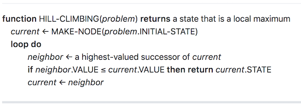
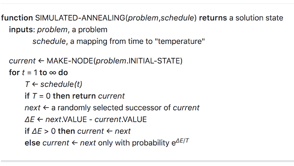
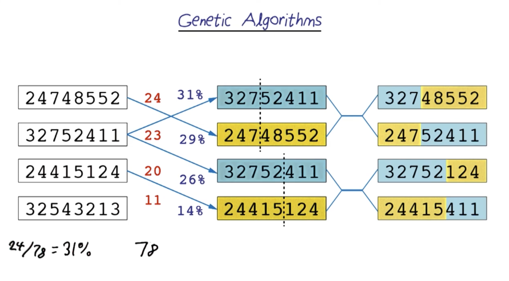
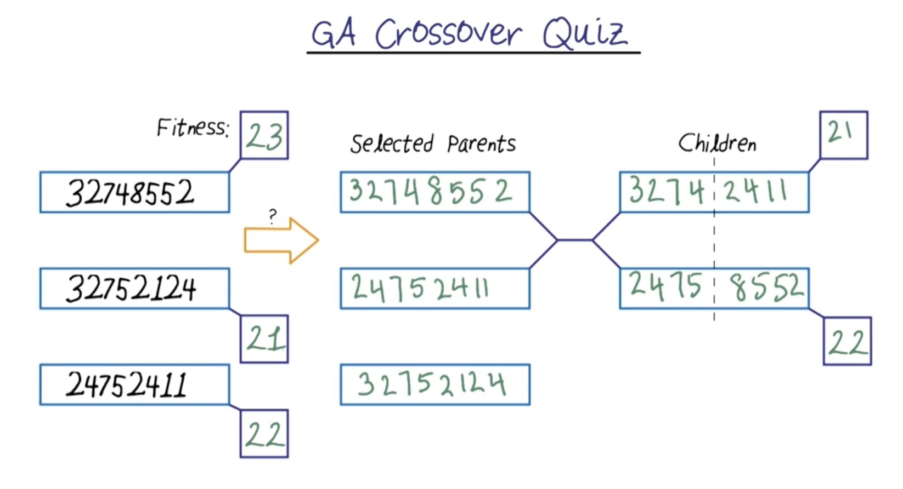
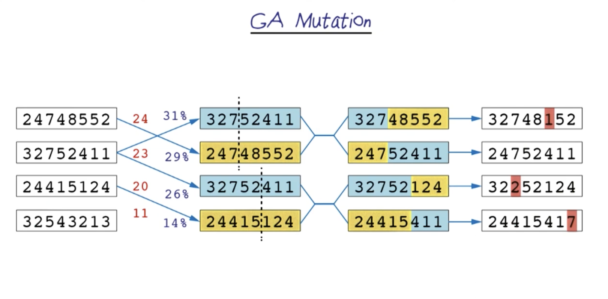
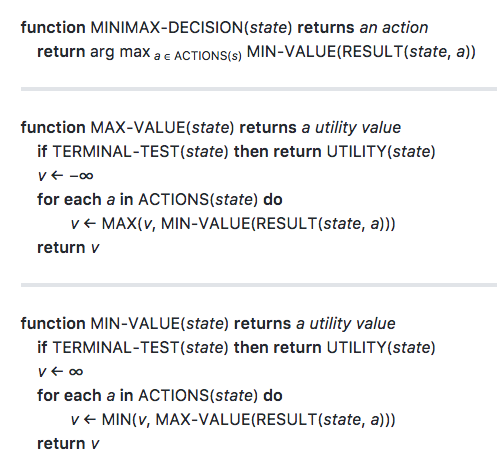
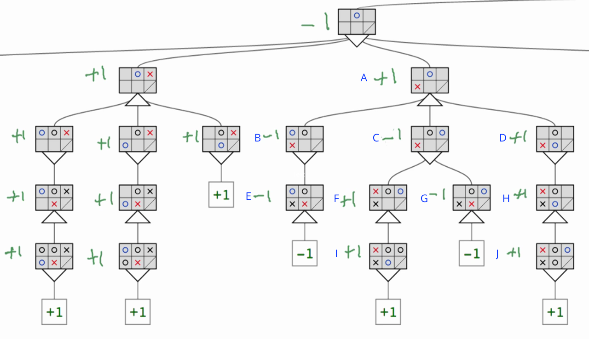
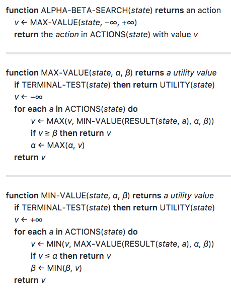
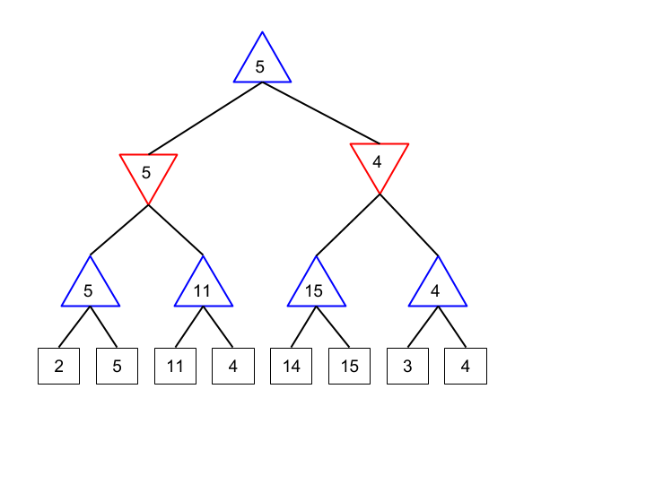

<br>

# Optimization Problems | COURSE 4

<br>

<br>

# 1. Introduction to Optimization

<br>

This week you'll learn about combinatorial optimization problems and several solution methods based on local search (which was mentioned briefly in week 2 as an alternative method of solving CSPs. The optimization techniques presented here include so-called "gradient-free" methods, which are suitable for problems where the optimal solutions can be computed without calculus.

Optimization algorithms attempt to find optimal solutions that maximize or minimize objective functions. As we have seen in the previous lessons, the search algorithms return a solution and the path to the solution in the state space. However, the optimization algorithms do not concern the path to the solution. Instead, the optimization algorithms rely on the objective functions to find the most optimal solutions.

In this course, we will learn three optimization algorithms in AI. They are: Hill Climbing, Simulated Annealing, and Genetic Algorithms. 


NP problems
Computer Scientists are concerned with the time to execute an algorithm. The execution time is not measured in seconds or milliseconds. However, it is proportionate to the number of elements in the problems (denoted as N), such as the number of cities to visit in the classic Traveling Salesman Problem.

Sometimes, the execution time to compute complex problems can be slow, as in N2 or Nm. This algorithm is said to take Polynomial time (denoted as P) to solve the problem. NP is defined as the set of problems where the solutions can be verified in polynomial time. A problem is called NP-hard when the algorithm used to solve this problem can be translated to solve other NP problems.

Thad introduces a trick to solve NP-hard problems by leveraging randomness. This is the essence of the optimization algorithms covered in this course. The algorithm picks a random start in the state space and takes small steps to find a better solution according to its objective function.


<br>

# 2. Hill Climbing

<br>

Note from the video: Thad is cavalier about switching from minimizing the objective function to maximizing the objective function because it is trivial to move back and forth in optimization problems between seeking to maximize or minimize an objective function.

If you want to minimize f(x) and your optimizer program seeks to maximize the objective function, then define g(x) = -f(x) and find max(g(x)) = max(-f(x)) = min(f(x)). Similarly, if your optimization problem needs to maximize f(x) and your optimizer program seeks to minimize the objective function, define g(x) = -f(x) and find min(g(x)) = min(-f(x)) = max(f(x)).

Hill Climbing Algorithm
Hill Climbing is also known as greedy local search. This algorithm only looks to the immediate neighbors without knowing where to go next. The algorithm evaluates the values of immediate neighbors and continually moves to the direction of the increasing value, hence the name “hill climbing”. The algorithm will terminate at a peak where there are no higher values among the neighbors.

You may have heard of the gradient descent algorithm. On the surface, both hill climbing and gradient descent algorithms share a similar goal to reach the maximum or minimum value on the state space landscape. However, there is a subtle difference between them. While hill climbing simply evaluates the value of the evaluation function, gradient descent computes the steepest slope of the function and moves to that direction.

Hill Climbing algorithm is said to be incomplete because it can get stuck in a local maximum and does not guarantee finding the global maximum. In the following videos, we will learn two techniques in the attempt to get unstuck in the local maxima. The two techniques are: (i) random restart and (ii) step size configuration.


<br>



<br>


Local Beam Search is a variation of Beam Search(opens in a new tab), a heuristic search algorithm that explores a graph by expanding the most promising node in a limited set (as defined by Wikipedia). Local beam search algorithm randomly generates k number of states and expand all the successors of all k states in each step. The algorithm will terminate when the successor has found the goal. Otherwise, it selects k’s best successors and iterates.

Since the algorithm expands the next best successors and passes useful information across all parallel searches, the search may become narrowed in a small region and may get stuck in the local maxima. A different variant of Stochastic Beam Search solves this problem by choosing k’s successors randomly.

In the following lesson, we will look into the Simulated Annealing algorithm. Unlike the Hill Climbing algorithm, simulated annealing allows the move to the neighbor with a lower value. It makes the search less efficient, but it can return a complete solution by avoiding getting stuck in the local maxima.


<br>

# 3. Simulated Annealing

<br>


This week's lessons introduce more techniques for solving combinatorial optimization problems: simulated annealing and genetic algorithms. Simulated annealing is not often used, but it is a classical algorithm that introduces some important concepts that lead to more modern replacement algorithms like basin hopping(opens in a new tab) and late acceptance hill climbing(opens in a new tab). The same principles have been used to explain "superconvergence(opens in a new tab)" in deep neural networks. Genetic algorithms have already received considerable attention lately for some applications in deep learning. 

Simulated Annealing algorithm is inspired by the annealing process in metallurgy(opens in a new tab). An annealing process reshapes a hard metal or glass by exposing it to a high temperature and gradually cool it down until it maintains the new shape. Unlike the Hill Climbing algorithm, which can get stuck in the local maxima, Simulated Annealing is guaranteed to find the global maximum.


<br>



<br>

Notation

T is the simulated temperature at time t, which reduces from a high value at the beginning to near zero eventually.
ΔE is the change in energy going from current to next.
Simulated Annealing Pseudocode

For t=1 to ∞ do
    T ← SCHEDULE(t)
    if T=0: return current
    next ← GET_RANDOM_SUCCESSOR(current)
    if Δe>0: current ← next
    else: current ← next with probability e^(ΔE/T)

Let's walk through the simulated annealing algorithm:


- The algorithm initializes the temperature (T) to very high (infinity).
- Through schedule(t) function, the temperature will be decreased at each step. When temperature is zero, it will return the current state.
- Unlike Hill Climbing algorithm which picks the best successor, Simulated Annealing will pick a random successor from the current state.
- When the change in temperature is still high, the algorithm will accept any new value from the successor state although the value may become worse.
- However, as the temperature cools down, the probability of making the transition from current to successor state is specified by the acceptance probability function: eΔE/T. As T is approaching zero, the acceptance probability becomes very small.


<br>

# 4. Genetic Algorithms

<br>

The last optimization algorithm covered in this course is Genetic Algorithm (GA). This algorithm is inspired by Charles Darwin's natural selection theory.

Steps in Genetic Algorithm:

1. Initialize a population with a set of k randomly generated states.
2. Evaluate the parent states according to the fitness function.
3. Select two parent states and split the parents’ chromosomes to crossover a successor child and evaluate the children’s fitness values.
4. With a small independent chance, mutate the children’s states to generate new children.
5. Return states from the parents and children with the best fitness values.

Similar to the Hill-Climbing algorithm, GA’s fitness function will select states with higher values. 


### Understanding the 8 Queens Problem in Genetic Algorithms

Let's understand how we check pairs in the 8 Queens problem! In this puzzle, we need to calculate conflicts between queens to determine fitness. We have two equivalent formulas for calculating total possible pairs:
1. n(n-1)/2 formula
2. n!/(n-2)!2! formula 

Let's prove they're the same:
n!/(n-2)!2! expands to:
* = n(n-1)(n-2)!/(n-2)!2!
* = n(n-1)/2!
* = n(n-1)/2

For our 8 queens board:
* Using n(n-1)/2: 8(8-1)/2 = 8×7/2 = 28 pairs
* Using n!/(n-2)!2!: 8!/(6!2!) = (8×7×6!)/(6!×2) = 28 pairs

## Analyzing Example Solutions
From our example population:

24748552 (fitness: 24)
32752411 (fitness: 23)
24415124 (fitness: 20)
32543213 (fitness: 11)


## Selection Probabilities
- Total fitness = 78 (24 + 23 + 20 + 11)
- Selection probabilities:
  * 24/78 = 31%
  * 23/78 = 29%
  * 20/78 = 26%
  * 11/78 = 14%

## Calculating Fitness For Best Solution
Looking at "24748552" (fitness 24):
1. Row Conflicts:
   - Row 4: Columns 2 and 4
   - Row 5: Columns 6 and 7
   - Row 2: Columns 1 and 8
2. Column Conflicts:   
4. Final Score:
   - Start with 28 possible pairs
   - Subtract 4 conflicts (3+1)
   - Results in fitness of 24

## Using Fitness in Genetic Algorithm
The fitness scores determine:
1. Selection probability (as shown by percentages)
2. Chance of being chosen for crossover (shown by connecting lines)
3. Quality of solution (higher is better)

This guides the evolution toward finding the optimal solution where all 28 pairs are non-threatening.


<br>



<br>

In the N-Queen problem, the fitness function is the number of non-attacking pairs of queens. The maximum fitness value for this problem is 28 (= 8! / (8-2)!2!), a combination of 8 choose 2, where 28 is all the possible combinations of pairing eight queens.

The first step is to compute the fitness function of the parents and sort them according to their fitness values. For example, the board 32752411 has five pairs of attacking queens. Therefore the fitness value is 23 (= 28 - 5). After we sort the parents according to their fitness values, we can crossover them to generate successors (children) as shown in the next video.


In this example, the instructor splits the parents’ 8-digit chromosomes into 3- and 5-digit to crossover the chromosomes as follows:

The first parent state of 24748552 is split into 247 and 48552 chromosomes.
The second parent state of 32752411 is split into 327 and 52411 chromosomes.
The crossover will generate two offsprings:
First child: 247 + 52411
Second child: 327 + 48552
Compute the fitness function of the children.
Please note that you can determine other splitting criteria. For example, you can split the parent’s chromosome by half. So, the board 24748552 can be halved into 2474 and 8552.


<br>



<br>


<br>



<br>

In the final mutation step, the algorithm will apply randomness to the children and generate additional children into the population. Instead of mutating the whole chromosome, the algorithm will just change the tiny bit in the chromosome.

Adding randomness into Genetic Algorithm brings benefits in the crossover step. As we have seen in the previous video, the crossover exchanges large blocks of the parents to the children. A tiny mutation adds the granularity during the crossover operation. Similar to stochastic beam search, the mutation allows Genetic Algorithm to explore new states.


This concludes the course on Optimization Algorithms. The optimization algorithms aim to find the best state according to their given objective functions. In this course, we learned three optimization algorithms. The algorithms are Hill Climbing, Simulated Annealing, and Genetic Algorithm.

In the intro lesson, we learned about global maxima and local maxima on the state space landscape and how the optimization algorithms may get stuck in the local maxima. However, adding randomness in the local search can help alleviate the problem.

The first optimization algorithm is Hill Climbing. This algorithm is also called greedy local search because it only looks at the immediate neighbors and moves to the new state with a higher value than the current state. However, this algorithm is prone to getting stuck in a local maximum.

The next algorithm, Simulated Annealing, alleviates the problem by allowing to accept the new state’s lower value at the early stage, as measured by temperature. Simulated Annealing algorithm is complete because it can find the global maximum and efficient because of the randomness in picking the next successor state. To expedite finding the global maximum, we can do local beam search where we can search k states at once and share the information among the parallel searches. A variant of beam search is stochastic beam search where the candidate successors are chosen at random.

The Genetic Algorithm is a variant of stochastic beam search where the successor states (the children) are generated by crossing-over two parents in a population. The objective function in Genetic Algorithm is called fitness function. Through crossover and mutation steps, the new population will be created from the parents in the original population. The algorithm will return the best state with the highest fitness function.


<br>

# 5. Optimization Exercise

<br>

<br>

# 6. Additional Optimization Topics

<br>

### Derivative-free optimization

Derivative-free optimization (sometimes referred to as blackbox optimization) is a discipline in mathematical optimization that does not use derivative information in the classical sense to find optimal solutions: Sometimes information about the derivative of the objective function f is unavailable, unreliable or impractical to obtain. For example, f might be non-smooth, or time-consuming to evaluate, or in some way noisy, so that methods that rely on derivatives or approximate them via finite differences are of little use. The problem to find optimal points in such situations is referred to as derivative-free optimization, algorithms that do not use derivatives or finite differences are called derivative-free algorithms.


<br>
<br>
<br>

# Adversarial Search | COURSE 5

<br>

<br>

# 1. Introduction to Adversarial Search

<br>

Welcome to the Adversarial Search course. In this course, you will learn to extend classical search to adversarial domains, to build agents that make good decisions without any human intervention—such as the DeepMind AlphaGo agent.

Course outline
Search in Multiagent Domains
In this lesson, you will learn about search in multi-agent domains, using the Minimax theorem to solve adversarial problems and build agents that make better decisions than humans.

Optimizing Minimax Search
In this lesson, we will discuss some of the limitations of minimax search and introduce optimizations & changes that make it practical in more complex domains.

Project: Build an Adversarial Game Playing Agent
In this project, you will experiment with adversarial search techniques by building an agent to play knights Isolation.

Extending Minimax Search
In this lesson, you will learn the extensions to minimax search to support more than two players and non-deterministic domains.

Additional Adversarial Search Topics
This lesson is a reading lesson. We will introduce Monte Carlo Tree Search, a highly-successful search technique in game domains, along with a reading list for other advanced adversarial search topics.


<br>

# 2. Search in Multiagent Domains

<br>


## Understanding Minimax Algorithm

## Simple Introduction
Minimax is like playing chess while thinking several moves ahead - for each of your moves, you consider how your opponent might respond, and then how you could counter that response. It assumes your opponent will play optimally to minimize your chances of winning, while you try to maximize your winning chances. This back-and-forth thinking forms the core of the minimax algorithm.

## Detailed Explanation
### How It Works
1. Tree Construction
   - Each node represents a game state
   - Alternating levels represent MAX (your turn) and MIN (opponent's turn)
   - Leaf nodes represent terminal states with definite values

2. Value Assignment
   - For terminal nodes: Assign actual game outcome values
   - For non-terminal nodes:
     * MAX nodes: Take maximum of children's values
     * MIN nodes: Take minimum of children's values

### Mathematical Representation
```
minimax(node, depth, maximizingPlayer) {
    if depth = 0 or node is terminal:
        return static evaluation of node

    if maximizingPlayer:
        value = -∞
        for each child of node:
            value = max(value, minimax(child, depth-1, FALSE))
        return value

    else:
        value = +∞
        for each child of node:
            value = min(value, minimax(child, depth-1, TRUE))
        return value
}
```

## Practical Applications
1. Game Playing
   - Chess
   - Tic-tac-toe
   - Checkers

2. Decision Making
   - Used in scenarios where two parties have opposing goals
   - Helps in strategic planning

## Limitations
1. Computational Complexity
   - Time complexity: O(b^d)
     * b = branching factor (number of legal moves)
     * d = search depth
   
2. Memory Requirements
   - Space complexity: O(bd)
   - Can be optimized with alpha-beta pruning

## Optimizations
1. Alpha-Beta Pruning
   - Reduces number of evaluated nodes
   - Maintains same final decision
   - Significantly improves performance

2. Depth Limiting
   - Set maximum search depth
   - Use evaluation function for non-terminal leaves

## Real-World Examples
1. Chess Engines
   - Evaluating positions
   - Choosing best moves
   - Planning strategies

2. Game AI
   - Creating challenging opponents
   - Balancing difficulty levels
   - Ensuring fair gameplay

This week you'll learn about minimax, which extends search to multi-agent domains (i.e., problems where your agent isn't the only influence on the environment). Minimax agents have been very successful in some games (like Chess), but the central idea is even more important: your agent can make better decisions by considering the consequences of its actions.


In this lesson, we will discuss the basics of adversarial search. The topics that we will cover are:

1. The MINMAX algorithm
2. Isolation
3. MIN and MAX levels
4. Propagating values up the tree
5. Computing MIN MAX values
6. Choosing the best branch
7. Max number of nodes
8. The branching factor


It is also common to see minimax presented as a simply recursive function(opens in a new tab), or other variants like negamax(opens in a new tab). However, we will adhere to the version from the AIMA text in this exercise, because it separates the functionality for handling the min level and max level nodes (which makes it easier to test), and it more explicitly shows that you only need to choose a move from the root node -- all other children nodes only need to return a value.

<br>



<br>


### Computing MIN MAX Solution


To begin with, boxes E, F, G, H, I, and J have just one child. As such, they simply take the value of their child.
Box C is a minimizer node, and hence chooses the minimum of boxes F, and G which is G's value of -1.
Box A is a maximizing node, and chooses the maximum of boxes B, C, and D which is D's value of +1.

<br>



<br>


<br>

# 3. Optimizing Minimax Search

<br>


In this lesson, you will learn about optimizing MINMAX search. Specifically, you will study these topics:

1. Depth-limited search
2. Evaluation function
3. Testing the evaluation function
4. Quiescent search
5. Iterative deepening
6. Varying the branching factor
7. Horizon effect
8. Alpha-Beta pruning


## Understanding Depth-Limited Search

## Simple Introduction
Depth-Limited Search solves the infinite depth problem of DFS by setting a maximum depth limit. Think of it like exploring a cave with a rope of fixed length - you can only go as deep as the rope allows, even if the cave continues further. This makes the search practical for real-world problems where resources are limited.

## Detailed Explanation

### Core Concept
1. Basic Structure
   - Similar to Depth-First Search (DFS)
   - Includes a depth limit parameter (l)
   - Returns failure if limit reached
   - Can return "cutoff" occurred status

### Mathematical Representation
```
DLS(node, goal, limit) {
    if node = goal:
        return solution
    else if limit = 0:
        return cutoff
    else:
        cutoff_occurred = false
        for each successor of node:
            result = DLS(successor, goal, limit - 1)
            if result = cutoff:
                cutoff_occurred = true
            else if result ≠ failure:
                return result
        if cutoff_occurred:
            return cutoff
        else:
            return failure
}
```

## Properties
1. Completeness
   - Not complete in general
   - Complete if solution lies within depth limit

2. Time Complexity
   - O(b^l) where:
     * b = branching factor
     * l = depth limit

3. Space Complexity
   - O(b×l)
   - Linear in depth limit

## Advantages
1. Memory Efficiency
   - Bounded space requirement
   - Practical for large search spaces

2. Control Over Search
   - Adjustable depth limit
   - Predictable resource usage

## Limitations
1. Solution Quality
   - May miss optimal solutions
   - Can fail to find solutions beyond limit

2. Choosing Limit
   - Too small: misses solutions
   - Too large: wastes resources

## Applications
1. Game Playing
   - Chess engines
   - Limited look-ahead in strategies

2. Planning Systems
   - Route finding
   - Resource allocation

3. Real-time Systems
   - Where time constraints exist
   - Quick decision making needed

## Variations
1. Iterative Deepening
   - Repeatedly increase depth limit
   - Combines benefits of BFS and DFS

2. Adaptive Depth Limits
   - Adjust limit based on resources
   - Dynamic optimization


Minimax search is guaranteed to find an optimal move, but it is impractical for all but the most trivial games. Game trees grow exponentially with each additional level of search, so the algorithm runtime is also exponential. With only finite computational resources available, we need a way to bound the runtime of the search. Using a fixed depth limit is the simplest mechanism to limit the runtime (although it introduces new problems that we'll see later).

Thad demonstrated the math to estimate a value to use for a fixed depth limit, so now it's time to add a depth limit to our minimax code. We'll add the depth limit as an additional parameter passed to each of the minimax functions, and then we'll update the logic to cut off search when we reach the depth limit.


## Quiescent Search

Quiescent Search solves the "horizon effect" in game-tree search by continuing evaluation beyond the normal depth limit for "noisy" positions. It's like looking at a chess position until things calm down - if there's a capture sequence, you don't stop evaluating until the captures are finished, ensuring you don't miss important tactical consequences.

## Detailed Explanation

### Core Concept
1. Position Types
   - Quiescent: Stable positions where evaluation is reliable
   - Non-quiescent: Unstable positions with pending tactical threats

2. Search Process
   - Continue beyond depth limit for non-quiescent positions
   - Only consider "forcing" moves (captures, checks, etc.)
   - Stop when position becomes quiescent

### Mathematical Representation
```
quiescent(position, alpha, beta) {
    stand_pat = evaluate(position)
    if stand_pat >= beta:
        return beta
    if alpha < stand_pat:
        alpha = stand_pat

    moves = generate_forcing_moves(position)
    for each move in moves:
        score = -quiescent(-beta, -alpha, make_move(position, move))
        if score >= beta:
            return beta
        if score > alpha:
            alpha = score
    return alpha
}
```

## Key Features
1. Selective Deepening
   - Extends search in tactical positions
   - Limits search in quiet positions

2. Move Selection
   - Focuses on forcing moves
   - Ignores quiet moves at extended depth

## Implementation Details
1. Move Generation
   - Captures
   - Checks (in chess)
   - Direct threats

2. Stand-Pat Evaluation
   - Initial position evaluation
   - Serves as search bound

## Advantages
1. Accuracy
   - Reduces horizon effect
   - Better tactical awareness

2. Efficiency
   - Selective search extension
   - Focus on critical variations

## Limitations
1. Search Explosion
   - Can greatly increase nodes searched
   - Need good move ordering

2. Resource Management
   - Must balance depth vs breadth
   - Need termination criteria

## Applications
1. Chess Engines
   - Evaluating tactical positions
   - Avoiding tactical oversights

2. Game AI
   - Improving tactical play
   - Better decision making

## Optimizations
1. Delta Pruning
   - Skip moves unlikely to change evaluation
   - Reduce search space

2. SEE (Static Exchange Evaluation)
   - Quick evaluation of captures
   - Prune unpromising variations


Iterative deepening is a search technique that allows minimax-style search functions to return an approximate solution when computational resources are bounded. The basic idea is to start with a small depth-limited search, and grow the depth limit until the resource limit (usually search time) expires.

In the quiz below, you'll implement the get_action() function, which should wrap calls to the minimax.minimax_decision function to perform "iterative deepening" depth limited search. Start with a depth of 1 (the root node itself is a depth of 0), and call the decision function for each depth value up to (and including) the depth limit.

Open the search.ipynb in the workspace below and complete the functions. If you get stuck, feel free to check the solution in the search_solutions.ipynb.


<br>


<br>


Iterative Deepening: b = 3

b = 2       n = 2^(d+1) - 1
b = 3       n = (3^(d+1) - 1)/2
b = k       n = (k^(d+1) - 1)/(k-1)


Here b appears to be the branching factor and n seems to be representing the number of nodes, where d is likely the depth of the search tree.


Here's how to find MAX alpha and MIN beta values in a tree structure:

1. Finding MAX (Alpha)

```textmate
maxAlpha = -∞
for each child node:
    childValue = evaluate(child)
    maxAlpha = max(maxAlpha, childValue)
    if maxAlpha ≥ beta:
        break  // Prune remaining branches
```

2. Finding MIN (Beta)

```textmate
minBeta = +∞
for each child node:
    childValue = evaluate(child)
    minBeta = min(minBeta, childValue)
    if alpha ≥ minBeta:
        break  // Prune remaining branches
```

Let's use a simple example:

```textmate
       Root(MAX)
      /    |    \
     3     5     2
    /|\   /|\   /|\
   2 8 4 1 5 3 7 4 9
```

At MAX level (Root):
1. First branch: α = max(-∞, 3) = 3
2. Second branch: α = max(3, 5) = 5
3. Third branch: α = max(5, 2) = 5

At MIN level (Children):
1. Left node: β = min(+∞, min(2,8,4)) = 2
2. Middle node: β = min(+∞, min(1,5,3)) = 1
3. Right node: β = min(+∞, min(7,4,9)) = 4

The algorithm would prune branches where α ≥ β, significantly reducing the search space.


Let me explain alpha-beta pruning with a clearer example:

```textmate
           A(MAX)
         /        \
    B(MIN)        C(MIN)
    /    \        /    \
D(MAX)  E(MAX)  F(MAX) G(MAX)
   3      5      2      8
```

Let's walk through this step by step:

1. Starting values: 
   - α = -∞
   - β = +∞

2. Traverse left first:
   - At D: α = 3
   - At E: α = 5
   - At B: β = min(3,5) = 3
   - Update A's α = 3

3. Now at C:
   - At F: α = 2
   - B already gave value 3
   - If next move (G) can't beat 3 (MIN will choose smaller value), MAX won't choose C
   - No need to evaluate G (pruning!)

Better example with pruning:

```textmate
           A(MAX)
         /        \
    B(MIN)        C(MIN)
    /    \        /    \
D(MAX)  E(MAX)  F(MAX) G(MAX)
   5      3      2      ? (pruned)
```

Here's why G is pruned:

1. B returns 3 (MIN chooses smaller between 5 and 3)
2. At C, we find F = 2
3. Since 2 < 3, MIN at C will choose ≤ 2
4. MAX at A already has 3 from B
5. Therefore, A will never choose C's path
6. No need to evaluate G


### The Alpha Beta Search Algorithm

<br>



<br>

<br>


This video introduces the concept of alpha-beta pruning which modifies the minimax algorithm by introducing two new variables: α -- the maximum lower bound of the minimax value -- and β -- the minimum upper bound of the minimax value. In other words: at every state in the game tree α represents the guaranteed worst-case score that the MAX player could achieve, and β represents the guaranteed worst-case score that the MIN player could achieve.

The estimates of α are only updated in each MAX node, while β is only updated in each MIN node. If the estimate of the upper bound is ever lower than the estimate of the lower bound in any state, then the search can be cut off because there are no values between the upper and lower bounds. Practically this means that your agent could do better by making a different move earlier in the game tree to avoid the pruned state.

Implementing alpha-beta pruning in minimax only adds the two new variables (alpha & beta), and adds a conditional branch to the MIN and MAX nodes to break and return the appropriate bound when a state is pruned. (See the pseudocode above & compare with the minimax(opens in a new tab) algorithm.)

There's one more difference you'll notice between minimax and alpha-beta: the alpha-beta search function seems to call the max_value()helper from the root node, while minimax calls the min_value()helper. But the pseudocode for alpha-beta search is just hiding some additional complexity: calling max_value() returns the score of the best branch -- but it doesn't tell you what the best branch is. You can implement the algorithm just like the minimax-decision function if you modify it to update alpha between branches.


Let me analyze the alpha-beta pruning step by step on this tree:

Shape symbols indicate:
- Triangles pointing up (blue): MAX nodes
- Triangles pointing down (red): MIN nodes
- Squares (gray): intermediate nodes
- Rectangles (white): leaf nodes

Values:

```textmate
                    MAX(5)
                /          \
           MIN(5)        MIN(4)
          /      \      /      \
    MAX(5)    MAX(11) MAX(15) MAX(4)
    /    \    /    \   /    \  /    \
    2     5   11    4  14   15  3    4
```

Let's walk through with α and β:

1. Start with α = -∞, β = +∞

2. Left subtree under first MIN:
   - First MAX: max(2,5) = 5
   - Second MAX: max(11,4) = 11
   - MIN chooses: min(5,11) = 5

3. Right subtree under second MIN:
   - First MAX: max(14,15) = 15
   - No need to evaluate last MAX node (4) because:
     * We already know this MIN will return ≤15
     * Previous MIN returned 5
     * MAX at root has α = 5
     * Any value ≤15 won't improve α
   - Thus prune the last node (3,4)

4. Final result at root MAX = 5

The key pruning happens in the rightmost branch - we don't need to evaluate the last MAX node (with values 3,4) because it can't affect the final decision.


Let me break down each step with α and β values:

1. Initial Values:
   * α = -∞ 
   * β = +∞

2. Left Side First:


Level 1 (Root MAX): α = -∞, β = +∞

Level 2 (First MIN): α = -∞, β = +∞
   - First MAX node (2,5):
     * evaluates 2: α = max(-∞, 2) = 2
     * evaluates 5: α = max(2, 5) = 5
     * returns 5
   
   - Second MAX node (11,4):
     * evaluates 11: α = max(-∞, 11) = 11
     * evaluates 4: α = max(11, 4) = 11
     * returns 11

   MIN selects minimum(5,11) = 5
   Updates root's α = 5


3. Right Side:


Level 2 (Second MIN): α = 5, β = +∞
   - First MAX node (14,15):
     * evaluates 14: α = max(-∞, 14) = 14
     * evaluates 15: α = max(14, 15) = 15
     * returns 15

   - Second MAX node (3,4):
     * PRUNED! Because:
       - Parent MIN will select ≤15
       - Root already has α = 5
       - Any value ≤15 won't improve α = 5


4. Final Result:
   * Root MAX has α = 5
   * This is the optimal value

The pruning saves us from evaluating the last node because:
- If any value in pruned branch ≤5: won't be chosen by MAX
- If any value >5 but ≤15: will be minimized by MIN node above
- Therefore, can't affect final decision


<br>



<br>


The last technique we'll cover is alpha-beta pruning, which allows the agent to avoid searching nodes that cannot lead to better outcomes than what they've already searched by keeping track of the upper and lower bounds of the value for each branch. The lower bound is called alpha, and the upper bound is called beta.


### Opening Book

An opening book isn't specific to Minimax search. It's a general technique for game playing that builds on the intuitive idea that we can learn from experience which opening moves are most likely to result in a win. Opening books are usually built by analyzing a large corpus of games between expert players to find the most promising opening lines.

If you don't have a large corpus of historical matches, then you can create a corpus by either using random rollouts (or by using your agent) to play many games while accumulating statistics on which opening moves are best. An opening book can be as simple as a dictionary book = {hashable_game_state: action_to_take} for as many pairs of game states and actions as you choose.

Keep in mind that opening books are estimates of the best move. It's possible for the book to learn bad moves, especially if you don't have much data or if your data is noisy. The game tree grows exponentially, so it can take an enormous number of games to collect reliable statistics on the opening moves. You can improve the quality of the estimates by incorporating more domain knowledge in the process (like the symmetries discussed for 5x5 Isolation).


# 4. Build an Adversarial Game Playing Agent

<br>

<br>

# 5. Extending Minimax Search

<br>

<br>

# 6. Additional Adversarial Search Topics

<br>
